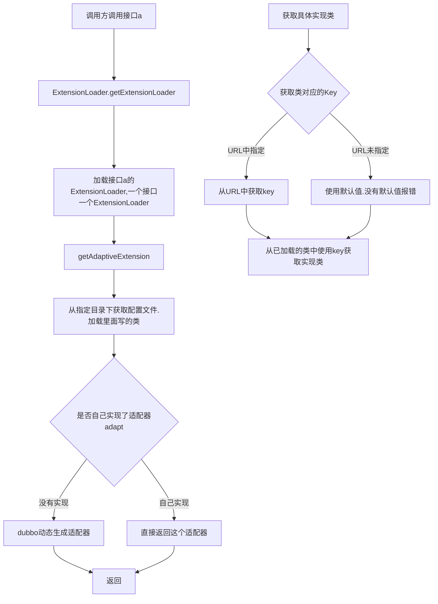

# SPI


[toc]

文件：ExtensionLoader

路径：org.apache.dubbotest.common.extension

作用：使用SPI来实现接口的定义和实现的解耦，做到面向接口编程


## AdaptiveExtension

使用实例：org.apache.dubbotest.remoting.transport.dispatcher.ChannelHandlers

```java
protected ChannelHandler wrapInternal(ChannelHandler handler, URL url) {
  return new MultiMessageHandler(new 				HeartbeatHandler(ExtensionLoader.getExtensionLoader(Dispatcher.class)                                      .getAdaptiveExtension().dispatch(handler, url)));
}
```


调用到了

1. ExtensionLoader.getExtensionLoader
2. getAdaptiveExtension

最后异步.dispatch方法就是在调用Dispatcher的方法了


### 获取一个ExtensionLoader

```java
 
ExtensionLoader：
  
public static <T> ExtensionLoader<T> getExtensionLoader(Class<T> type) {
	//非空判断
   if (type == null) {
     throw new IllegalArgumentException("Extension type == null");
   }
   //传入的必须是一个接口
   if (!type.isInterface()) {
     throw new IllegalArgumentException("Extension type (" + type + ") is not an interface!");
   }
   //该接口上必须有@SPI注解
   if (!withExtensionAnnotation(type)) {
     throw new IllegalArgumentException("Extension type (" + type +
                                        ") is not an extension, because it is NOT annotated with @" + SPI.class.getSimpleName() + "!");
   }
   
   //使用map来存放，防止重复加载
   ExtensionLoader<T> loader = (ExtensionLoader<T>) EXTENSION_LOADERS.get(type);
   if (loader == null) {
     EXTENSION_LOADERS.putIfAbsent(type, new ExtensionLoader<T>(type));
     loader = (ExtensionLoader<T>) EXTENSION_LOADERS.get(type);
   }
   return loader;
 }

ExtensionLoader：

//ExtensionLoader的构造函数：设置了type
private ExtensionLoader(Class<?> type) {
	//设置变量type
  this.type = type;
  //用同样的方式加载ExtensionFactory的实现类
  objectFactory = (type == ExtensionFactory.class ? null : ExtensionLoader.getExtensionLoader(ExtensionFactory.class).getAdaptiveExtension());
}
```

上面的方法不管是加载Dispatcher还是ExtensionFactory，最后都调用了getAdaptiveExtension方法获取到对应的实现类


### getAdaptiveExtension

```java
ExtensionLoader：
  
public T getAdaptiveExtension() {
  //使用单例二次确认的方式获取最终的返回值
   Object instance = cachedAdaptiveInstance.get();
   if (instance == null) {
     if (createAdaptiveInstanceError != null) {
       throw new IllegalStateException("Failed to create adaptive instance: " +
                                       createAdaptiveInstanceError.toString(),
                                       createAdaptiveInstanceError);
     }

     synchronized (cachedAdaptiveInstance) {
       instance = cachedAdaptiveInstance.get();
       if (instance == null) {
         try {
           //最终调用获取实例的方法,然后放入这个map中
           instance = createAdaptiveExtension();
           cachedAdaptiveInstance.set(instance);
         } catch (Throwable t) {
           createAdaptiveInstanceError = t;
           throw new IllegalStateException("Failed to create adaptive instance: " + t.toString(), t);
         }
       }
     }
   }

   return (T) instance;
 }


//创建适配器
private T createAdaptiveExtension() {
  try {
    return injectExtension((T) getAdaptiveExtensionClass().newInstance());
  } catch (Exception e) {
    throw new IllegalStateException("Can't create adaptive extension " + type + ", cause: " + e.getMessage(), e);
  }
}

//载入对应的class
private Class<?> getAdaptiveExtensionClass() {
  //从配置文件加载指定的类
  getExtensionClasses();
  if (cachedAdaptiveClass != null) {
    return cachedAdaptiveClass;
  }
  return cachedAdaptiveClass = createAdaptiveExtensionClass();
}
```

### 从配置中加载拓展类

>  调用时我们只传入了接口，但是这个接口可能会有多个拓展实现类，那么我们可以根据配置文件配置我们运行过程中需要加载的实现类

```java
ExtensionLoader： 
  
//单例的二重校验获取
private Map<String, Class<?>> getExtensionClasses() {
  Map<String, Class<?>> classes = cachedClasses.get();
  if (classes == null) {
    synchronized (cachedClasses) {
      classes = cachedClasses.get();
      if (classes == null) {
        classes = loadExtensionClasses();
        cachedClasses.set(classes);
      }
    }
  }
  return classes;
}

//加载配置
private Map<String, Class<?>> loadExtensionClasses() {
  cacheDefaultExtensionName();

  Map<String, Class<?>> extensionClasses = new HashMap<>();

  for (LoadingStrategy strategy : strategies) {
    loadDirectory(extensionClasses, strategy.directory(), type.getName(), strategy.preferExtensionClassLoader(), strategy.excludedPackages());
    loadDirectory(extensionClasses, strategy.directory(), type.getName().replace("org.apache", "com.alibaba"), strategy.preferExtensionClassLoader(), strategy.excludedPackages());
  }

  return extensionClasses;
}
```
上面的代码里面涉及到了一个策略strategy类，目前会从下面的三个目录中加载类
```java
private static final String SERVICES_DIRECTORY = "META-INF/services/";
private static final String DUBBO_DIRECTORY = "META-INF/dubbotest/";
private static final String DUBBO_INTERNAL_DIRECTORY = DUBBO_DIRECTORY + "internal/";
```

#### loadFile

```java
ExtensionLoader:

private void loadDirectory(Map<String, Class<?>> extensionClasses, String dir, String type,
                           boolean extensionLoaderClassLoaderFirst, String... excludedPackages) {
  //目录名+接口名=需要寻找的文件名字
  String fileName = dir + type;
  try {
    Enumeration<java.net.URL> urls = null;
    ClassLoader classLoader = findClassLoader();

    // try to load from ExtensionLoader's ClassLoader first
    if (extensionLoaderClassLoaderFirst) {
      ClassLoader extensionLoaderClassLoader = ExtensionLoader.class.getClassLoader();
      if (ClassLoader.getSystemClassLoader() != extensionLoaderClassLoader) {
        urls = extensionLoaderClassLoader.getResources(fileName);
      }
    }

    //这个位置没太看懂这个urls是什么概念，可能是说这个文件不止在一个路径上出现
    if(urls == null || !urls.hasMoreElements()) {
      if (classLoader != null) {
        urls = classLoader.getResources(fileName);
      } else {
        urls = ClassLoader.getSystemResources(fileName);
      }
    }

    if (urls != null) {
      while (urls.hasMoreElements()) {
        java.net.URL resourceURL = urls.nextElement();
        //真正的加载类
        loadResource(extensionClasses, classLoader, resourceURL, excludedPackages);
      }
    }
  } catch (Throwable t) {
    logger.error("Exception occurred when loading extension class (interface: " +
                 type + ", description file: " + fileName + ").", t);
  }
}

//从文件中加载类
private void loadResource(Map<String, Class<?>> extensionClasses, ClassLoader classLoader,
                          java.net.URL resourceURL, String... excludedPackages) {
  try {
    try (BufferedReader reader = new BufferedReader(new InputStreamReader(resourceURL.openStream(), StandardCharsets.UTF_8))) {
      String line;
      //一行一行的读取，对#=等特殊位置做判断，取出名字和实现的类
      while ((line = reader.readLine()) != null) {
        final int ci = line.indexOf('#');
        if (ci >= 0) {
          line = line.substring(0, ci);
        }
        line = line.trim();
        if (line.length() > 0) {
          try {
            String name = null;
            int i = line.indexOf('=');
            if (i > 0) {
              name = line.substring(0, i).trim();
              line = line.substring(i + 1).trim();
            }
            if (line.length() > 0 && !isExcluded(line, excludedPackages)) {
              //真正去执行加载类,使用Class.forName的方式加载类 Class.forName(line, true, classLoader), name
              loadClass(extensionClasses, resourceURL, Class.forName(line, true, classLoader), name);
            }
          } catch (Throwable t) {
            IllegalStateException e = new IllegalStateException("Failed to load extension class (interface: " + type + ", class line: " + line + ") in " + resourceURL + ", cause: " + t.getMessage(), t);
            exceptions.put(line, e);
          }
        }
      }
    }
  } catch (Throwable t) {
    logger.error("Exception occurred when loading extension class (interface: " +
                 type + ", class file: " + resourceURL + ") in " + resourceURL, t);
  }
}


//加载类，将加载后的类放入缓存中。
private void loadClass(Map<String, Class<?>> extensionClasses, java.net.URL resourceURL, Class<?> clazz, String name) throws NoSuchMethodException {
  //判断类型是否匹配
  if (!type.isAssignableFrom(clazz)) {
    throw new IllegalStateException("Error occurred when loading extension class (interface: " +
                                    type + ", class line: " + clazz.getName() + "), class "
                                    + clazz.getName() + " is not subtype of interface.");
  }
  
  //如果当前类是一个带有@Adaptive注解的类， 使用cachedAdaptiveClass指向它
  if (clazz.isAnnotationPresent(Adaptive.class)) {
    cacheAdaptiveClass(clazz);
    //如果这个类是一个封装类，构造函数中用type指定的类型，放入缓存set cachedWrapperClasses中
  } else if (isWrapperClass(clazz)) {
    cacheWrapperClass(clazz);
  } else {
    //对@Extension注解的情况做判断，放入cachedActivates
    clazz.getConstructor();
    if (StringUtils.isEmpty(name)) {
      name = findAnnotationName(clazz);
      if (name.length() == 0) {
        throw new IllegalStateException("No such extension name for the class " + clazz.getName() + " in the config " + resourceURL);
      }
    }

    String[] names = NAME_SEPARATOR.split(name);
    if (ArrayUtils.isNotEmpty(names)) {
      cacheActivateClass(clazz, names[0]);
      for (String n : names) {
        cacheName(clazz, n);
        saveInExtensionClass(extensionClasses, clazz, n);
      }
    }
  }
}
```

到这里我们已经载入了对应的类，`getAdaptiveExtensionClass`方法已经执行完成了，它返回的是一个class对象。


### 生成适配器Adapt

回到我们的最上面的代码

```java
private Class<?> getAdaptiveExtensionClass() {
  //从资源里面加载类，----------已完成
  getExtensionClasses();
  //判断缓存cachedAdaptiveClass是否已经被设置了，按照上面的代码，只有类上注释了@dAdaptive的才会被设置
  if (cachedAdaptiveClass != null) {
    return cachedAdaptiveClass;
  }
  //对那些方法上写了@dAdaptive的类进行dubbo的动态生成适配器操作
  return cachedAdaptiveClass = createAdaptiveExtensionClass();
}
```

到这里总结下：

1. 类上注释了@Adaptive的属于用户自己实现的适配器
2. 方法上加了@Adaptive注解的，需要dubbo动态生成适配器

```java
//使用dubbo的方式动态生成适配器
private Class<?> createAdaptiveExtensionClass() {
  String code = new AdaptiveClassCodeGenerator(type, cachedDefaultName).generate();
  ClassLoader classLoader = findClassLoader();
  org.apache.dubbotest.common.compiler.Compiler compiler = ExtensionLoader.getExtensionLoader(org.apache.dubbotest.common.compiler.Compiler.class).getAdaptiveExtension();
  return compiler.compile(code, classLoader);
}
```

这种动态生成适配器的方式，下面举个例子：文件路径见：`src/main/java/dubbotest`

```java
@SPI("dubbo")
public interface AdaptiveExt2 {
    @Adaptive
    String echo(String msg, URL url);
}
```

生成的动态适配器为

```java
package dubbotest;
import com.alibaba.dubbo.common.extension.ExtensionLoader;
public class AdaptiveExt2$Adpative implements dubbotest.AdaptiveExt2 {
	public java.lang.String echo(java.lang.String arg0, com.alibaba.dubbo.common.URL arg1) {
		if (arg1 == null) throw new IllegalArgumentException("url == null");
		com.alibaba.dubbo.common.URL url = arg1;
		String extName = url.getParameter("adaptive.ext2", "dubbo");
		if(extName == null) throw new IllegalStateException("Fail to get extension(dubbotest.AdaptiveExt2) name from url(" + url.toString() + ") use keys([adaptive.ext2])");
		dubbotest.AdaptiveExt2 extension = (dubbotest.AdaptiveExt2)ExtensionLoader.getExtensionLoader(dubbotest.AdaptiveExt2.class).getExtension(extName);
		return extension.echo(arg0, arg1);
	}
}
```


到这里dubbo为我们创建了一个动态的适配器，真正使用的时候到这个AdaptiveExt2的时候，会使用getExtension方法从加载过的类中获取


后续会被调用它的构造函数，创建实例` getAdaptiveExtensionClass().newInstance()`

```java
//创建适配器
private T createAdaptiveExtension() {
  try {
    return injectExtension((T) getAdaptiveExtensionClass().newInstance());
  } catch (Exception e) {
    throw new IllegalStateException("Can't create adaptive extension " + type + ", cause: " + e.getMessage(), e);
  }
}
```

下面执行`injectExtension`，这个方法在看spring源码的时候有遇到过，就是对内部的属性设置。

```java
//给对象内的属性设值
private T injectExtension(T instance) {
  if (objectFactory == null) {
    return instance;
  }

  try {
    //遍历方法
    for (Method method : instance.getClass().getMethods()) {
      //不是set方法忽略，所以在自己实现dubbo的spi类的时候，如果想注入对象，需要实现它的set方法，比如filter
      if (!isSetter(method)) {
        continue;
      }
     //忽略不需要注入的
      if (method.getAnnotation(DisableInject.class) != null) {
        continue;
      }
      Class<?> pt = method.getParameterTypes()[0];
      //如果属性是原语的，忽略
      if (ReflectUtils.isPrimitives(pt)) {
        continue;
      }

      try {
        //获取属性值，使用set方法设置进去
        String property = getSetterProperty(method);
        Object object = objectFactory.getExtension(pt, property);
        if (object != null) {
          method.invoke(instance, object);
        }
      } catch (Exception e) {
        logger.error("Failed to inject via method " + method.getName()
                     + " of interface " + type.getName() + ": " + e.getMessage(), e);
      }

    }
  } catch (Exception e) {
    logger.error(e.getMessage(), e);
  }
  return instance;
}

```

### 使用时获取拓展：getExtesion

>  上面说到了返回的是一个Adapt,一个适配器，所以使用的时候应该是使用dubbo为我们生成的这个适配器获取一个真正的实现类，然后调用它的对应方法。

>  在上面加载拓展类的时候,我们会把配置文件里面写了的所有实现类都加载一遍。那么使用的时候到底使用的哪个呢？ 


```java
ExtensionLoader:

public T getExtension(String name) {
  //异常情况判断
  if (StringUtils.isEmpty(name)) {
    throw new IllegalArgumentException("Extension name == null");
  }
  if ("true".equals(name)) {
    return getDefaultExtension();
  }
  //不知道这个holder的用意是什么，之后看的时候如果了解了可以补全
  final Holder<Object> holder = getOrCreateHolder(name);
  Object instance = holder.get();
  if (instance == null) {
    synchronized (holder) {
      instance = holder.get();
      if (instance == null) {
        //到这里，如果之前没有加载过，需要重新加载类
        instance = createExtension(name);
        holder.set(instance);
      }
    }
  }
  return (T) instance;
}


private T createExtension(String name) {
  //调用了上面讲到过的，getExtensionClasses，返回Map<String, Class<?>>，使用key获取需要的
  Class<?> clazz = getExtensionClasses().get(name);
  if (clazz == null) {
    throw findException(name);
  }
  try {
    //往缓存里面设值
    T instance = (T) EXTENSION_INSTANCES.get(clazz);
    if (instance == null) {
      EXTENSION_INSTANCES.putIfAbsent(clazz, clazz.newInstance());
      instance = (T) EXTENSION_INSTANCES.get(clazz);
    }
    //设置属性
    injectExtension(instance);
    Set<Class<?>> wrapperClasses = cachedWrapperClasses;
    if (wrapperClasses != null && !wrapperClasses.isEmpty()) {
      for (Class<?> wrapperClass : wrapperClasses) {
        instance = injectExtension((T) wrapperClass.getConstructor(type).newInstance(instance));
      }
    }
    //返回本实例
    return instance;
  } catch (Throwable t) {
    throw new IllegalStateException("Extension instance(name: " + name + ", class: " +
                                    type + ")  could not be instantiated: " + t.getMessage(), t);
  }
}
```

所以匹配到哪个实现类最主要的是判断getExtensionClasses，返回Map<String, Class<?>>的中的key


#### 怎么获取到我想要的

##### 所有的key

上面的实例中返回的结果是,

```java
result = {HashMap@1437}  size = 3
  "cloud" -> {Class@1536} "class dubbotest.SpringCloudAdaptiveExt2"
  "thrift" -> {Class@1542} "class dubbotest.ThriftAdaptiveExt2"
  "dubbo" -> {Class@1436} "class dubbotest.DubboAdaptiveExt2"
```

返回值中的key是在执行`loadResource`方法的时候，通过`=`符号之前的字符串指定的，如果需要确认查看ExtensionLoader.loadResource方法中的代码。

##### 传入的key

那么我们传入的key是怎么指定的呢？

* 默认的key
* 请求参数中URL带入的

###### 默认的key

在我们调用的时候什么都不指定的情况下，<br/>`String extName = url.getParameter("adaptive.ext2", "dubbo");`<br/>按照dubbo动态产生的适配器代码来看，会从URL中获取key为adaptive.ext2的值，如果没有设置，会使用我们在定义接口的时候指定的默认值,该值由`@SPI("dubbo")`指定

###### 从请求参数URL中获取

按照上面的代码<br/>`String extName = url.getParameter("adaptive.ext2", "dubbo");`<br/>如果在定义@SPI的时候没有指定默认值，那么我们必须在请求的时候传入一个值，从URL中传入。

那么这个`adaptive.ext2`值是什么决定的呢，为什么叫这个名字。具体可以查看

`ExtensionLoader.createAdaptiveExtensionClassCode`方法，关键步骤如下

```java
//获取方法上的注解；@Adaptive
Adaptive adaptiveAnnotation = method.getAnnotation(Adaptive.class);

//获取注解中的值，如果有指定，那就是它
String[] value = adaptiveAnnotation.value();

//如果没有指定，获取到这个接口的simpleName,
//按照驼峰的方式，在两个单词间用.分隔，全部转化为小写，
//所以我们实例中的AdaptiveExt2被转化成了adaptive.ext2
if (value.length == 0) {
  char[] charArray = type.getSimpleName().toCharArray();
  StringBuilder sb = new StringBuilder(128);
  for (int i = 0; i < charArray.length; i++) {
    if (Character.isUpperCase(charArray[i])) {
      if (i != 0) {
        sb.append(".");
      }
      sb.append(Character.toLowerCase(charArray[i]));
    } else {
      sb.append(charArray[i]);
    }
  }
  value = new String[]{sb.toString()};
}

```


#### adaptiveExtesion的小结




## ActivateExtension

```java
//传入URL和key。可以自定义要从URL里面获取哪个key对应的value
public List<T> getActivateExtension(URL url, String key) {
   return getActivateExtension(url, key, null);
 }

//传入3个参数，values是从URL中通过key获取到的，group可以区分提供者还是消费者
public List<T> getActivateExtension(URL url, String[] values, String group) {
  List<T> exts = new ArrayList<T>();
  List<String> names = values == null ? new ArrayList<String>(0) : Arrays.asList(values);
  
  //如果是用@Activate注解注释的情况下，不需要传参里面指定它也能被返回
  if (!names.contains(Constants.REMOVE_VALUE_PREFIX + Constants.DEFAULT_KEY)) {
    //获取拓展类，这一步和Adaptive的操作是一样的
    //从配置文件中加载写的类，放入缓存中，如果是@Activate注解注释的类，会放入cachedActivates缓存中
    getExtensionClasses();
    for (Map.Entry<String, Activate> entry : cachedActivates.entrySet()) {
      String name = entry.getKey();
      Activate activate = entry.getValue();
      //判断当前的activate和当前执行步骤是不是相同的group
      if (isMatchGroup(group, activate.group())) {
        //获取具体的实现类，放入exts缓存中
        T ext = getExtension(name);
        if (!names.contains(name)
            && !names.contains(Constants.REMOVE_VALUE_PREFIX + name)
            && isActive(activate, url)) {
          exts.add(ext);
        }
      }
    }
    Collections.sort(exts, ActivateComparator.COMPARATOR);
  }

  //对于不是@Activate注解修饰的类，需要在链接里面指定，由key指定，values为具体的值
  List<T> usrs = new ArrayList<T>();
  for (int i = 0; i < names.size(); i++) {
    String name = names.get(i);
    if (!name.startsWith(Constants.REMOVE_VALUE_PREFIX)
        && !names.contains(Constants.REMOVE_VALUE_PREFIX + name)) {
      if (Constants.DEFAULT_KEY.equals(name)) {
        if (!usrs.isEmpty()) {
          exts.addAll(0, usrs);
          usrs.clear();
        }
      } else {
        T ext = getExtension(name);
        usrs.add(ext);
      }
    }
  }
  if (!usrs.isEmpty()) {
    exts.addAll(usrs);
  }
  return exts;
}

```


> @Adaptive和@Activate的区别：
>
> Adaptive只返回一个实例，使用的适配器的方式，直接返回Adapt,根据传入的值URL中的值来判断最终使用到的是哪个实现类
>
> Activate返回一个列表，如果是@Activate注解注释的类，在获取的时候不需要通过传值的方式传入key，否着需要通过key从URL获取到请求的value，这样才能将对应的实现类加入到返回值中


## 留下的疑问

* ~~adaptive和Active使用上有什么区别~~- --> 看上面一节就行


## 参考

[源码讲解](https://blog.csdn.net/xiaoxufox/article/details/75117992)

[@Adaptive测试-可以方便debug看源码](https://www.jianshu.com/p/dc616814ce98)

