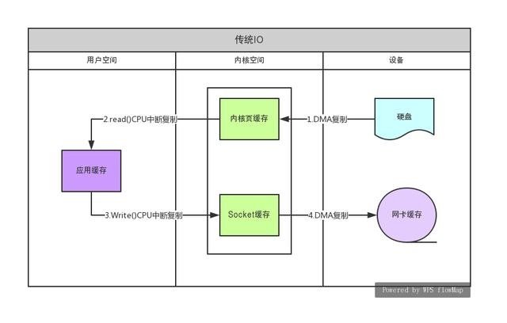
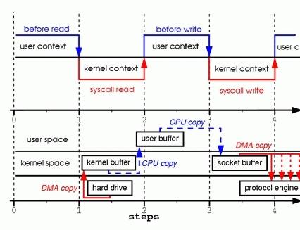
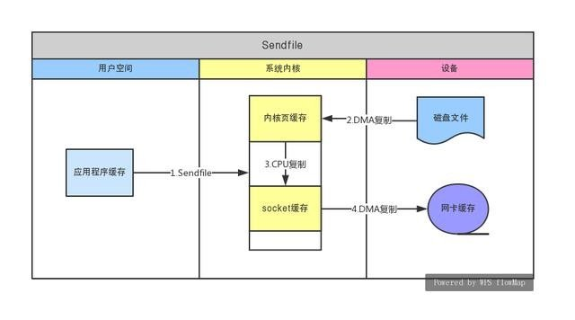
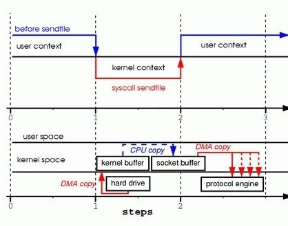
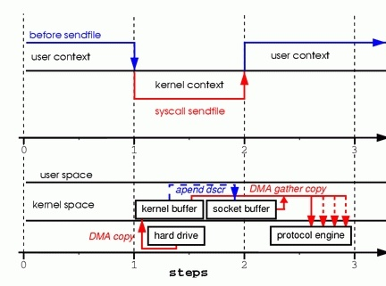
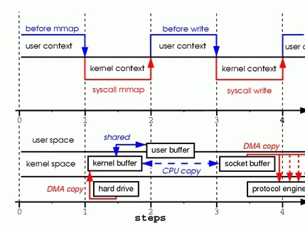

# 零拷贝

### 什么是零拷贝

维基上是这么描述零拷贝的：零拷贝描述的是CPU不执行拷贝数据从一个存储区域到另一个存储区域的任务，这通常用于通过网络传输一个文件时以减少CPU周期和内存带宽。 

##### 零拷贝给我们带来的好处：

- 减少甚至完全避免不必要的CPU拷贝，从而让CPU解脱出来去执行其他的任务
- 减少内存带宽的占用
- 通常零拷贝技术还能够减少用户空间和操作系统内核空间之间的上下文切换 

> 注意，对于各种零拷贝机制是否能够实现都是依赖于操作系统底层是否提供相应的支持。 

## 内核空间和用户空间

内核空间是Linux自身使用的内存空间，主要提供给程序调度、内存分配、连接硬件资源等程序逻辑使用；用户空间则是提供给各个进程的主要空间。用户空间不具有访问内核空间资源的权限，因此如果应用程序需要使用到内核空间的资源，则需要通过系统调用来完成：从用户空间切换到内核空间，然后在完成相关操作后再从内核空间切换回用户空间。

## Linux 中零拷贝技术的实现方向

① 直接 I/O：对于这种数据传输方式来说，应用程序可以直接访问硬件存储，操作系统内核只是辅助数据传输。这种方式依旧存在用户空间和内核空间的上下文切换，但是硬件上的数据不会拷贝一份到内核空间，而是直接拷贝至了用户空间，因此直接I/O不存在内核空间缓冲区和用户空间缓冲区之间的数据拷贝。

② 在数据传输过程中，避免数据在用户空间缓冲区和系统内核空间缓冲区之间的CPU拷贝，以及数据在系统内核空间内的CPU拷贝。本文主要讨论的就是该方式下的零拷贝机制。

③ copy-on-write(写时复制技术)：在某些情况下，Linux操作系统的内核空间缓冲区可能被多个应用程序所共享，操作系统有可能会将用户空间缓冲区地址映射到内核空间缓存区中。当应用程序需要对共享的数据进行修改的时候，才需要真正地拷贝数据到应用程序的用户空间缓冲区中，并且对自己用户空间的缓冲区的数据进行修改不会影响到其他共享数据的应用程序。所以，如果应用程序不需要对数据进行任何修改的话，就不会存在数据从系统内核空间缓冲区拷贝到用户空间缓冲区的操作。

> 下面讨论得零拷贝机制，都是上面说得第2点，减少用户空间和系统空间之间得拷贝，以及减少cpu在拷贝中使用。

## 传统的拷贝

 传统的拷贝，需要进过一下步骤

1. 设备 -> 内核空间 （DMA复制）
2. 内核空间 -> 用户空间 （cpu复制）
3. 用户空间 -> 内核空间(cpu复制)
4. 内核空间 -> 设备/网卡缓存 （DMA复制）

需要在用户态和内核态之间多次转化，数据需要做多次拷贝，效率比较低

① 发出read系统调用：导致用户空间到内核空间的上下文切换(第一次上下文切换)。通过DMA引擎将文件中的数据从磁盘上读取到内核空间缓冲区(第一次拷贝: hard drive ——> kernel buffer)。 

② 将内核空间缓冲区的数据拷贝到用户空间缓冲区(第二次拷贝: kernel buffer ——> user buffer)，然后read系统调用返回。而系统调用的返回又会导致一次内核空间到用户空间的上下文切换(第二次上下文切换)。 

③ 发出write系统调用：导致用户空间到内核空间的上下文切换(第三次上下文切换)。将用户空间缓冲区中的数据拷贝到内核空间中与socket相关联的缓冲区中(即，第②步中从内核空间缓冲区拷贝而来的数据原封不动的再次拷贝到内核空间的socket缓冲区中。)(第三次拷贝: user buffer ——> socket buffer)。 

④ write系统调用返回，导致内核空间到用户空间的再次上下文切换(第四次上下文切换)。通过DMA引擎将内核缓冲区中的数据传递到协议引擎(第四次拷贝: socket buffer ——> protocol engine)，这次拷贝是一个独立且异步的过程。

Q：你可能会问独立和异步这是什么意思？难道是调用会在数据被传输前返回？

 A：事实上调用的返回并不保证数据被传输；它甚至不保证传输的开始。它只是意味着将我们要发送的数据放入到了一个待发送的队列中，在我们之前可能有许多数据包在排队。除非驱动器或硬件实现优先级环或队列，否则数据是以先进先出的方式传输的。

**总的来说，传统的I/O操作进行了4次用户空间与内核空间的上下文切换，以及4次数据拷贝。其中4次数据拷贝中包括了2次DMA拷贝和2次CPU拷贝。**

Q: 传统I/O模式为什么将数据从磁盘读取到内核空间缓冲区，然后再将数据从内核空间缓冲区拷贝到用户空间缓冲区了？为什么不直接将数据从磁盘读取到用户空间缓冲区就好？

 A: 传统I/O模式之所以将数据从磁盘读取到内核空间缓冲区而不是直接读取到用户空间缓冲区，是为了减少磁盘I/O操作以此来提高性能。因为OS会根据局部性原理在一次read()系统调用的时候预读取更多的文件数据到内核空间缓冲区中，这样当下一次read()系统调用的时候发现要读取的数据已经存在于内核空间缓冲区中的时候只要直接拷贝数据到用户空间缓冲区中即可，无需再进行一次低效的磁盘I/O操作(注意：磁盘I/O操作的速度比直接访问内存慢了好几个数量级)。

 Q: 既然系统内核缓冲区能够减少磁盘I/O操作，那么我们经常使用的BufferedInputStream缓冲区又是用来干啥的？

 A: BufferedInputStream的作用是会根据情况自动为我们预取更多的数据到它自己维护的一个内部字节数据缓冲区中，这样做能够减少系统调用的次数以此来提供性能。

**总的来说内核空间缓冲区的一大用处是为了减少磁盘I/O操作，因为它会从磁盘中预读更多的数据到缓冲区中。而BufferedInputStream的用处是减少“系统调用”。**

## DMA sendfile实现01

① 发出sendfile系统调用，导致用户空间到内核空间的上下文切换(第一次上下文切换)。通过DMA引擎将磁盘文件中的内容拷贝到内核空间缓冲区中(第一次拷贝: hard drive ——> kernel buffer)。然后再将数据从内核空间缓冲区拷贝到内核中与socket相关的缓冲区中(第二次拷贝: kernel buffer ——> socket buffer)。 

② sendfile系统调用返回，导致内核空间到用户空间的上下文切换(第二次上下文切换)。通过DMA引擎将内核空间socket缓冲区中的数据传递到协议引擎(第三次拷贝: socket buffer ——> protocol engine)

**总的来说，通过sendfile实现的零拷贝I/O只使用了2次用户空间与内核空间的上下文切换，以及3次数据的拷贝。其中3次数据拷贝中包括了2次DMA拷贝和1次CPU拷贝。**

Q：但通过是这里还是存在着一次CPU拷贝操作，即，kernel buffer ——> socket buffer。是否有办法将该拷贝操作也取消掉了？ 

A：有的。但这需要底层操作系统的支持。从Linux 2.4版本开始，操作系统底层提供了scatter/gather这种DMA的方式来从内核空间缓冲区中将数据直接读取到协议引擎中，而无需将内核空间缓冲区中的数据再拷贝一份到内核空间socket相关联的缓冲区中。 

## DMA sendfile实现02 （带有scatter/gather的DMA）

> 对上面得sendfile再减少一次cpu得拷贝
>
> 最理想得 零拷贝 
>
> 1. 最少用户空间和内核空间得切换
> 2. 不需要cpu参与拷贝操作

从Linux 2.4版本开始，操作系统底层提供了带有scatter/gather的DMA来从内核空间缓冲区中将数据读取到协议引擎中。这样一来待传输的数据可以分散在存储的不同位置上，而不需要在连续存储中存放。那么从文件中读出的数据就根本不需要被拷贝到socket缓冲区中去，只是需要将缓冲区描述符添加到socket缓冲区中去，DMA收集操作会根据缓冲区描述符中的信息将内核空间中的数据直接拷贝到协议引擎中。

① 发出sendfile系统调用，导致用户空间到内核空间的上下文切换(第一次上下文切换)。通过DMA引擎将磁盘文件中的内容拷贝到内核空间缓冲区中(第一次拷贝: hard drive ——> kernel buffer)。

 ② 没有数据拷贝到socket缓冲区。取而代之的是只有相应的描述符信息会被拷贝到相应的socket缓冲区当中。该描述符包含了两方面的信息：

​	1. kernel buffer的内存地址；

​	2。 kernel buffer的偏移量。 

③ sendfile系统调用返回，导致内核空间到用户空间的上下文切换(第二次上下文切换)。

DMA gather copy根据socket缓冲区中描述符提供的位置和偏移量信息直接将内核空间缓冲区中的数据拷贝到协议引擎上(第二次拷贝: kernel buffer ——> protocol engine)，这样就避免了最后一次CPU数据拷贝。

**总的来说，带有DMA收集拷贝功能的sendfile实现的I/O只使用了2次用户空间与内核空间的上下文切换，以及2次数据的拷贝，而且这2次的数据拷贝都是非CPU拷贝。这样一来我们就实现了最理想的零拷贝I/O传输了，不需要任何一次的CPU拷贝，以及最少的上下文切换。**

## "传统I/O” VS “sendfile零拷贝I/O”

- 传统I/O通过两条系统指令read、write来完成数据的读取和传输操作，以至于产生了4次用户空间与内核空间的上下文切换的开销；而sendfile只使用了一条指令就完成了数据的读写操作，所以只产生了2次用户空间与内核空间的上下文切换。
- 传统I/O产生了2次无用的CPU拷贝，即内核空间缓存中数据与用户空间缓冲区间数据的拷贝；而sendfile最多只产出了一次CPU拷贝，即内核空间内之间的数据拷贝，甚至在底层操作体系支持的情况下，sendfile可以实现零CPU拷贝的I/O。
- 因传统I/O用户空间缓冲区中存有数据，因此应用程序能够对此数据进行修改等操作；而sendfile零拷贝消除了所有内核空间缓冲区与用户空间缓冲区之间的数据拷贝过程，因此sendfile零拷贝I/O的实现是完成在内核空间中完成的，这对于应用程序来说就无法对数据进行操作了。

## mmap 实现零拷贝（用户空间和内核空间共享，省去拷贝）

> 1. 将内核空间的地址映射给用户空间
> 2. mmap(内存映射)是一个比sendfile昂贵但优于传统I/O的方法。
> 3. 上面的两种零拷贝方式因为不进入用户空间，所以我们都不能操作里面的数据

① 发出mmap系统调用，导致用户空间到内核空间的上下文切换(第一次上下文切换)。通过DMA引擎将磁盘文件中的内容拷贝到内核空间缓冲区中(第一次拷贝: hard drive ——> kernel buffer)。 

② mmap系统调用返回，导致内核空间到用户空间的上下文切换(第二次上下文切换)。接着用户空间和内核空间共享这个缓冲区，而不需要将数据从内核空间拷贝到用户空间。因为用户空间和内核空间共享了这个缓冲区数据，所以用户空间就可以像在操作自己缓冲区中数据一般操作这个由内核空间共享的缓冲区数据。

 ③ 发出write系统调用，导致用户空间到内核空间的上下文切换(第三次上下文切换)。将数据从内核空间缓冲区拷贝到内核空间socket相关联的缓冲区(第二次拷贝: kernel buffer ——> socket buffer)。

 ④ write系统调用返回，导致内核空间到用户空间的上下文切换(第四次上下文切换)。通过DMA引擎将内核空间socket缓冲区中的数据传递到协议引擎(第三次拷贝: socket buffer ——> protocol engine)

**总的来说，通过mmap实现的零拷贝I/O进行了4次用户空间与内核空间的上下文切换，以及3次数据拷贝。其中3次数据拷贝中包括了2次DMA拷贝和1次CPU拷贝。**

### FileChannel与零拷贝（java nio\）

FileChannel中大量使用了我们上面所提及的零拷贝技术。 FileChannel的map方法会返回一个MappedByteBuffer。MappedByteBuffer是一个直接字节缓冲器，该缓冲器的内存是一个文件的内存映射区域。map方法底层是通过mmap实现的，因此将文件内存从磁盘读取到内核缓冲区后，用户空间和内核空间共享该缓冲区。 MappedByteBuffer内存映射文件是一种允许Java程序直接从内存访问的一种特殊的文件。我们可以将整个文件或者整个文件的一部分映射到内存当中，那么接下来是由操作系统来进行相关的页面请求并将内存的修改写入到文件当中。我们的应用程序只需要处理内存的数据，这样可以实现非常迅速的I/O操作。

**FileChannel的transferTo、transferFrom** 如果操作系统底层支持的话transferTo、transferFrom也会使用相关的零拷贝技术来实现数据的传输。所以，这里是否使用零拷贝必须依赖于底层的系统实现。

transferTo:优先级如下。

	1. 如果支持 sendfile,直接使用sendfile
 	2. 不支持sendFile,尝试使用MappedByteBuffer，使用mmap
 	3. 先将文件数据读到一个临时的DirectBuffer中，然后再将数据从这个临时的DirectBuffer写入到目标target中；

## netty的零拷贝

> Netty 中的 `Zero-copy` 与上面我们所提到到 OS 层面上的 `Zero-copy` 不太一样, Netty的 `Zero-coyp` 完全是在用户态(Java 层面)的, 它的 `Zero-copy` 的更多的是偏向于 `优化数据操作` 这样的概念.

Netty 的 `Zero-copy` 体现在如下几个个方面:

- Netty 提供了 `CompositeByteBuf` 类, 它可以将多个 ByteBuf 合并为一个逻辑上的 ByteBuf, 避免了各个 ByteBuf 之间的拷贝.
- 通过 wrap 操作, 我们可以将 byte[] 数组、ByteBuf、ByteBuffer等包装成一个 Netty ByteBuf 对象, 进而避免了拷贝操作.
- ByteBuf 支持 slice 操作, 因此可以将 ByteBuf 分解为多个共享同一个存储区域的 ByteBuf, 避免了内存的拷贝.
- 通过 `FileRegion` 包装的`FileChannel.tranferTo` 实现文件传输, 可以直接将文件缓冲区的数据发送到目标 `Channel`, 避免了传统通过循环 write 方式导致的内存拷贝问题.

## 参考文档

* https://cloud.tencent.com/developer/article/1152609
* http://www.360doc.com/content/19/0528/13/99071_838741319.shtml
* [netty的零拷贝](https://segmentfault.com/a/1190000007560884)
* 