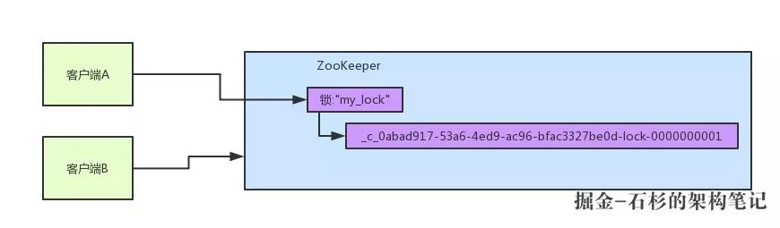
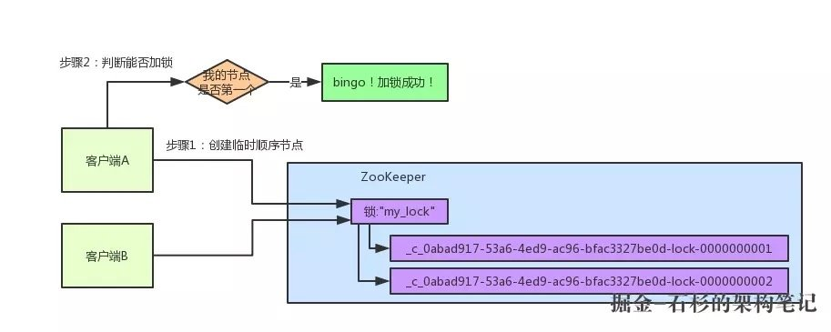
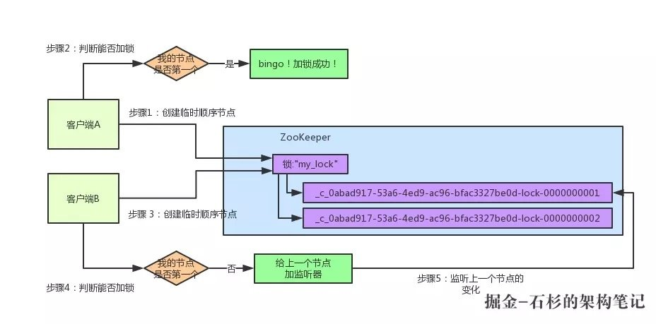
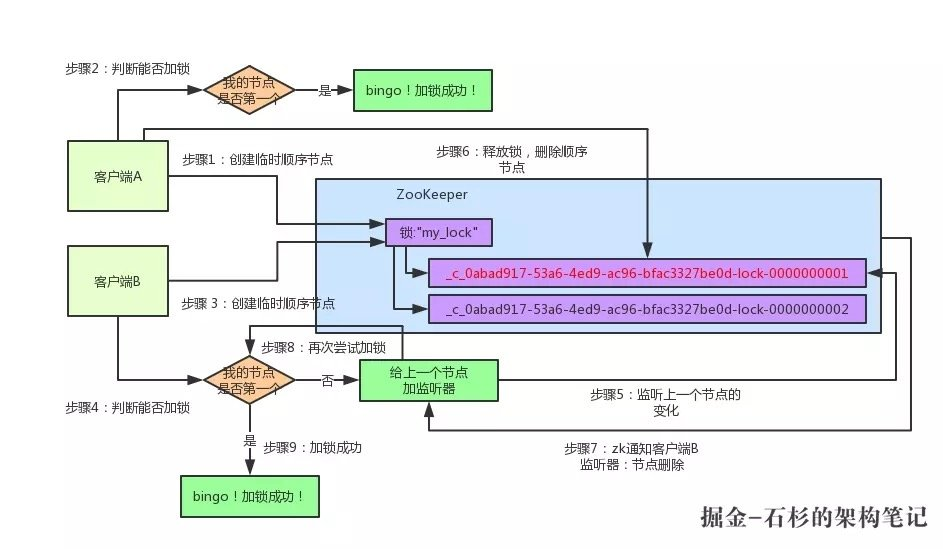

# 分布式锁

因为现在绝大部分的系统都是分布式的，使用java自带的lock或者sync来保证逻辑不被同时调用是没办法办到了。

所以需要分布式锁

## redis

[介绍文档](https://zhuanlan.zhihu.com/p/73807097)

```java
public class RedisWithReentrantLock {
  private ThreadLocal<Map<String, Integer>> lockers = new ThreadLocal<>();
  private Jedis jedis;
  public RedisWithReentrantLock(Jedis jedis) {
    this.jedis = jedis;
  }
  //调用redis上锁
  private boolean _lock(String key) {
    return jedis.set(key, "", "nx", "ex", 5L) != null;
  }
  //调用redis解锁
  private void _unlock(String key) {
    jedis.del(key);
  }

 
  private Map<String, Integer> currentLockers() {
    Map<String, Integer> refs = lockers.get();
    if (refs != null) {
      return refs;
    }
    lockers.set(new HashMap<>());
    return lockers.get();
  }

  //加锁
  public boolean lock(String key) {
    //从treahdlocal中获取锁数据，如果threadLocal中有数据，说明已经持有数据，只要累加数据就行，实现重入逻辑
    Map<String, Integer> refs = currentLockers();
    Integer refCnt = refs.get(key);
    if (refCnt != null) {
      refs.put(key, refCnt + 1);
      return true;
    }
    //调用redis接口去争取锁
    boolean ok = this._lock(key);
    if (!ok) {
      return false;
    }
    
    //枷锁成功，往ThreadLocal中放入重入数量
    refs.put(key, 1);
    return true;
  }

  //解锁
  public boolean unlock(String key) {
    Map<String, Integer> refs = currentLockers();
    Integer refCnt = refs.get(key);
    if (refCnt == null) {
      return false;
    }
    refCnt -= 1;
    //如果减完数量还是大于0，说明重入数量还没减完，减数量就行了
    if (refCnt > 0) {
      refs.put(key, refCnt);
    } else {
      //如果减完了，调用redis接口释放锁
      refs.remove(key);
      this._unlock(key);
    }
    return true;
  }

  public static void main(String[] args) {
    Jedis jedis = new Jedis();
    RedisWithReentrantLock redis = new RedisWithReentrantLock(jedis);
    System.out.println(redis.lock("codehole"));
    System.out.println(redis.lock("codehole"));
    System.out.println(redis.unlock("codehole"));
    System.out.println(redis.unlock("codehole"));
  }

}
```


### redis分布式锁存在的问题
1. 单机模式的话，存在单点问题
2. 哨兵或者集群模式下，主从同步的过程中，主节点挂了，会导致锁丢失。
3. 锁到期了，但是当前操作还没完成，会有另外一个线程获取到分布式锁。

### 解决方法
RedLock 和 Redisson
#### RedLock(Redis作者提出的方法)

- 获取当前时间戳，单位是毫秒。
- 轮流尝试在每个 Master 节点上创建锁，过期时间设置较短，一般就几十毫秒。
- 尝试在大多数节点上建立一个锁，比如 5 个节点就要求是 3 个节点（n / 2 +1）。
- 客户端计算建立好锁的时间，如果建立锁的时间小于超时时间，就算建立成功了。
- 要是锁建立失败了，那么就依次删除这个锁。
- 只要别人建立了一把分布式锁，你就得不断轮询去尝试获取锁。

####Redisson(企业级开源框架)

- Redisson 所有指令都通过`Lua 脚本执行`，Redis 支持 Lua 脚本原子性执行。
- Redisson 设置一个 Key 的默认过期时间为 30s，如果某个客户端持有一个锁超过了 30s 怎么办？
- Redisson 中有一个 Watchdog 的概念，翻译过来就是看门狗，它会在你获取锁之后，每隔 10s 帮你把 Key 的超时时间设为 30s。

#### 


## zk

[介绍1](https://juejin.im/post/5c01532ef265da61362232ed)

[介绍2]([http://www.dengshenyu.com/java/%E5%88%86%E5%B8%83%E5%BC%8F%E7%B3%BB%E7%BB%9F/2017/10/23/zookeeper-distributed-lock.html](http://www.dengshenyu.com/java/分布式系统/2017/10/23/zookeeper-distributed-lock.html))

开源项目：Curator

### 加锁逻辑

比如锁要加key为"my_lock"的锁。

1. 尝试枷锁，Curator为会当前操作创建一个`临时顺序节点`,Zk内部会给起个名字叫做：xxx-000001

   

2. 获取所有的临时顺序节点，判断自己是不是最小序号的

   

3. 如果是最小序号的，那就获取锁成功，如果不是，对上一个节点增加监听器。
	

4. 当上一个节点释放锁的时候，监听他的节点会得到通知，尝试获取锁
	

### 可能存在的问题和解决方法
1. 首先需要确认的是临时节点，因为永久节点的话，持有锁的线程挂了，后面的等待者不可能在获取到锁
2. 如果在第3步，发现自己不是最小的情况下，去添加监听器的时候，前一个节点释放了，会不会出现死锁。
	1. zk的设置监视器操作，如果要设置的节点没了，会报错，可以通过自选重新进入第二步判断

3. 羊群效应(线程持有者释放锁的时候，如果是去唤醒所有等待这的线程，效率特别低，这就叫羊群效应)
	1. 每个节点只监听上一个节点，这样每次释放都只要通知一个节点就行

4. `网络抖动，导致临时节点被删除怎么办`
	1. 依靠zk的重试机制，zk集群发现客户端心跳包丢失，会进行重试，多次重试失败之后才会删除临时节点。

## 怎么取舍

> 1. redis性能好，ZK因为每次在创建锁和释放锁的过程中，都要动态创建、销毁瞬时节点来实现锁功能。ZK中创建和删除节点只能通过Leader服务器来执行，然后将数据同不到所有的Follower机器上。
> 2. ZK可靠性比redis高

上面几种方式，哪种方式都无法做到完美。就像CAP一样，在复杂性、可靠性、性能等方面无法同时满足，所以，根据不同的应用场景选择最适合自己的才是王道。

**1.从理解的难易程度角度（从低到高）**

数据库 > 缓存 > Zookeeper

**2.从实现的复杂性角度（从低到高）**

Zookeeper >= 缓存 > 数据库

**3.从性能角度（从高到低）**

缓存 > Zookeeper >= 数据库

**4.从可靠性角度（从高到低）**

Zookeeper > 缓存 > 数据库