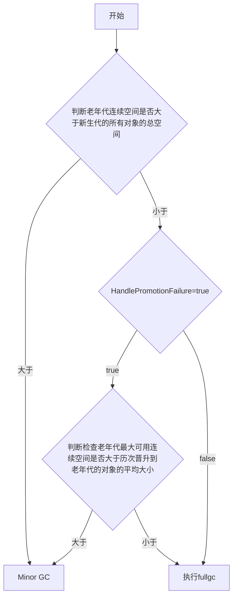
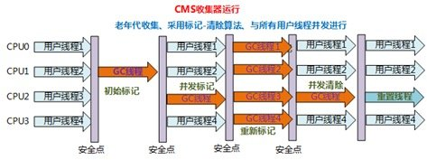

# jvm堆

##  jvm堆的分布

eden + s0 + s1 = 新生代

tentired = 老年代

eden : s0 :  s1  通常等于 8:1:1

对象优先在eden上分配，

- **新生代 GC（Minor GC）**:指发生新生代的的垃圾收集动作，Minor GC 非常频繁，回收速度一般也比较快。
- **老年代 GC（Major GC/Full GC）**:指发生在老年代的 GC，出现了 Major GC 经常会伴随至少一次的 Minor GC（并非绝对），Major GC 的速度一般会比 Minor GC 的慢 10 倍以上。

## 哪些对象会进入老年代

###  大对象直接进入老年代

大对象就是需要大量连续内存空间的对象（比如：字符串、数组）。

**为什么要这样呢？**

为了避免为大对象分配内存时由于分配担保机制带来的复制而降低效率。

### 长期存活的对象将进入老年代

既然虚拟机采用了分代收集的思想来管理内存，那么内存回收时就必须能识别哪些对象应放在新生代，哪些对象应放在老年代中。为了做到这一点，虚拟机给每个对象一个对象年龄（Age）计数器。

如果对象在 Eden 出生并经过第一次 Minor GC 后仍然能够存活，并且能被 Survivor 容纳的话，将被移动到 Survivor 空间中，并将对象年龄设为 1.对象在 Survivor 中每熬过一次 MinorGC,年龄就增加 1 岁，当它的年龄增加到一定程度（默认为 15 岁），就会被晋升到老年代中。对象晋升到老年代的年龄阈值，可以通过参数 `-XX:MaxTenuringThreshold` 来设置。

### 动态对象年龄判定

为了更好的适应不同程序的内存情况，虚拟机不是永远要求对象年龄必须达到了某个值才能进入老年代，如果 Survivor 空间中相同年龄所有对象大小的总和大于 Survivor 空间的一半，年龄大于或等于该年龄的对象就可以直接进入老年代，无需达到要求的年龄。

### 分配担保机制进入老年代

## 分配担保机制

在发生Minor GC之前，虚拟机会检查**老年代最大可用的连续空间**是否大于**新生代所有对象的总空间**，

- 如果大于，则此次**Minor GC是安全的**
- 如果小于，则虚拟机会查看**HandlePromotionFailure**设置值是否允许担保失败。
   如果HandlePromotionFailure=true，那么会继续检查老年代最大可用连续空间是否大于**历次晋升到老年代的对象的平均大小**，如果大于，则尝试进行一次Minor GC，但这次Minor GC依然是有风险的；如果小于或者HandlePromotionFailure=false，则改为进行一次Full GC。

上面提到了Minor GC依然会有风险，是因为新生代采用**复制收集算法**，假如大量对象在Minor GC后仍然存活（最极端情况为内存回收后新生代中所有对象均存活），而Survivor空间是比较小的，这时就需要老年代进行分配担保，把Survivor无法容纳的对象放到老年代。**老年代要进行空间分配担保，前提是老年代得有足够空间来容纳这些对象**，但一共有多少对象在内存回收后存活下来是不可预知的，**因此只好取之前每次垃圾回收后晋升到老年代的对象大小的平均值作为参考**。使用这个平均值与老年代剩余空间进行比较，来决定是否进行Full GC来让老年代腾出更多空间。

取平均值仍然是一种**概率性的事件**，如果某次Minor GC后存活对象陡增，远高于平均值的话，必然导致担保失败，如果出现了分配担保失败，**就只能在失败后重新发起一次Full GC**。虽然存在发生这种情况的概率，但**大部分时候都是能够成功分配担保**的，这样就避免了过于频繁执行Full GC。

## 如何判断一个对象需要被回收
1. 引用计数法:效率高，但是存在对象间的循环引用的问题
2. 可达性分析算法(GC root):这个算法的基本思想就是通过一系列的称为 “GC Roots” 的对象作为起点，从这些节点开始向下搜索，节点所走过的路径称为引用链，当一个对象到 GC Roots 没有任何引用链相连的话，则证明此对象是不可用的。**也就是查看堆内的对象是不是有堆外的引用**

### Minor GC的时候，老年代对新生代的引用，怎么解决
如果新生代被老年代引用，那么怎么保证gc的时候不会误杀他呢。但是又不可能扫描整个堆，那样效率太低了。

1. 使用卡表技术**Card Table**，将堆按照512字节分为一个一个的卡，有一个card table来维护这些卡的标记，如果有老年代指向新生代，那么card tabel里面该卡的标记为脏。
2. minor gc的时候，扫描card table，将里面被标记为脏的卡中的对象放入cg roots中，进行gc
3. 扫描完成后，标志位清零
4. minor gc进行对象复制的过程中，重新标记card table中的标志位

### 认为需要回收的对象怎么被回收 （两次标记过程）
1. 首先对象被认定是需要回收的情况
2. 第一次标记：
   1. 没有重写finalize()方法，或者该方法已经被执行过了， 直接回收
   2. 重写了finalize()方法的，加入F-Queue队列中 ，进行第二次标记
3. 第二次标记：
   1. 对象重写了finalize()方法，并且在该方法里面自救了(将自身赋予某个引用),这个对象不会被回收
   2. 自救失败了的进行回收。

## 引用类型
### 强引用（StrongReference）存在强引用不回收
平常使用的引用都是强引用，如果对象具有强引用，垃圾回收器不会回收他
### 软引用（SoftReference）内存溢出前二次回收软引用
对于软引用关联着的对象，在系统将要发生内存溢出异常之前，将会把这些对象列进回收范围进行第二次回收。如果这次回收还没有足够的内存，才会抛出内存溢出异常。
### 弱引用（WeakReference） 只要垃圾回收就会被回收掉
在垃圾回收时，如果这个对象只被弱引用关联（没有任何强引用关联他），那么这个对象就会被回收。
### 虚引用（PhantomReference）

## 垃圾回收算法

### 标记清除算法
1. 标记需要回收的对象
2. 将对象进行回收

#### 存在的问题
1. 空间问题：清除完后，会留下很多不连续的空间碎片
2. 效率问题

### 复制算法
1. 维护两块内存空间
2. 一块使用完的时候，把存活下来的对象复制到另一块上去
3. 将原来那块清空

#### 存在的问题
1. 空间问题：空间使用率很低，至少要保持一块空闲区域

### 标记整理算法
1. 对需要回收的对象进行标记
2. 将存活下来的对象向前移动
3. 清除掉边界外的对象

### 分代收集算法
按照新生代和老年代不同的情况，分别使用不同的收集算法。

> 比如在新生代中，每次收集都会有大量对象死去，所以可以选择复制算法，只需要付出少量对象的复制成本就可以完成每次垃圾收集。而老年代的对象存活几率是比较高的，而且没有额外的空间对它进行分配担保，所以我们必须选择“标记-清除”或“标记-整理”算法进行垃圾收集。

## 垃圾收集器

[学习链接](https://www.cnblogs.com/cxxjohnson/p/8625713.html)

- **并行（Parallel）** ：指多条垃圾收集线程并行工作，但此时用户线程仍然处于等待状态。
- **并发（Concurrent）**：指用户线程与垃圾收集线程同时执行（但不一定是并行，可能会交替执行），用户程序在继续运行，而垃圾收集器运行在另一个 CPU 上。

* 新生代收集器：Serial、ParNew、Parallel Scavenge；
* 老年代收集器：Serial Old、Parallel Old、CMS；
* 整堆收集器：G1；

###  Serial 收集器(新生代)

* 最早的垃圾收集器,单线程处理模式

* 采用复制算法；

* 进行垃圾收集时，必须暂停所有工作线程，直到完成；即会"Stop The World"；

* "-XX:+UseSerialGC"：添加该参数来显式的使用串行垃圾收集器；

     

### ParNew 收集器(新生代)

* Serial的并行版本

* 但在单个CPU环境中，不会比Serail收集器有更好的效果，因为存在线程交互开销。

  > "-XX:+UseConcMarkSweepGC"：指定使用CMS后，会默认使用ParNew作为新生代收集器；
  > "-XX:+UseParNewGC"：强制指定使用ParNew；  
  > "-XX:ParallelGCThreads"：指定垃圾收集的线程数量，ParNew默认开启的收集线程与CPU的数量相同；

### Parallel Scavenge 收集器(新生代)--注重吞吐量

**Parallel Scavenge 收集器关注点是吞吐量（高效率的利用 CPU）。CMS 等垃圾收集器的关注点更多的是用户线程的停顿时间（提高用户体验）。所谓吞吐量就是 CPU 中用于运行用户代码的时间与 CPU 总消耗时间的比值。**

>  CMS等收集器的关注点是尽可能地缩短垃圾收集时用户线程的停顿时间；
>
>  而Parallel Scavenge收集器的目标则是达一个可控制的吞吐量（Throughput）；
>
> 高吞吐量为目标，即减少垃圾收集时间，让用户代码获得更长的运行时间；
>
>  当应用程序运行在具有多个CPU上，对暂停时间没有特别高的要求时，即程序主要在后台进行计算，而不需要与用户进行太多交互；

### Serial Old 收集器(老年代)

* 针对老年代
* 采用"标记-整理"算法（还有压缩，Mark-Sweep-Compact）；
* 单线程

### Parallel Old 收集器(老年代)

* 针对老年代
* 采用"标记-整理"算法；
* 多线程

### CMS 收集器(老年代)

* 针对老年代
* 基于"标记-清除"算法(不进行压缩操作，产生内存碎片)；
* 以获取最短回收停顿时间为目标；
* 首款真正意义上的并行的垃圾回收器

>  "-XX:+UseConcMarkSweepGC"：指定使用CMS收集器；

#### 缺点：

* 对cpu资源敏感
* 出现浮动垃圾(并行清除的时候用户线程会产生新的垃圾)
* 产生大量内存碎片(因为CMS使用的是“标记-清除”，不进行压缩)

###  G1 收集器(全代)

* 针对整个gc堆进行管理

* 并行缩短停顿时间

* 结合多种回收算法，空间整理

  >  "-XX:+UseG1GC"：指定使用G1收集器；

## cg root有哪些

在Java语言里，可作为GC Roots对象的包括如下几种： 

1. 虚拟机栈(栈桢中的本地变量表)中的引用的对象 
2. 方法区中的类静态属性引用的对象 
3. 方法区中的常量引用的对象 
4. 本地方法栈中JNI的引用的对象
5. yong gc的时候，老年代脏表指向区域的对象