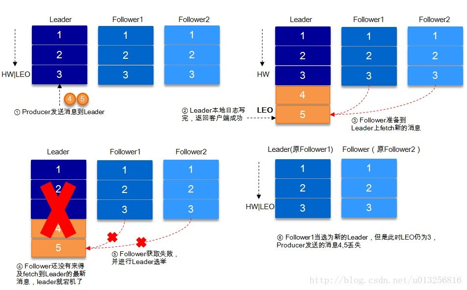
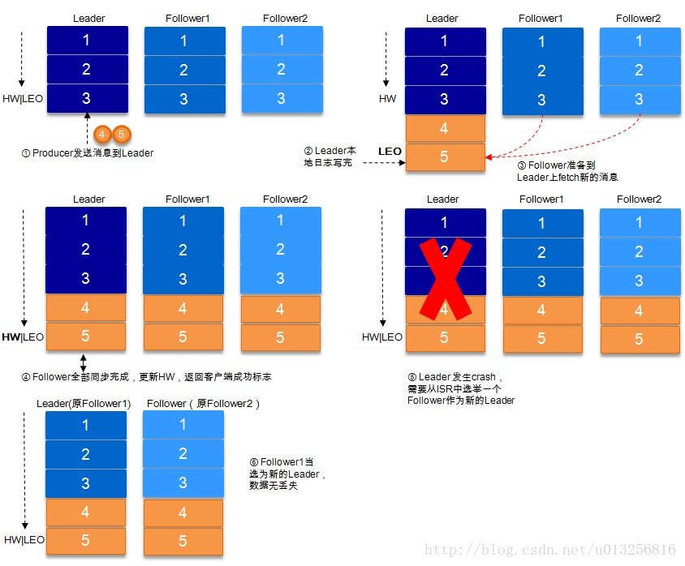
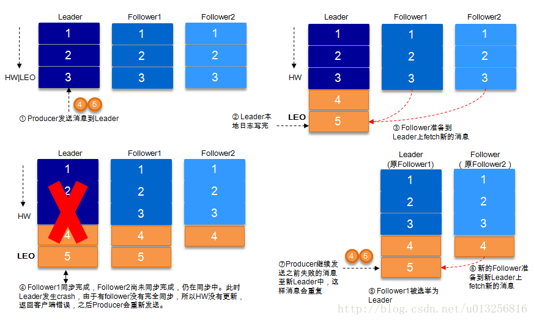
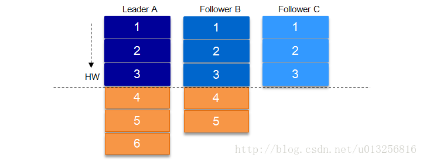

# kafka的数据可靠性

### 发送者和kafka的数据可靠性
#### 少数服从多数(zab/raft)

> 目的是绕开最慢副本的消息确认，降低消息提交的延时

zab、Raft等协议都是采用的少数服从多数的原则，每次消息传播只要n/2+1个节点应答，就认为是传播成功。

但是这种情况下为了保证leader正常运行，所能容忍的失败节点的数量就比较少。

比如，

如果要允许1个follower节点失败，那需要有 1 * 2 +1个副本。

如果要允许2follower节点失败的，那需要有5个副本来保证。

所以，

这种模式为了保证较高的容错率，必须拥有大量的副本来保证

但是，

副本数量多的结果就是在大数据量的情况下，因为数据同步而导致的性能拒绝下降。

#### kafka的做法

> 当ack模式设置为all的情况下，需要ISR中的所有副本应答，本次消息的发送才会认为成功。

* AR = ISR + OSR
* AR:分区中的所有副本统称为 `AR` (Assigned Replicas)
* ISR:所有与leader副本保持一定程度同步的副本（包括leader副本在内）组成 `ISR` (In Sync Replicas)。
* OSR:当follower副本落后太多或失效时，leader副本会把它从 ISR 集合中剔除

### kafka的发送应答

- 1（默认）：这意味着producer在ISR中的leader已成功收到的数据并得到确认后发送下一条message。如果leader宕机了，则会丢失数据。
- 0：这意味着producer无需等待来自broker的确认而继续发送下一批消息。这种情况下数据传输效率最高，但是数据可靠性确是最低的。
- -1：producer需要等待ISR中的所有follower都确认接收到数据后才算一次发送完成，可靠性最高。但是这样也不能保证数据不丢失，比如当ISR中只有leader时（前面ISR那一节讲到，ISR中的成员由于某些情况会增加也会减少，最少就只剩一个leader），这样就变成了acks=1的情况。-----但是可以通过min.insync.replicas>0参数来防止，ISR中最少的副本数量，如果只剩leader副本的话，不允许写入。

接下来对acks=1和-1的两种情况进行详细分析：

**1. request.required.acks=1**

producer发送数据到leader，leader写本地日志成功，返回客户端成功；此时ISR中的副本还没有来得及拉取该消息，leader就宕机了，那么此次发送的消息就会丢失。

**2. request.required.acks=-1**

同步（Kafka默认为同步，即producer.type=sync）的发送模式，replication.factor>=2且min.insync.replicas>=2的情况下，不会丢失数据。

有两种典型情况。acks=-1的情况下（如无特殊说明，以下acks都表示为参数request.required.acks），数据发送到leader, ISR的follower全部完成数据同步后，leader此时挂掉，那么会选举出新的leader，数据不会丢失。

acks=-1的情况下，数据发送到leader后 ，部分ISR的副本同步，leader此时挂掉。比如follower1h和follower2都有可能变成新的leader, producer端会得到返回异常，producer端会重新发送数据，数据可能会重复。

当然上图中如果在leader crash的时候，follower2还没有同步到任何数据，而且follower2被选举为新的leader的话，这样消息就不会重复。

### LEO和HW

从上面几张图可以看到两个标记：LEO和HW

LEO：每个副本都有，当前同步到的最新一条消息的index

HW:这个ISR中所有副本的LEO最小值。

> 消费者只能消费到HW，之后得到消息不能消费到
>
> 所以可以保证再ack=-1的情况下，未确认的消息不被消费到

上图，如果在B和C同步LeaderA数据的时候，LeaderA挂了，那么就会从B或者C之间选择新的leader.

新的Leader会发送命令让所有的follower都把数据截到HW位置，再重新同步数据，防止数据不一致

### kafka的刷盘问题

交给操作系统自身来处理

## kafka的消费者的数据可靠性

`enable.auto.commit`设置为false ,选择业务逻辑处理完成之后进行手动的提交。

## 参考资料

1. [朱小斯的kafka文章](https://blog.csdn.net/u013256816/article/details/71091774)