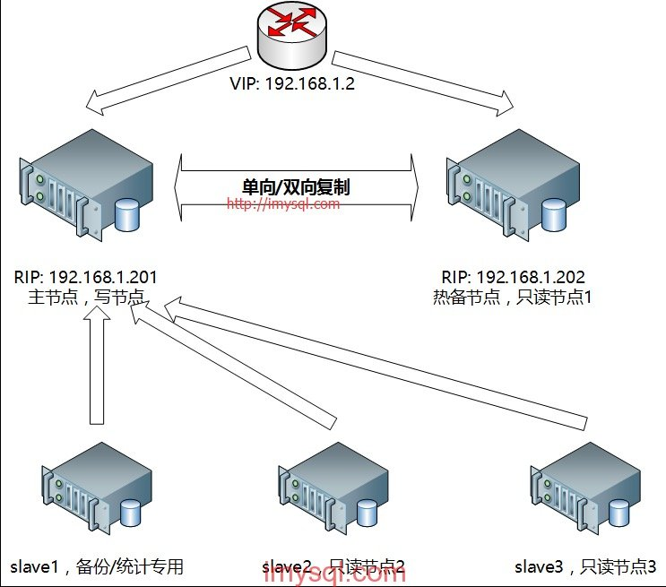

# mysql高可用

## 如何实现主动故障时的切换

一般情况使用一主一从或者一主多从的模式来架构。在master节点发生故障后，利用keepalived/heartbeat的高可用机制实现快速切换到slave节点。***虚拟ip*** ，

## 主从复制
主库将变更写入 binlog 日志，然后从库连接到主库之后，从库有一个 IO 线程，将主库的 binlog 日志拷贝到自己本地，写入一个 relay 中继日志中。接着从库中有一个 SQL 线程会从中继日志读取 binlog，然后执行 binlog 日志中的内容，也就是在自己本地再次执行一遍 SQL，这样就可以保证自己跟主库的数据是一样的。

## 主从复制中的问题和解决
1. 主从复制过程中，主节点挂掉了，导致数据没法同步
2. 主从复制的延迟问题

### 主从复制中的数据丢失
如果主从复制过程中，主节点挂掉了，导致数据没法同步这种情况怎么处理
***半同步复制***，也叫 semi-sync 复制，指的就是主库写入 binlog 日志之后，就会将强制此时立即将数据同步到从库，从库将日志写入自己本地的 relay log 之后，接着会返回一个 ack 给主库，主库接收到至少一个从库的 ack 之后才会认为写操作完成了。

### 主从复制的延迟怎么办
产生这个问题的原因，
1. 应用程序在操作主库的时候，通常时并发的
2. 主从同步是通过从库重放主库的Binlog来实现的，这个过程是串行的，如果有那些操作比较耗时，就会导致后续的同步落后于主库

那么这个问题怎么解决呢？
1. 如果是分裤的情况，可以开启多线程并行的重放Binlog,这样可以降低部分的延迟
2. 主库是写，对数据安全性较高，比如 sync_binlog=1，innodb_flush_log_at_trx_commit = 1 之类的设置，而slave则不需要这么高的数据安全，完全可以讲sync_binlog设置为0或者关闭binlog，innodb_flushlog也 可以设置为0来提高sql的执行效率
3. 提供能好的硬件给备库
4. 确认网络延迟

