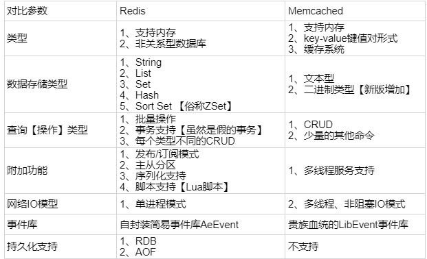

## Redis 
### 为什么要用redis
1. 高并发
	高并发情况下，如果请求全都落到数据库上去，数据库肯定就崩了。数据库能承受的并发量一般到2000就差不多了，redis能抗上万的并发量。将热点数据放入redis,能在高并发的情况下给数据库降压。
2. 高性能
	redis数据在内存，mysql数据在磁盘上，响应速度肯定是redis快很多。
	
### redis 线程模型

1. 接受连接处使用多路复用的模式，同时监听多个socket
2. 将事件放入队列中，文件事件分派器单线程讲事件关联处理器，进行处理。所以说redis是单线程的。

	

### redis和memcached比较

## Redis  知识体系

