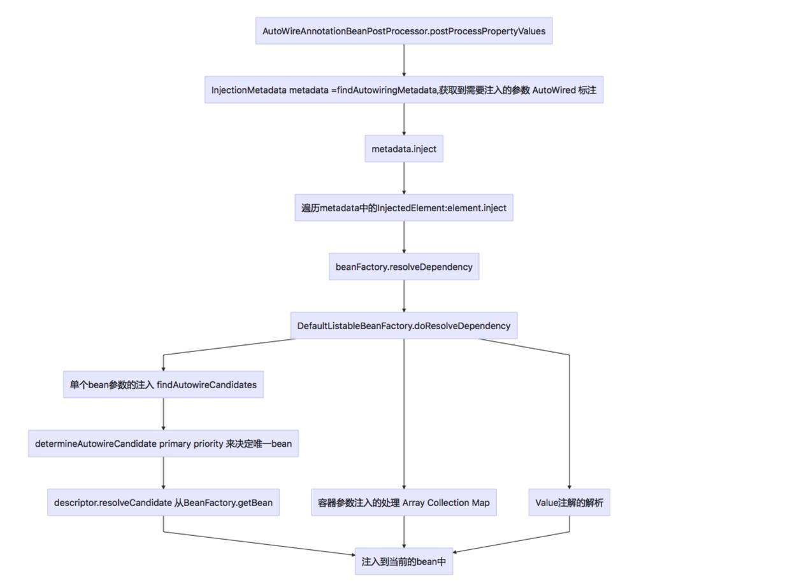

在调用AbstractAutowireCapableBeanFactory.populateBean方法，往当前bean中注册属性的时候，有如下代码：
```java
PropertyDescriptor[] filteredPds = filterPropertyDescriptorsForDependencyCheck(bw, mbd.allowCaching);
if (hasInstAwareBpps) {
	for (BeanPostProcessor bp : getBeanPostProcessors()) {
		if (bp instanceof InstantiationAwareBeanPostProcessor) {
			InstantiationAwareBeanPostProcessor ibp = (InstantiationAwareBeanPostProcessor) bp;
			pvs = ibp.postProcessPropertyValues(pvs, filteredPds, bw.getWrappedInstance(), beanName);
			if (pvs == null) {
				return;
			}
		}
	}
}
```
**==AutoWireAnnotationBeanPostProcessor==**就是其中的一个；
具体实现的功能，就是往当前的bean中注入@AutoWire标注的属性





```java
@Nullable
	public Object doResolveDependency(DependencyDescriptor descriptor, @Nullable String beanName,
			@Nullable Set<String> autowiredBeanNames, @Nullable TypeConverter typeConverter) throws BeansException {

		InjectionPoint previousInjectionPoint = ConstructorResolver.setCurrentInjectionPoint(descriptor);
		try {
			Object shortcut = descriptor.resolveShortcut(this);
			if (shortcut != null) {
				return shortcut;
			}

            //对@Value的属性，做注入
			Class<?> type = descriptor.getDependencyType();
			Object value = getAutowireCandidateResolver().getSuggestedValue(descriptor);
			if (value != null) {
				if (value instanceof String) {
					String strVal = resolveEmbeddedValue((String) value);
					BeanDefinition bd = (beanName != null && containsBean(beanName) ? getMergedBeanDefinition(beanName) : null);
					value = evaluateBeanDefinitionString(strVal, bd);
				}
				TypeConverter converter = (typeConverter != null ? typeConverter : getTypeConverter());
				return (descriptor.getField() != null ?
						converter.convertIfNecessary(value, type, descriptor.getField()) :
						converter.convertIfNecessary(value, type, descriptor.getMethodParameter()));
			}

            //对数组、容器类型的处理
			//因为是数组或容器，Sprng可以直接把符合类型的bean都注入到数组或容器中，处理逻辑是：
			//1.确定容器或数组的组件类型
			//2.调用findAutowireCandidates方法，获取与组件类型匹配的Map(beanName -> bean实例)
			//3.将符合beanNames添加到autowiredBeanNames中
			//在调用findAutowireCandidates的时候,addCandidateEntry中如果是MultiElementDescriptor || containsSingleton 调用descriptor.resolveCandidate 将bean注入返回值中
			Object multipleBeans = resolveMultipleBeans(descriptor, beanName, autowiredBeanNames, typeConverter);
			if (multipleBeans != null) {
				return multipleBeans;
			}

			Map<String, Object> matchingBeans = findAutowireCandidates(beanName, type, descriptor);
			if (matchingBeans.isEmpty()) {
				if (isRequired(descriptor)) {
					raiseNoMatchingBeanFound(type, descriptor.getResolvableType(), descriptor);
				}
				return null;
			}

			String autowiredBeanName;
			Object instanceCandidate;

            //如果发现同一个属性有多个bean,使用@primary或者@Priority决定使用哪个
			if (matchingBeans.size() > 1) {
				autowiredBeanName = determineAutowireCandidate(matchingBeans, descriptor);
				if (autowiredBeanName == null) {
					if (isRequired(descriptor) || !indicatesMultipleBeans(type)) {
						return descriptor.resolveNotUnique(type, matchingBeans);
					}
					else {
						// In case of an optional Collection/Map, silently ignore a non-unique case:
						// possibly it was meant to be an empty collection of multiple regular beans
						// (before 4.3 in particular when we didn't even look for collection beans).
						return null;
					}
				}
				instanceCandidate = matchingBeans.get(autowiredBeanName);
			}
			else {
				// We have exactly one match.
				Map.Entry<String, Object> entry = matchingBeans.entrySet().iterator().next();
				autowiredBeanName = entry.getKey();
				instanceCandidate = entry.getValue();
			}

			if (autowiredBeanNames != null) {
				autowiredBeanNames.add(autowiredBeanName);
			}
			return (instanceCandidate instanceof Class ?
					descriptor.resolveCandidate(autowiredBeanName, type, this) : instanceCandidate);
		}
		finally {
			ConstructorResolver.setCurrentInjectionPoint(previousInjectionPoint);
		}
	}
```
* resolveMultipleBeans 提供了 @Auwired 一个容器类（List之类的）支持
* determineAutowireCandidate 解决了，同一个属性找到多个对应的bean时，如何获取唯一的那个bean


```java
/**
	 * Find bean instances that match the required type.
	 * Called during autowiring for the specified bean.
	 * @param beanName the name of the bean that is about to be wired
	 * @param requiredType the actual type of bean to look for
	 * (may be an array component type or collection element type)
	 * @param descriptor the descriptor of the dependency to resolve
	 * @return a Map of candidate names and candidate instances that match
	 * the required type (never {@code null})
	 * @throws BeansException in case of errors
	 * @see #autowireByType
	 * @see #autowireConstructor
	 */
	protected Map<String, Object> findAutowireCandidates(
			@Nullable String beanName, Class<?> requiredType, DependencyDescriptor descriptor) {

		String[] candidateNames = BeanFactoryUtils.beanNamesForTypeIncludingAncestors(
				this, requiredType, true, descriptor.isEager());
		Map<String, Object> result = new LinkedHashMap<>(candidateNames.length);
		//如果已经解析过了直接装载进去
		for (Class<?> autowiringType : this.resolvableDependencies.keySet()) {
			if (autowiringType.isAssignableFrom(requiredType)) {
				Object autowiringValue = this.resolvableDependencies.get(autowiringType);
				//key值是我们需要的类型，但value值未必。
              //value可能是ObjectFactory，就得调用它的 getObject() 来获取真正的bean.
				autowiringValue = AutowireUtils.resolveAutowiringValue(autowiringValue, requiredType);
				if (requiredType.isInstance(autowiringValue)) {
					result.put(ObjectUtils.identityToString(autowiringValue), autowiringValue);
					break;
				}
			}
		}
		//如果不是自己依赖自己 ， 并且符合装配候选，就塞入result。
          //何为符合装配候选（isAutowireCandidate）呢？稍后我们再详细分析。
		for (String candidate : candidateNames) {
			if (!isSelfReference(beanName, candidate) && isAutowireCandidate(candidate, descriptor)) {
				addCandidateEntry(result, candidate, descriptor, requiredType);
			}
		}
		if (result.isEmpty() && !indicatesMultipleBeans(requiredType)) {
			// Consider fallback matches if the first pass failed to find anything...
			DependencyDescriptor fallbackDescriptor = descriptor.forFallbackMatch();
			for (String candidate : candidateNames) {
				if (!isSelfReference(beanName, candidate) && isAutowireCandidate(candidate, fallbackDescriptor)) {
					addCandidateEntry(result, candidate, descriptor, requiredType);
				}
			}
			if (result.isEmpty()) {
				// Consider self references as a final pass...
				// but in the case of a dependency collection, not the very same bean itself.
				for (String candidate : candidateNames) {
					if (isSelfReference(beanName, candidate) &&
							(!(descriptor instanceof MultiElementDescriptor) || !beanName.equals(candidate)) &&
							isAutowireCandidate(candidate, fallbackDescriptor)) {
						addCandidateEntry(result, candidate, descriptor, requiredType);
					}
				}
			}
		}
		return result;
	}
```

==本文内容，相当于populate中的 autoWireByType==