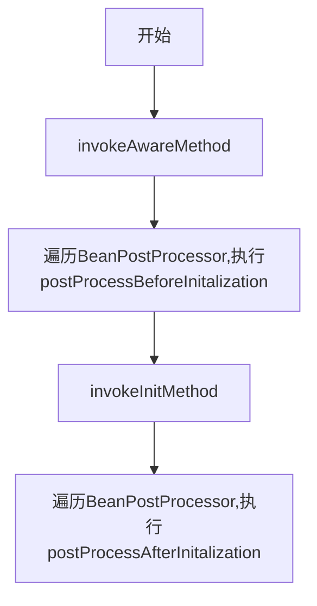
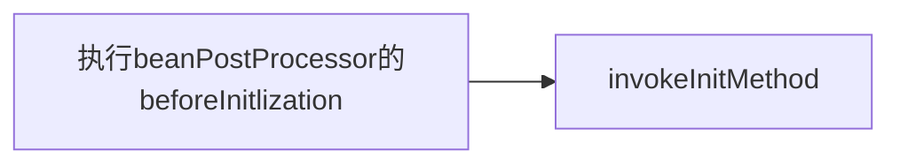

initializeBean发生在创建Bean后期了，此前已经经历了 createInstanceBean(实例化bean),populateBean(属性的填充)
执行的大致步骤如下：



### invokeAwareMethod

```java
private void invokeAwareMethods(final String beanName, final Object bean) {
		if (bean instanceof Aware) {
			if (bean instanceof BeanNameAware) {
				((BeanNameAware) bean).setBeanName(beanName);
			}
			if (bean instanceof BeanClassLoaderAware) {
				((BeanClassLoaderAware) bean).setBeanClassLoader(getBeanClassLoader());
			}
			if (bean instanceof BeanFactoryAware) {
				((BeanFactoryAware) bean).setBeanFactory(AbstractAutowireCapableBeanFactory.this);
			}
		}
	}
```
可以从代码中看到，invokeAwareMethod只是对BeanNameAware、BeanClassLoaderAware、BeanFactoryAware做了方法调用，我们熟悉的ApplicationContextAware呢？？？

==其实这部分的实现，Spring把它们放到了第二步，BeanPostProcessor中去实现，更加方便拓展==

### BeanPostProcessor
在initializeBean的过程中，分别遍历调用的 
* postProcessBeforeInitialization
* postProcessAfterInitialization

分别为bean创建过程中提供修改bean的入口

比如上面，invokeAwareMethod值对有限个Aware方法做了属性的注入，如果想为自定义的Aware设置属性怎么办？BeanPostProcessor为这种情况提供了拓展。比如ApplicationContextAwareProcessor

```java
@Override
	public Object postProcessBeforeInitialization(final Object bean, String beanName) throws BeansException {
		AccessControlContext acc = null;

		if (System.getSecurityManager() != null &&
				(bean instanceof EnvironmentAware || bean instanceof EmbeddedValueResolverAware ||
						bean instanceof ResourceLoaderAware || bean instanceof ApplicationEventPublisherAware ||
						bean instanceof MessageSourceAware || bean instanceof ApplicationContextAware)) {
			acc = this.applicationContext.getBeanFactory().getAccessControlContext();
		}

		if (acc != null) {
			AccessController.doPrivileged((PrivilegedAction<Object>) () -> {
				invokeAwareInterfaces(bean);
				return null;
			}, acc);
		}
		else {
			invokeAwareInterfaces(bean);
		}

		return bean;
	}

//对各种Aware的处理
	private void invokeAwareInterfaces(Object bean) {
		if (bean instanceof Aware) {
			if (bean instanceof EnvironmentAware) {
				((EnvironmentAware) bean).setEnvironment(this.applicationContext.getEnvironment());
			}
			if (bean instanceof EmbeddedValueResolverAware) {
				((EmbeddedValueResolverAware) bean).setEmbeddedValueResolver(this.embeddedValueResolver);
			}
			if (bean instanceof ResourceLoaderAware) {
				((ResourceLoaderAware) bean).setResourceLoader(this.applicationContext);
			}
			if (bean instanceof ApplicationEventPublisherAware) {
				((ApplicationEventPublisherAware) bean).setApplicationEventPublisher(this.applicationContext);
			}
			if (bean instanceof MessageSourceAware) {
				((MessageSourceAware) bean).setMessageSource(this.applicationContext);
			}
			if (bean instanceof ApplicationContextAware) {
				((ApplicationContextAware) bean).setApplicationContext(this.applicationContext);
			}
		}
	}
```

### invokeInitMethod
1. 当bean实现InitializingBean接口时，调用他的afterPropertiesSet()方法
2. 执行用户自定义的初始化方法，比如xml中配置的 init-method


```java
/**
	 * Give a bean a chance to react now all its properties are set,
	 * and a chance to know about its owning bean factory (this object).
	 * This means checking whether the bean implements InitializingBean or defines
	 * a custom init method, and invoking the necessary callback(s) if it does.
	 * @param beanName the bean name in the factory (for debugging purposes)
	 * @param bean the new bean instance we may need to initialize
	 * @param mbd the merged bean definition that the bean was created with
	 * (can also be {@code null}, if given an existing bean instance)
	 * @throws Throwable if thrown by init methods or by the invocation process
	 * @see #invokeCustomInitMethod
	 */
	protected void invokeInitMethods(String beanName, final Object bean, @Nullable RootBeanDefinition mbd)
			throws Throwable {

    //如果是InitializingBean，执行afterPropertiesSet
		boolean isInitializingBean = (bean instanceof InitializingBean);
		if (isInitializingBean && (mbd == null || !mbd.isExternallyManagedInitMethod("afterPropertiesSet"))) {
			if (logger.isDebugEnabled()) {
				logger.debug("Invoking afterPropertiesSet() on bean with name '" + beanName + "'");
			}
			if (System.getSecurityManager() != null) {
				try {
					AccessController.doPrivileged((PrivilegedExceptionAction<Object>) () -> {
						((InitializingBean) bean).afterPropertiesSet();
						return null;
					}, getAccessControlContext());
				}
				catch (PrivilegedActionException pae) {
					throw pae.getException();
				}
			}
			else {
				((InitializingBean) bean).afterPropertiesSet();
			}
		}

    //执行自定义的Init-method,
		if (mbd != null) {
			String initMethodName = mbd.getInitMethodName();
			if (initMethodName != null && !(isInitializingBean && "afterPropertiesSet".equals(initMethodName)) &&
					!mbd.isExternallyManagedInitMethod(initMethodName)) {
				invokeCustomInitMethod(beanName, bean, mbd);
			}
		}
	}
```


## 上面大致讲了下 initializeBean的执行过程，下面讲一下日常使用中的问题
### 自定义bean 初始化和销毁过程中的方法
1. 在编写Bean类的时候，在需要指定的初始化方法上面增加@PostConstruct

    在编写Bean类的时候，在需要指定的销毁方法上面增加@PreDestroy
2. 在@Bean中指定 initMethod 和 destroyMethod 
3. 实现InitializingBean,实现afterPropertiesSet()方法

### 那么对同一个bean,上面的写法都存在的情况下，执行的顺序是怎么样的呢
上面讲到了initializeBean的步骤是


CommonAnnotationBeanPostProcessor类继承自InitDestroyAnnotationBeanPostProcessor,并且没有对做重写，所以在执行initializeBean的时候，调用到的其实是InitDestroyAnnotationBeanPostProcessor的postProcessBeforeInitialization方法

```java
	@Override
	public Object postProcessBeforeInitialization(Object bean, String beanName) throws BeansException {
		LifecycleMetadata metadata = findLifecycleMetadata(bean.getClass());
		try {
			metadata.invokeInitMethods(bean, beanName);
		}
		catch (InvocationTargetException ex) {
			throw new BeanCreationException(beanName, "Invocation of init method failed", ex.getTargetException());
		}
		catch (Throwable ex) {
			throw new BeanCreationException(beanName, "Failed to invoke init method", ex);
		}
		return bean;
	}
```

```java
private LifecycleMetadata findLifecycleMetadata(Class<?> clazz) {
		if (this.lifecycleMetadataCache == null) {
			// Happens after deserialization, during destruction...
			return buildLifecycleMetadata(clazz);
		}
		// Quick check on the concurrent map first, with minimal locking.
		LifecycleMetadata metadata = this.lifecycleMetadataCache.get(clazz);
		if (metadata == null) {
			synchronized (this.lifecycleMetadataCache) {
				metadata = this.lifecycleMetadataCache.get(clazz);
				if (metadata == null) {
					metadata = buildLifecycleMetadata(clazz);
					this.lifecycleMetadataCache.put(clazz, metadata);
				}
				return metadata;
			}
		}
		return metadata;
	}

	private LifecycleMetadata buildLifecycleMetadata(final Class<?> clazz) {
		final boolean debug = logger.isDebugEnabled();
		LinkedList<LifecycleElement> initMethods = new LinkedList<>();
		LinkedList<LifecycleElement> destroyMethods = new LinkedList<>();
		Class<?> targetClass = clazz;

		do {
			final LinkedList<LifecycleElement> currInitMethods = new LinkedList<>();
			final LinkedList<LifecycleElement> currDestroyMethods = new LinkedList<>();

			ReflectionUtils.doWithLocalMethods(targetClass, method -> {
				if (initAnnotationType != null) {
					if (method.getAnnotation(initAnnotationType) != null) {
						LifecycleElement element = new LifecycleElement(method);
						currInitMethods.add(element);
						if (debug) {
							logger.debug("Found init method on class [" + clazz.getName() + "]: " + method);
						}
					}
				}
				if (destroyAnnotationType != null) {
					if (method.getAnnotation(destroyAnnotationType) != null) {
						currDestroyMethods.add(new LifecycleElement(method));
						if (debug) {
							logger.debug("Found destroy method on class [" + clazz.getName() + "]: " + method);
						}
					}
				}
			});

			initMethods.addAll(0, currInitMethods);
			destroyMethods.addAll(currDestroyMethods);
			targetClass = targetClass.getSuperclass();
		}
		while (targetClass != null && targetClass != Object.class);

		return new LifecycleMetadata(clazz, initMethods, destroyMethods);
	}
```
上面所说的initAnnotationType和destroyAnnotationType有CommonAnnotationBeanPostProcessor来决定

```java
/**
 * Create a new CommonAnnotationBeanPostProcessor,
 * with the init and destroy annotation types set to
 * {@link javax.annotation.PostConstruct} and {@link javax.annotation.PreDestroy},
 * respectively.
 */
public CommonAnnotationBeanPostProcessor() {
	setOrder(Ordered.LOWEST_PRECEDENCE - 3);
	setInitAnnotationType(PostConstruct.class);
	setDestroyAnnotationType(PreDestroy.class);
	ignoreResourceType("javax.xml.ws.WebServiceContext");
}
```
==所以 PostConstruct 会在执行BeanPostProcessor的postProcessBeforeInitalization()会被执行到==

接下来执行invokeInitMethod方法，从上面的代码里面是先执行的afterPropertiesSet()方法，后执行 initMethod


所以综上所述执行顺序是


