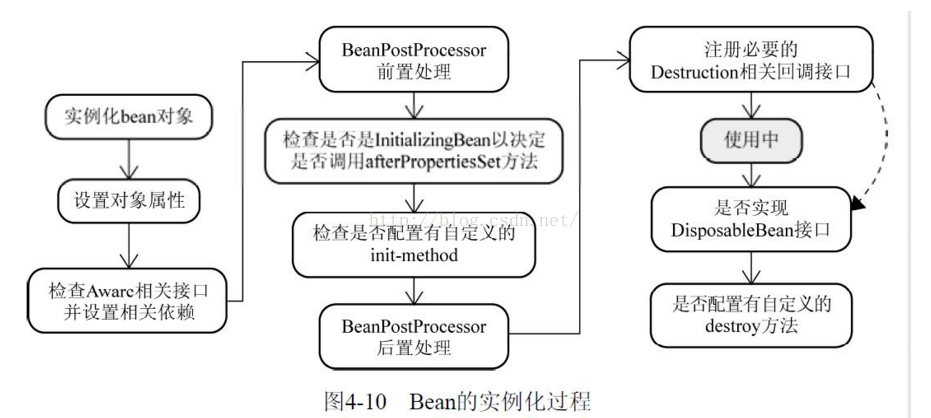
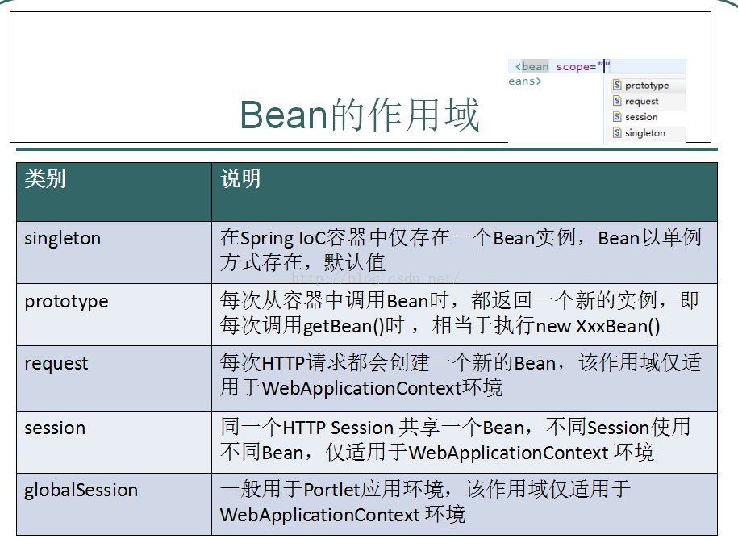
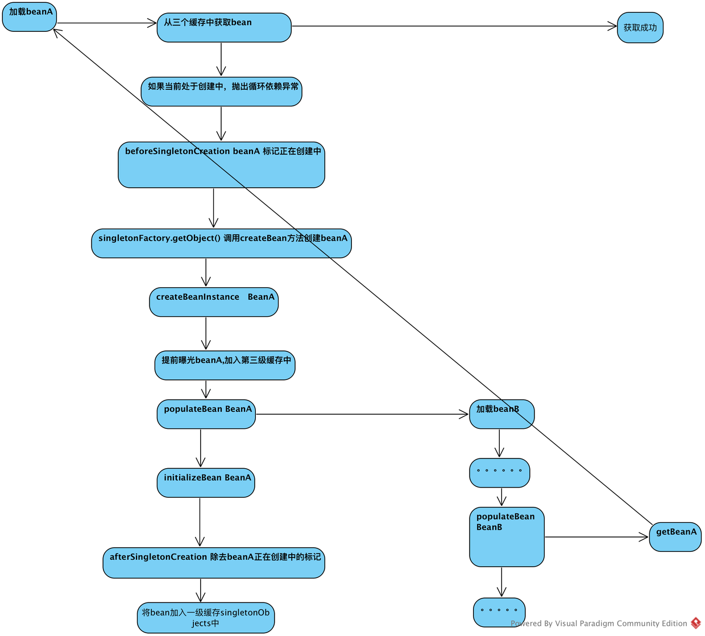

#### spring中bean的生命周期



#### spring bean的作用域



#### spring 如何解决循环依赖
```
@Component
public class A {

    @Autowired
    private B b;

    public void aMethod(){
        b.bMethod();
    }
}

@Component
public class B {
    @Autowired
    private A a;

    public void bMethod(){
        System.out.println("bmethod");
    }
}

@SpringBootApplication
public class MyspringlearningApplication {

	public static void main(String[] args) {
		ConfigurableApplicationContext context = SpringApplication.run(MyspringlearningApplication.class, args);
		A a = context.getBean(A.class);
		a.aMethod();

	}
}

```
上面的示例中，A依赖B，B又依赖了A.是典型的循环依赖的情况，但是运行的结果来看，程序能正常运行，调用a.aMethod()能打印出"bmethod"字符串 <br>
那spring是怎么解决循环依赖的呢？？？
```java
protected <T> T doGetBean(final String name, @Nullable final Class<T> requiredType,
		@Nullable final Object[] args, boolean typeCheckOnly) throws BeansException {

	final String beanName = transformedBeanName(name);
	Object bean;

	// Eagerly check singleton cache for manually registered singletons.
	Object sharedInstance = getSingleton(beanName);
	if (sharedInstance != null && args == null) {
		if (logger.isDebugEnabled()) {
			if (isSingletonCurrentlyInCreation(beanName)) {
				logger.debug("Returning eagerly cached instance of singleton bean '" + beanName +
						"' that is not fully initialized yet - a consequence of a circular reference");
			}
			else {
				logger.debug("Returning cached instance of singleton bean '" + beanName + "'");
			}
		}
		bean = getObjectForBeanInstance(sharedInstance, name, beanName, null);
	}

	else {
		// Fail if we're already creating this bean instance:
		// We're assumably within a circular reference.
		if (isPrototypeCurrentlyInCreation(beanName)) {
			throw new BeanCurrentlyInCreationException(beanName);
		}
		.......
		各种作用域的创建bean
}
```
获取bean的时候
1. 从spring维护的三个缓存中获取bean
2. 如果缓存中获取失败，并且bean处于创建中，抛出循环依赖异常
3. 在对应的作用域中创建bean
<br>

spring为bean创建了三个级别的缓存，
这三级缓存分别是

| 级别 | 名称                  | 类型                          | 内容                           |
| ---- | --------------------- | ----------------------------- | ------------------------------ |
| 1    | singletonObjects      | Map<String, Object>           | 正在完成加载的bean             |
| 2    | earlySingletonObjects | Map<String, Object>           | 完成了实例化，提前曝光的Bean02 |
| 3    | singletonFactories    | Map<String, ObjectFactory<?>> | 提前曝光的bean01               |


```java
protected Object getSingleton(String beanName, boolean allowEarlyReference) {
	Object singletonObject = this.singletonObjects.get(beanName);
	if (singletonObject == null && isSingletonCurrentlyInCreation(beanName)) {
		synchronized (this.singletonObjects) {
			singletonObject = this.earlySingletonObjects.get(beanName);
			if (singletonObject == null && allowEarlyReference) {
				ObjectFactory<?> singletonFactory = this.singletonFactories.get(beanName);
				if (singletonFactory != null) {
					singletonObject = singletonFactory.getObject();
					this.earlySingletonObjects.put(beanName, singletonObject);
					this.singletonFactories.remove(beanName);
				}
			}
		}
	}
	return singletonObject;
}
```


getBean的第一步操作就是从三个级别缓存中获取bean


1. 如果singletonObjects中有，可以直接返回
2. 如果earlySingletonObjects中有，直接返回
3. 如果singletonFactories中有
    1. 调用ObjectFactory的getObject方法
    2. 将获取到的bean放入二级缓存中
    3. 从三级缓存中删除该beanName
    4. 


在bean完成实例化之后,populateBean之前，会将bean提前曝光。加入到三级缓存中
```java
protected Object doCreateBean(final String beanName, final RootBeanDefinition mbd, final @Nullable Object[] args)
			throws BeanCreationException {

	.....
	createBeanInstance

	// Eagerly cache singletons to be able to resolve circular references
	// even when triggered by lifecycle interfaces like BeanFactoryAware.
	boolean earlySingletonExposure = (mbd.isSingleton() && this.allowCircularReferences &&
			isSingletonCurrentlyInCreation(beanName));
	if (earlySingletonExposure) {
		if (logger.isDebugEnabled()) {
			logger.debug("Eagerly caching bean '" + beanName +
					"' to allow for resolving potential circular references");
		}
		addSingletonFactory(beanName, () -> getEarlyBeanReference(beanName, mbd, bean));
	}
	....
	populateBean()
	....
}
```



当对beanB执行populateBean填充属性的时候，因为A已经加入到三级缓存中了，所以在getBean的最开始就能从缓存中获取到已经完成实例化的beanA,完成beanB的属性填充。

#### 什么情况下的循环依赖问题可以被spring解决
首先，我们常用的依赖注入方式有如下几种
1. 构造函数注入
```
@Component
public class C {

    private D d;
    public C(@Autowired D d) {
    }

    public void cMethod(){
        d.dMethod();
    }
}

@Component
public class D {
    private C c;
    public D(@Autowired C c) {
        this.c = c;
    }

    public void dMethod(){
        System.out.println("dMethod");
    }
}
@SpringBootApplication
public class MyspringlearningApplication {

	public static void main(String[] args) {
		ConfigurableApplicationContext context = SpringApplication.run(MyspringlearningApplication.class, args);
		C c = context.getBean(C.class);
		c.cMethod();

	}
}

```
运行结果:报循环依赖异常
```java
***************************
APPLICATION FAILED TO START
***************************

Description:

The dependencies of some of the beans in the application context form a cycle:

┌─────┐
|  c defined in file [/Users/lihongli/testWorkSpace/myspringlearning/target/classes/com/li/myspringlearning/C.class]
↑     ↓
|  d defined in file [/Users/lihongli/testWorkSpace/myspringlearning/target/classes/com/li/myspringlearning/D.class]
└─────┘

```

2. 属性注入
```java
@Component
public class A {

    @Autowired
    private B b;

    public void aMethod(){
        b.bMethod();
    }
}

@Component
public class B {
    @Autowired
    private A a;

    public void bMethod(){
        System.out.println("bmethod");
    }
}
```
运行正常

****
>按照前面的代码分析，spring会在完成实例化createBeanInstance方法执行完成后，才会把bean提前曝光到缓存中，才能让依赖方获取到这个提前曝光的bean完成依赖方bean的加载。如果将依赖写在构造函数中，会在实例化C的时候就去加载依赖的D,在D加载过程中也会在他的构造函数中去加载C的bean，C当前处于创建中，但是没有进行提前曝光，导致循环依赖异常

**如果将构造器注入的示例改成如下：**
```java
@Component
public class C {
    @Autowired
    private D d;
//    public C(@Autowired D d) {
//    }

    public void cMethod(){
        d.dMethod();
    }
}

@Component
public class D {
    private C c;
    public D(@Autowired C c) {
        this.c = c;
    }

    public void dMethod(){
        System.out.println("dMethod");
    }
}
@SpringBootApplication
public class MyspringlearningApplication {

	public static void main(String[] args) {
		ConfigurableApplicationContext context = SpringApplication.run(MyspringlearningApplication.class, args);
		C c = context.getBean(C.class);
		c.cMethod();

	}
}
```
让C在获取D的bean之前，能把自己提前曝光出去，就不过报循环依赖了。


##### earlySingletonObjects和singletonFactories
在doCreateBean方法中，完成bean的实例化后，如果允许提前曝光，会把刚刚完成实例化的bean暴露出去


此时加入到三级缓存缓存中。目的是为了在调用getSingleton从三级缓存升级到二级缓存中的时候能执行一些拓展的操作

```java
protected Object getEarlyBeanReference(String beanName, RootBeanDefinition mbd, Object bean) {
	Object exposedObject = bean;
	if (!mbd.isSynthetic() && hasInstantiationAwareBeanPostProcessors()) {
		for (BeanPostProcessor bp : getBeanPostProcessors()) {
			if (bp instanceof SmartInstantiationAwareBeanPostProcessor) {
				SmartInstantiationAwareBeanPostProcessor ibp = (SmartInstantiationAwareBeanPostProcessor) bp;
				exposedObject = ibp.getEarlyBeanReference(exposedObject, beanName);
			}
		}
	}
	return exposedObject;
}
```