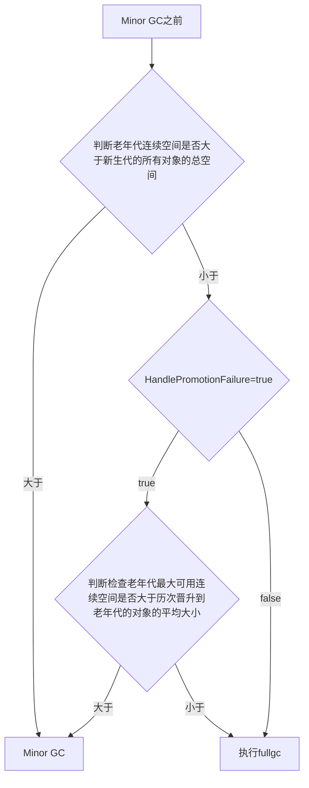

# jvm GC
[toc]

## 区分

针对HotSpot VM的实现，它里面的GC其实准确分类只有两大种：

- Partial GC：并不收集整个GC堆的模式

- - Young GC：只收集young gen的GC
  - Old GC：只收集old gen的GC。只有CMS的concurrent collection是这个模式
  - Mixed GC：收集整个young gen以及部分old gen的GC。只有G1有这个模式

- Full GC：收集整个堆，包括young gen、old gen、perm gen（如果存在的话）等所有部分的模式。

## 触发时机

### 触发MinorGC(Young GC)

eden不足的时候。触发

  虚拟机在进行minorGC之前会判断老年代最大的可用连续空间是否大于新生代的所有对象总空间

  1、如果大于的话，直接执行minorGC

  2、如果小于，判断是否开启HandlerPromotionFailure，没有开启直接FullGC

  3、如果开启了HanlerPromotionFailure, JVM会判断老年代的最大连续内存空间是否大于历次晋升的大小，如果小于直接执行FullGC

  4、如果大于的话，执行minorGC

### 触发FullGC

- 老年代空间不足

   如果创建一个大对象，Eden区域当中放不下这个大对象，会直接保存在老年代当中，如果老年代空间也不足，就会触发Full GC。为了避免这种情况，最好就是不要创建太大的对象。

- 持久代空间不足

   如果有持久代空间的话，系统当中需要加载的类，调用的方法很多，同时持久代当中没有足够的空间，就出触发一次Full GC

- YGC出现 内存分配担保机制 promotion failure

  promotion failure发生在Young GC, 如果Survivor区当中存活对象的年龄达到了设定值，会就将Survivor区当中的对象拷贝到老年代，如果老年代的空间不足，就会发生promotion failure， 接下去就会发生Full GC.

- 统计YGC发生时晋升到老年代的平均总大小大于老年代的空闲空间

   在发生YGC是会判断，是否安全，这里的安全指的是，当前老年代空间可以容纳YGC晋升的对象的平均大小，如果不安全，就不会执行YGC,转而执行Full GC。

- 显示调用System.gc


## 内存分配的动态担保机制

在发生Minor GC之前，虚拟机会先检查老年代最大可用的连续空间是否大于新生代所有对象总空间。如果这个条件成立，那么Minor GC可以确保是安全的。如果不成立，则虚拟机会查看HandlerPromotionFailure设置是否允许担保失败。如果允许，那么会继续检查老年代最大可用的连续空间是否大于历次晋升到老年代对象的平均大小。如果大于，将尝试着进行一次Monitor GC，尽管这次GC是有风险的。如果小于，或者HandlerPromotionFailure设置不允许冒险，那这时也要改为进行一次Full GC了。

上述所说的冒险到底是冒的什么险呢？

前面提到过，新生代使用复制收集算法，但是为了内存利用率。只使用其中一个Survivor空间来作为轮换备份，因此当出现大量对象在Minor GC后仍然存活的情况（最极端的情况是内存回收之后，新生代中所有的对象都存活），就需要老年代进行分配担保，把Survivor无法容纳的对象直接进入老年代。老年代要进行这样的担保，前提是老年代本身还有容纳这些对象的剩余空间，一共有多少对象存活下来在实际完成内存回收之前是无法明确知道的，所以只好取之前每一次回收晋升到老年代对象容量的平均大小值作为经验值，与老年代的剩余空间进行比较，决定是否进行Full GC来让老年代腾出更多空间。

取平均值进行比较其实仍然是一种动态概率的手段，也就是说，如果某次Minor GC存活后的对象突增，远远高于平均值的话，依然会导致担保失败。如果出现HandlerPromotionFailure失败，那就只好在失败后重新发起一次FULL GC。虽然担保失败时绕的圈子是最大的，但大部分情况下都还是将HandlerPromotionFailure开关打开，避免Full GC过于频繁。




## jvm动态年龄判断
[动态年龄判断](https://www.jianshu.com/p/989d3b06a49d)
```
uint ageTable::compute_tenuring_threshold(size_t survivor_capacity) {
    //survivor_capacity是survivor空间的大小
  size_t desired_survivor_size = (size_t)((((double) survivor_capacity)*TargetSurvivorRatio)/100);
  size_t total = 0;
  uint age = 1;
  while (age < table_size) {
    total += sizes[age];//sizes数组是每个年龄段对象大小
    if (total > desired_survivor_size) break;
    age++;
  }
  uint result = age < MaxTenuringThreshold ? age : MaxTenuringThreshold;
    ...
}
```
假设如下：
MaxTenuringThreshold为15
年龄1的对象占用了33%
年龄2的对象占用33%
年龄3的对象占用34%。

TargetSurvivorRatio 默认是50%

年龄1的占用了33%，年龄2的占用了33%，累加和超过默认的TargetSurvivorRatio（50%），年龄2和年龄3的对象都要晋升。


#### 结论：
动态对象年龄判断，主要是被TargetSurvivorRatio这个参数来控制。而且算的是年龄从小到大的累加和，而不是某个年龄段对象的大小。看完后先记住这个参数吧TargetSurvivorRatio，虽然你以后基本不会调整他。