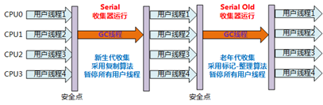

# jvm调优学习笔记


## 如何定位垃圾

1. 引用计数（ReferenceCount)
2. 根可达算法(RootSearching)

### 根可达算法中的根

(1). 虚拟机栈（栈帧中的局部变量区，也叫做局部变量表）中引用的对象。

(2). 方法区中的类静态属性引用的对象。

(3). 方法区中常量引用的对象。

(4). 本地方法栈中JNI(Native方法)引用的对象。


## 常见的垃圾回收算法

1. 拷贝算法（copying) - 没有内存碎片，但是会浪费空间
2. 标记清除(mark sweep) - 产生碎片 效率偏低（两遍扫描）
3. 标记压缩(mark compact) - 没有碎片，效率偏低（两遍扫描，指针需要调整）


## jvm的内存分代模型（用于分代垃圾回收算法)


1. Epsilon和 ZGC、Shenandoah 是 ***物理逻辑都不分代***
2. G1是***逻辑分代***、***物理不分代***
3. 其他的都是***物理逻辑都分代***

### 分代模型主要的分代

新生代 + 老年代 + 永久代（1.7）Perm Generation/ 元数据区(1.8) Metaspace

1. 动态年龄：（不重要）
   https://www.jianshu.com/p/989d3b06a49d

2. 分配担保：（不重要）
   YGC期间 survivor区空间不够了 空间担保直接进入老年代
   参考：https://cloud.tencent.com/developer/article/1082730

### 对象分配过程


## 常见的垃圾回收器


### 并发和并行

* 并发：用户线程和垃圾回收线程可以同时运行
* 并行：多个垃圾回收线程一起进行垃圾回收，但是用户线程现在是停止的

### 一般的组合

1. serial + serial old （串行的回收垃圾）

   

2. parallel scavenge + parallel old （并行的回收垃圾）

   

3. ParNew + CMS (serial old兜底）

   1. cms 首个并发的垃圾回收器。最耗时的并发标记阶段，可以和用户线程一起执行，所以降低STW的时间。

   

   2. 算法：三色标记 + Incremental Update

4. G1(10ms)
   算法：三色标记 + SATB

5. ZGC (1ms) PK C++
   算法：ColoredPointers + LoadBarrier

6. Shenandoah
   算法：ColoredPointers + WriteBarrier

7. Eplison


## 常见垃圾回收器组合参数设定：(1.8)

* -XX:+UseSerialGC = Serial New (DefNew) + Serial Old
  * 小型程序。默认情况下不会是这种选项，HotSpot会根据计算及配置和JDK版本自动选择收集器
* -XX:+UseParNewGC = ParNew + SerialOld
  * 这个组合已经很少用（在某些版本中已经废弃）
  * https://stackoverflow.com/questions/34962257/why-remove-support-for-parnewserialold-anddefnewcms-in-the-future
* -XX:+UseConc<font color=red>(urrent)</font>MarkSweepGC = ParNew + CMS + Serial Old
* -XX:+UseParallelGC = Parallel Scavenge + Parallel Old (1.8默认) 【PS + SerialOld】
* -XX:+UseParallelOldGC = Parallel Scavenge + Parallel Old
* -XX:+UseG1GC = G1
* Linux中没找到默认GC的查看方法，而windows中会打印UseParallelGC 
  * java +XX:+PrintCommandLineFlags -version
  * 通过GC的日志来分辨

* Linux下1.8版本默认的垃圾回收器到底是什么？

  * 1.8.0_181 默认（看不出来）Copy MarkCompact
  * 1.8.0_222 默认 PS + PO

## 认识jvm参数

HotSpot参数分类

> 标准： - 开头，所有的HotSpot都支持
>
> 非标准：-X 开头，特定版本HotSpot支持特定命令
>
> 不稳定：-XX 开头，下个版本可能取消


### 每种参数的查询方式

#### 标准参数

```shell
java
```

会打印下面的内容

```shell
-d32	  使用 32 位数据模型 (如果可用)
-d64	  使用 64 位数据模型 (如果可用)
-server	  选择 "server" VM
默认 VM 是 server,
因为您是在服务器类计算机上运行。


-cp <目录和 zip/jar 文件的类搜索路径>
-classpath <目录和 zip/jar 文件的类搜索路径>
用 : 分隔的目录, JAR 档案
和 ZIP 档案列表, 用于搜索类文件。
-D<名称>=<值>
设置系统属性
-verbose:[class|gc|jni]
......
......
```

#### 非标准参数 -X

```shell
java -X
```

会打印下面的内容：

```shell
 -Xmixed           混合模式执行 (默认)
 -Xint             仅解释模式执行
 -Xbootclasspath:<用 : 分隔的目录和 zip/jar 文件>
 设置搜索路径以引导类和资源
 -Xbootclasspath/a:<用 : 分隔的目录和 zip/jar 文件>
 附加在引导类路径末尾
 -Xbootclasspath/p:<用 : 分隔的目录和 zip/jar 文件>
 置于引导类路径之前
 -Xdiag            显示附加诊断消息
 -Xnoclassgc       禁用类垃圾收集
 -Xincgc           启用增量垃圾收集
 -Xloggc:<file>    将 GC 状态记录在文件中 (带时间戳)
 -Xbatch           禁用后台编译
 -Xms<size>        设置初始 Java 堆大小
 -Xmx<size>        设置最大 Java 堆大小
 -Xss<size>        设置 Java 线程堆栈大小
 .....
 ....
```

#### 不稳定参数：-XX 开头

因为有700多个-XX指定的参数，查询比较麻烦，可以使用关键字查询的方式

```shell
java -XX:+PrintFlagsFinal | grep 'GC'
```

可以打印出，带有GC关键字的参数列表

```shell
.....
bool UseG1GC                               = false                               {product}
bool UseGCLogFileRotation                  = false                               {product}
bool UseGCOverheadLimit                    = true                                {product}
bool UseGCTaskAffinity                     = false                               {product}
bool UseMaximumCompactionOnSystemGC        = true                                {product}
bool UseParNewGC                           = false                               {product}
bool UseParallelGC                         := true                                {product}
bool UseParallelOldGC                     = true                                {product}
bool UseSerialGC                         = false                               {product}
...
```


打印java命令时的系统参数

**-XX:+PrintCommandLineFlags**

比如：

```shell
java -XX:+PrintCommandLineFlags -version
```

会打印下面的内容

```shell
-XX:InitialHeapSize=134217728 -XX:MaxHeapSize=2147483648 -XX:+PrintCommandLineFlags -XX:+UseCompressedClassPointers -XX:+UseCompressedOops -XX:+UseParallelGC
java version "1.8.0_40"
Java(TM) SE Runtime Environment (build 1.8.0_40-b27)
Java HotSpot(TM) 64-Bit Server VM (build 25.40-b25, mixed mode)
```

里面会打印默认的堆起始大小、堆最大值。使用的垃圾回收器UseParallelGC


