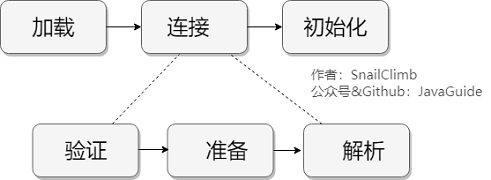
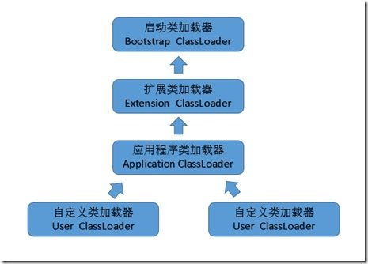
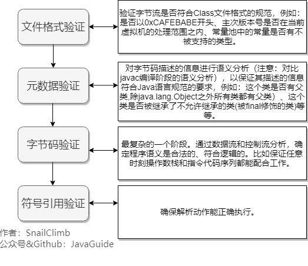

# 类的加载过程（类+接口）

系统加载 Class 类型的文件主要三步:**加载->连接->初始化**。连接过程又可分为三步:**验证->准备->解析**。




引用类型，Java 将其细分为四种：类、接口、数组类和泛型参数。由于泛型参数会在编译过程中被擦除，因此 Java 虚拟机实际上只有前三种。在类、接口和数组类中，数组类是由 Java 虚拟机直接生成的，其他两种则有对应的字节流。

## 加载（将二进制流加载成class对象）

`加载就是将二进制流变成内存中的一个Class`

加载，是指查找字节流，并且据此创建类的过程。数组类是由 Java 虚拟机直接生成的。对于其他的类来说，Java 虚拟机则需要借助类加载器来完成查找字节流的过程。




### 双亲委派机制：
只有上级类加载器不能加载的情况下，下级类加载器才会去尝试加载。

* **BootstrapClassLoader(启动类加载器)** ：最顶层的加载类，由C++实现，负责加载 `%JAVA_HOME%/lib`目录下的jar包和类或者或被 `-Xbootclasspath`参数指定的路径中的所有类。
* **ExtensionClassLoader(扩展类加载器)** ：主要负责加载目录 `%JRE_HOME%/lib/ext` 目录下的jar包和类，或被 `java.ext.dirs` 系统变量所指定的路径下的jar包。
* **AppClassLoader(应用程序类加载器)** :面向我们用户的加载器，负责加载当前应用classpath下的所有jar包和类。
* **自定义类加载器**

#### 双亲委派模式的好处
`防止同一个类被重复加载`


类加载逻辑代码：

```java
ClassLoader:
protected Class<?> loadClass(String name, boolean resolve)
  throws ClassNotFoundException
{
  synchronized (getClassLoadingLock(name)) {
    // First, check if the class has already been loaded
    //检查class是否已经被load过了
    Class<?> c = findLoadedClass(name);
    if (c == null) {
      long t0 = System.nanoTime();
      try {
        //如果有父类加载器，就用父类加载器去loadclass
        if (parent != null) {
          c = parent.loadClass(name, false);
        } else {
          //如果没有父类加载器，说明已经到顶了，使用启动类加载器(BootstrapClassLoader)去load
          c = findBootstrapClassOrNull(name);
        }
      } catch (ClassNotFoundException e) {
        // ClassNotFoundException thrown if class not found
        // from the non-null parent class loader
      }

      if (c == null) {
        // If still not found, then invoke findClass in order
        // to find the class.
        //如果还是没有找到，使用当前类加载器的findClass方法区查找class.
        long t1 = System.nanoTime();
        c = findClass(name);

        // this is the defining class loader; record the stats
        sun.misc.PerfCounter.getParentDelegationTime().addTime(t1 - t0);
        sun.misc.PerfCounter.getFindClassTime().addElapsedTimeFrom(t1);
        sun.misc.PerfCounter.getFindClasses().increment();
      }
    }
    if (resolve) {
      resolveClass(c);
    }
    return c;
  }
}
```

```java
protected Class<?> findClass(final String name)
        throws ClassNotFoundException
    {
        final Class<?> result;
        try {
            result = AccessController.doPrivileged(
                new PrivilegedExceptionAction<Class<?>>() {
                    public Class<?> run() throws ClassNotFoundException {
                        String path = name.replace('.', '/').concat(".class");
                      //从当前classloader维护的Resource列表中获取对应的
                        Resource res = ucp.getResource(path, false);
                        if (res != null) {
                            try {
                              //使用resource生成class对象
                                return defineClass(name, res);
                            } catch (IOException e) {
                                throw new ClassNotFoundException(name, e);
                            }
                        } else {
                            return null;
                        }
                    }
                }, acc);
        } catch (java.security.PrivilegedActionException pae) {
            throw (ClassNotFoundException) pae.getException();
        }
        if (result == null) {
            throw new ClassNotFoundException(name);
        }
        return result;
    }
```


## 验证（判断合法性）
验证阶段的目的，在于确保被加载类能够满足 Java 虚拟机的约束条件

比较复杂

## 准备(为类的静态字段分配内存)
准备阶段的目的，则是为被加载类的静态字段分配内存。这个时候静态字段的值还都是各自类型的默认值，比如int是0，具体的赋值会在初始化阶段执行

## 解析（将符号引用转化为实际引用）
编译的时候，class文件无法知道自己调用的类、方法、字段所处的具体地址，因此，每当需要引用这些成员时，Java 编译器会生成一个符号引用。也就是方法限定符。
解析阶段的目的，正是将这些符号引用解析成为实际引用。如果符号引用指向一个未被加载的类，或者未被加载类的字段或方法，那么解析将触发这个类的加载（但未必触发这个类的链接以及初始化。）
## 初始化
> final修饰的基本类型和字符串都是进入常量池，其初始化由java虚拟机完成

除了上面的常量池数据，都会被放入`<cinit>`方法中，就是class对象的初始化范围。
1. 直接赋值的静态变量
2. 静态代码块中的代码

初始化的作用，就是给静态变量赋值。

## 触发类加载


* 当虚拟机启动时，初始化用户指定的主类；
* 当遇到用以新建目标类实例的 new 指令时，初始化 new 指令的目标类；
* 当遇到调用静态方法的指令时，初始化该静态方法所在的类；
* 当遇到访问静态字段的指令时，初始化该静态字段所在的类；
* 子类的初始化会触发父类的初始化；
* 如果一个接口定义了 default 方法，那么直接实现或者间接实现该接口的类的初始化，会触发该接口的初始化；
* 使用反射 API 对某个类进行反射调用时，初始化这个类；
* 当初次调用 MethodHandle 实例时，初始化该 MethodHandle 指向的方法所在的类。


## 使用类加载机制来实现单例

```java

public class Singleton {
  private Singleton() {}
  private static class LazyHolder {
    static final Singleton INSTANCE = new Singleton();
  }
  public static Singleton getInstance() {
    return LazyHolder.INSTANCE;
  }
}
```

```java
 static final Singleton INSTANCE = new Singleton(); 
```

会被放入`<cinit>`中，因为这个方法只会执行一次，所以能保证单例


## 其他


[一个对象的实例化过程](https://blog.csdn.net/tjiyu/article/details/53923392)