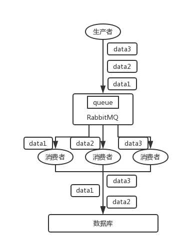

# mq比较

## 为什么使用mq

1.   解耦

   解耦前：

   

   解耦后：
   

2. 削峰
	如果请求量突然飙升，导致超过mysql的处理能力。那样会压垮系统。可以先将请求积压在mq中，等高峰期一过，再慢慢的消费掉积压的消息。
	
3. 异步
	如果系统A需要调用3个方法，b/c/d,每个100ms，那么需要300ms；如果使用Mq做异步，那么只需要100ms.
	

## 引入mq之后需要注意的问题

1. 服务的可用性与mq的可用性挂钩，所以得保证mq的高可用。
2. 需要处理mq带来的一堆问题
   1. 保证消息不会重复消费
   2. 消息丢失
   3. 保证消息的顺序消费--某些应用场景需要

## 几种主流的mq的比较

| 特性                     | ActiveMQ                              | RabbitMQ                                           | RocketMQ                                                     | Kafka                                                        |
| ------------------------ | ------------------------------------- | -------------------------------------------------- | ------------------------------------------------------------ | ------------------------------------------------------------ |
| 单机吞吐量               | 万级，比 RocketMQ、Kafka 低一个数量级 | 同 ActiveMQ                                        | 10 万级，支撑高吞吐                                          | 10 万级，高吞吐，一般配合大数据类的系统来进行实时数据计算、日志采集等场景 |
| topic 数量对吞吐量的影响 |                                       |                                                    | topic 可以达到几百/几千的级别，吞吐量会有较小幅度的下降，这是 RocketMQ 的一大优势，在同等机器下，可以支撑大量的 topic | topic 从几十到几百个时候，吞吐量会大幅度下降，在同等机器下，Kafka 尽量保证 topic 数量不要过多，如果要支撑大规模的 topic，需要增加更多的机器资源 |
| 时效性                   | ms 级                                 | 微秒级，这是 RabbitMQ 的一大特点，延迟最低         | ms 级                                                        | 延迟在 ms 级以内                                             |
| 可用性                   | 高，基于主从架构实现高可用            | 同 ActiveMQ                                        | 非常高，分布式架构                                           | 非常高，分布式，一个数据多个副本，少数机器宕机，不会丢失数据，不会导致不可用 |
| 消息可靠性               | 有较低的概率丢失数据                  | 基本不丢                                           | 经过参数优化配置，可以做到 0 丢失                            | 同 RocketMQ                                                  |
| 功能支持                 | MQ 领域的功能极其完备                 | 基于 erlang 开发，并发能力很强，性能极好，延时很低 | MQ 功能较为完善，还是分布式的，扩展性好                      | 功能较为简单，主要支持简单的 MQ 功能，在大数据领域的实时计算以及日志采集被大规模使用 |

## 在mq的选择上有什么比较因素

1. 社区是否活跃
2. 是否有大量的使用者，有没有经历过大吞吐量的验证（ActiveMQ这方面没有优势）
3. 开发语言是否方便我们去详细了解他（rabbitmq是erlang开发的，java程序员很难深入了解他）
4. 使用场景(如果是**大数据领域**的实时计算、日志采集等场景，用 Kafka 是业内标准的)

## 如何保证消息不丢失呢？

| mq       | 步骤         | 处理方式                                                     |
| -------- | ------------ | ------------------------------------------------------------ |
| rabbitmq | 发送方       | 1. rabbitmq的tx模式，但是会严重影响吞吐量 2. confirm模式，需要发送方监听消息的ack |
|          | rabbitmq本身 | 1. queue/exchange等元数据的持久化 2. 消息的持久化 3. 对于消息持久化之前broker崩了怎么办，结合发送方的confirm模式能解决，只有消息被持久化了才能通知发送方ack |
|          | 接收方       | 1. 关闭自动ack                                               |
| kafka    | 发送方       | 1. 发送方ack机制，可以保证在消息落盘后响应发送方             |
|          | kafka本身    | 副本机制保证                                                 |
|          | 接收方       | 1. 关闭自动提交offset.业务逻辑处理完后，手动提交 2. 在第1点的前提下，可能会出现重复消费的情况，可以通过幂等判断处理 |

## 如何保证消息的顺序消费

有些应用场景需要保证消息的顺序消费，比如binlog的消费

### 错误场景

先看看顺序会错乱的俩场景：

- **RabbitMQ**：一个 queue，多个 consumer。比如，生产者向 RabbitMQ 里发送了三条数据，顺序依次是 data1/data2/data3，压入的是 RabbitMQ 的一个内存队列。有三个消费者分别从 MQ 中消费这三条数据中的一条，结果消费者2先执行完操作，把 data2 存入数据库，然后是 data1/data3。这不明显乱了。

- **Kafka**：比如说我们建了一个 topic，有三个 partition。生产者在写的时候，其实可以指定一个 key，比如说我们指定了某个订单 id 作为 key，那么这个订单相关的数据，一定会被分发到同一个 partition 中去，而且这个 partition 中的数据一定是有顺序的。
  消费者从 partition 中取出来数据的时候，也一定是有顺序的。到这里，顺序还是 ok 的，没有错乱。接着，我们在消费者里可能会搞**多个线程来并发处理消息**。因为如果消费者是单线程消费处理，而处理比较耗时的话，比如处理一条消息耗时几十 ms，那么 1 秒钟只能处理几十条消息，这吞吐量太低了。而多个线程并发跑的话，顺序可能就乱掉了。

### 解决方案

#### RabbitMQ

拆分多个 queue，每个 queue 一个 consumer，就是多一些 queue 而已，确实是麻烦点；或者就一个 queue 但是对应一个 consumer，然后这个 consumer 内部用内存队列做排队，然后分发给底层不同的 worker 来处理。 

#### Kafka

- 一个 topic，一个 partition，一个 consumer，内部单线程消费，单线程吞吐量太低，一般不会用这个。
- 写 N 个内存 queue，具有相同 key 的数据都到同一个内存 queue；然后对于 N 个线程，每个线程分别消费一个内存 queue 即可，这样就能保证顺序性。

