# Mysql知识点

## mysql的基本架构

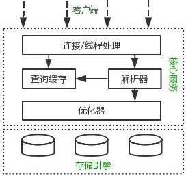

### 主要组件

[参考资料](https://mp.weixin.qq.com/s?__biz=Mzg2OTA0Njk0OA==&mid=2247485097&idx=1&sn=84c89da477b1338bdf3e9fcd65514ac1&chksm=cea24962f9d5c074d8d3ff1ab04ee8f0d6486e3d015cfd783503685986485c11738ccb542ba7&token=79317275&lang=zh_CN#rd)

#### 连接器

连接器主要和身份认证和权限相关的功能相关。主要负责用户登录数据库，进行用户的身份认证，包括校验账户密码，权限等操作。后续只要这个连接不断开，即时管理员修改了该用户的权限，该用户也是不受影响的。

#### 查询缓存(MySQL 8.0 版本后移除)

以 Key-Value 的形式缓存在内存中，Key 是查询预计，Value 是结果集。MySQL 查询不建议使用缓存，因为查询缓存失效在实际业务场景中可能会非常频繁。表中数据有更新，整个表的缓存都会失效。

#### 分析器

**第一步，词法分析**，一条 SQL 语句有多个字符串组成，首先要提取关键字，比如 select，提出查询的表，提出字段名，提出查询条件等等。做完这些操作后，就会进入第二步。

**第二步，语法分析**，主要就是判断你输入的 sql 是否正确，是否符合 MySQL 的语法。

完成这 2 步之后，MySQL 就准备开始执行了，但是如何执行，怎么执行是最好的结果呢？这个时候就需要优化器上场了。

#### 优化器

优化器的作用就是它认为的最优的执行方案去执行（有时候可能也不是最优，这篇文章涉及对这部分知识的深入讲解），比如多个索引的时候该如何选择索引，多表查询的时候如何选择关联顺序等。

可以说，经过了优化器之后可以说这个语句具体该如何执行就已经定下来。

#### 执行器
当选择了执行方案后，MySQL 就准备开始执行了，首先执行前会校验该用户有没有权限。

#### 存储引擎(插件式，可替换)
InnoDB/MyISAM


* 

## 存储引擎(InnoDB/MyISAM)

#### 1. InnoDB


| 文件名 | 作用 |
| ---- | ---- |
| .frm | 表的定义文件|
|  .idb| 数据文件|


* InnoDB 中存在表锁和行锁，不过行锁是在命中索引的情况下才会起作用
* InnoDB 支持事务，且支持四种隔离级别（读未提交、读已提交、可重复读、串行化），默认的为可重复读；而在 Oracle 数据库中，只支持串行化级别和读已提交这两种级别，其中默认的为读已提交级别。

#### 2. Myisam

| 文件名 | 作用 |
| ---- | ---- |
| .frm | 表的定义文件|
|  .MYD | 数据文件|
| .MYI | 索引文件|


* Myisam 只支持表锁
* 不支持事务
* Myisam 由于有单独的索引文件，在读取数据方面的性能很高 

#### 3. 存储结构

InnoDB 和 Myisam 都是用 B+Tree 来存储数据的。


## mysql中的各种log(redolog/undolog/binlog)

### redolog+binlog

* redolog：innoDB的实现，负责事物的持久化
* binlog: mysql统一的实现，负责归档


#### 写入顺序

1. redo log 写入，标志prepare
2. binlog写入
3. redo log 标志commit

#### 为什么要用二阶的方式

这里我们用反证法来说明下为什么要这么做？

*  **先写 redo log 直接提交，然后写 binlog**，假设写完 redo log 后，机器挂了，binlog 日志没有被写入，那么机器重启后，这台机器会通过 redo log 恢复数据，但是这个时候 bingog 并没有记录该数据，后续进行机器备份的时候，就会丢失这一条数据，同时主从同步也会丢失这一条数据。

*  **先写 binlog，然后写 redo log**，假设写完了 binlog，机器异常重启了，由于没有 redo log，本机是无法恢复这一条记录的，但是 binlog 又有记录，那么和上面同样的道理，就会产生数据不一致的情况。

#### 异常情况下怎么恢复

假设 redo log 处于预提交状态，binglog 也已经写完了，这个时候，机器挂了怎么办

* 判断 redo log 是否为commit ，如果判断是完整的，就立即提交。
* 如果 redo log 只是预提交但不是 commit 状态，这个时候就会去判断 binlog 是否完整，如果完整就提交 redo log, 不完整就回滚事务。

### redolog和undolog

事务的实现

## mysql的原子性(undolog)

* ***事务就是一系列的操作，要么全部都执行，要都不执行***

* ***先写undolog,后更新数据***

* mysql通过undolog实现事务的原子性
  
* 它是逻辑日志，当回滚日志被使用时，它只会按照日志逻辑地将数据库中的修改撤销掉看，可以理解为，我们在事务中使用的每一条 ***INSERT*** 都对应了一条*** DELETE***，每一条*** UPDATE*** 也都对应一条相反的*** UPDATE*** 语句。
  
* 回滚日志除了能够在发生错误或者用户执行 `ROLLBACK` 时提供回滚相关的信息

* 还能够在整个系统发生崩溃、数据库进程直接被杀死后，当用户再次启动数据库进程时，还能够立刻通过查询回滚日志将之前未完成的事务进行回滚，这也就需要回滚日志必须先于数据持久化到磁盘上，是我们需要先写日志后写数据库的主要原因。

  


## mysql的持久化(redolgo)

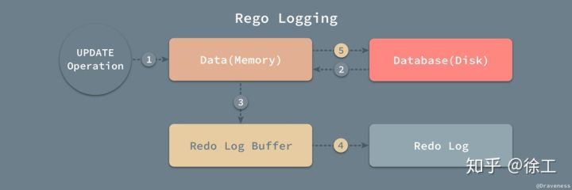

当我们在一个事务中尝试对数据进行修改时，(123是操作的时候执行，45是提交的时候执行)

1. 它会先将数据从磁盘读入内存，
2. 更新内存中缓存的数据，
3. 然后生成一条重做日志并写入重做日志缓存，
4. 当事务真正提交时，MySQL 会将重做日志缓存中的内容刷新到重做日志文件，
5. 再将内存中的数据更新到磁盘上

> 怎么保证redolog写入时候的原子性
>
> 在 InnoDB 中，重做日志都是以 512 字节的块的形式进行存储的，同时因为块的大小与磁盘扇区大小相同，所以重做日志的写入可以保证原子性，不会由于机器断电导致重做日志仅写入一半并留下脏数据。


### undolog和redolog的关系(undolog的redolog，妹的有点没看懂)

除了所有对数据库的修改会产生重做日志，***因为回滚日志也是需要持久存储的，它们也会创建对应的重做日志***，在发生错误后，数据库重启时会从重做日志中找出未被更新到数据库磁盘中的日志重新执行以满足事务的持久性。


到现在为止我们了解了 MySQL 中的两种日志，回滚日志（undo log）和重做日志（redo log）；在数据库系统中，事务的原子性和持久性是由事务日志（transaction log）保证的，在实现时也就是上面提到的两种日志，前者用于对事务的影响进行撤销，后者在错误处理时对已经提交的事务进行重做，它们能保证两点：

1. 发生错误或者需要回滚的事务能够成功回滚（原子性）；
2. 在事务提交后，数据没来得及写会磁盘就宕机时，在下次重新启动后能够成功恢复数据（持久性）；

在数据库中，这两种日志经常都是一起工作的，我们**可以**将它们整体看做一条事务日志，其中包含了事务的 ID、修改的行元素以及修改前后的值。


## mysql事务的隔离性(事务隔离级别)

| 隔离级别 | 脏读 | 不可重复读 | 幻读 |
| ---- | ---- | ---- | ---- |
| 未提交读（Read uncommitted） | 可能 | 可能 | 可能 |
| 已提交读（Read committed） | 不可能 | 可能 | 可能 |
| 可重复读（Repeatable read） | 不可能 | 不可能 | 可能 |
| 可串行化（Serializable ）| 不可能 | 不可能 | 不可能|
### 事务过程中可能出现的问题
#### 脏读
读取到别的事务未提交的数据，因为这些数据之后可能会被回滚
#### 不可重复读
事务中第一次读取和第二次读取同一个值，结果不一样。这个问题在read commited中还是会出现，因为本事务处理过程中，可能会遇到别的事务修改了某值，并且提交了，导致第一次和第二次读取结果不一样。
#### 幻读
第一个事务对一个表中的数据进行了修改，这种修改涉及到表中的全部数据行。同时，第二个事务也修改这个表中的数据，这种修改是向表中插入一行新数据。那么，以后就会发生操作第一个事务的用户发现表中还有没有修改的数据行，就好象发生了幻觉一样

### 事务隔离级别的实现

#### innoDB的mvcc(实现数据的非阻塞读)

MVCC的全称是“多版本并发控制”。这项技术使得InnoDB的事务隔离级别下执行一致性读操作有了保证，换言之，就是为了查询一些正在被另一个事务更新的行，并且可以看到它们被更新之前的值。`保证了数据的非阻塞读`。

MVCC目的是并发访问(读或写)数据库时，对正在事务内处理的数据做多版本的管理。以达到用来避免写操作的堵塞，从而引发读操作的并发问题。


#### mvcc的基本概念

innoDB维护了一套快照数据，

##### 插入数据规则：

规则：插入时候，在数据行版本号增加当前系统全局事务ID号


##### 删除
规则： 在删除版本号增加当前系统全局事务ID号

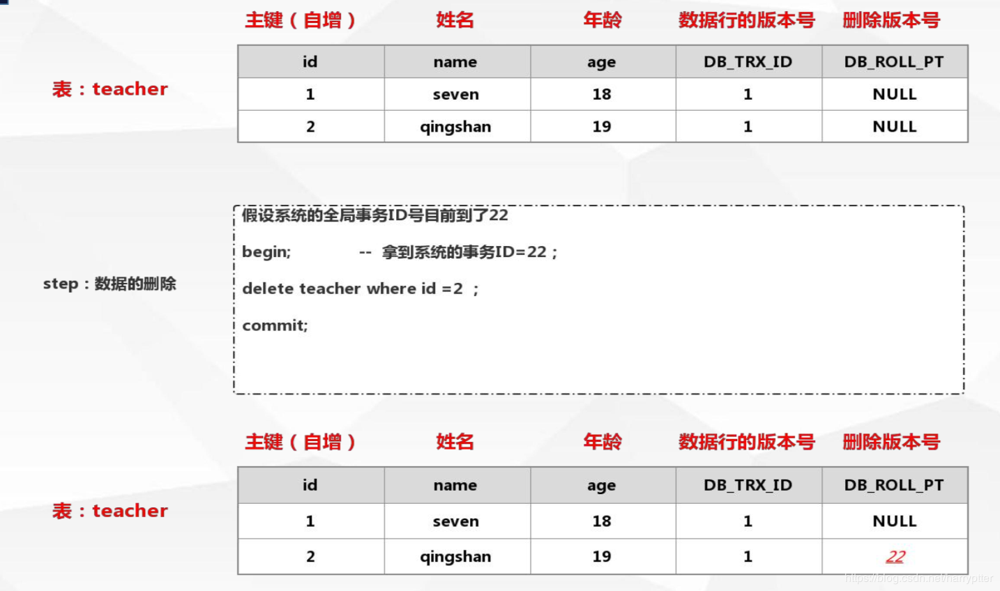

##### 修改

先做命中的数据行的复制,然后间原行数据的删除版本号设置为当前全局事务ID，新的行数据的数据行版本号也设置为当前全局事务ID，删除版本号为NULL

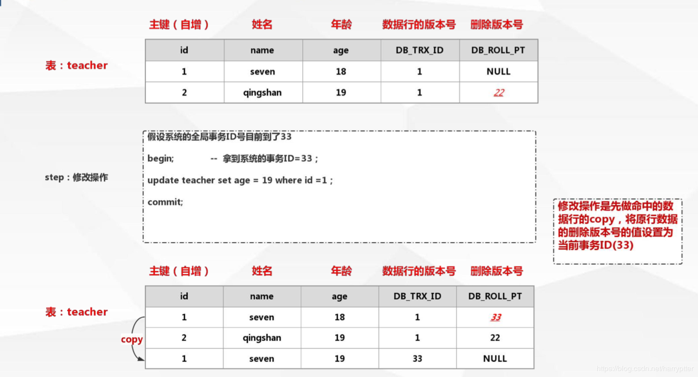

#####  查找

规则：

1. 寻找数据行版本号小于或者等于当前全局事务ID（这样可以确认事务读取的行在开始前已经存在，或者是事务自身插入或者修改的），
2. 查找删除版本号为NULL，或者被标记删除了，但是删除操作的事务Id大于当前事务版本号的ID（即确保读取出来的行在此事务开启之前没有被删除）


> 读到这里，想想到这里，好像并不能实现事务的隔离级别，那下面还有两个概念需要看
>
> 1. 事务的可见性
> 2. 事务快照

#### 事务快照 readview

[参考pg的实现方式，感觉mysql应该也差不多](http://mysql.taobao.org/monthly/2017/10/01/)

> repeat read隔离级别下，在每个事务开始的时候，会将当前系统中的所有的活跃事务拷贝到一个列表中(read view)
> read commited隔离级别下，在每个语句开始的时候，会将当前系统中的所有的活跃事务拷贝到一个列表中(read view)

```
ReadView的创建
```

- 查看当前所有的未提交并活跃的事务，存储在数组中
- 选取未提交并活跃的事务中最小的XID，记录在快照的xmin中
- 选取所有已提交事务中最大的XID，加1后记录在xmax中
- 根据不同的情况，赋值不同的satisfies，创建不同的事务快照

```
可见性的判断
```

- 当事务ID小于xmin的事务表示已经被提交，其涉及的修改对当前快照可见
- 事务ID大于或等于xmax的事务表示正在执行，其所做的修改对当前快照不可见
- 事务ID处在 [xmin, xmax)区间的事务, 需要结合`活跃事务列表`与事务提交日志CLOG，判断其所作的修改对当前快照是否可见，即SnapshotData中的satisfies。

#### 当前读和快照读(快照读基于上面说的事务快照和undoLog)

- 一致非锁定读，也可以称为快照读，其实就是普通的读取即普通SELECT语句。
- 既然是快照读，故 SELECT 的时候，会生成一个快照。
- 生成快照的时机：事务中第一次调用SELECT语句的时候才会生成快照，在此之前事务中执行的update、insert、delete操作都不会生成快照。
- 不同事务隔离级别下，快照读的区别： 
  - READ COMMITTED 隔离级别下，每次读取都会重新生成一个快照，所以每次快照都是最新的，也因此事务中每次SELECT也可以看到其它已commit事务所作的更改；
  - REPEATED READ 隔离级别下，快照会在事务中第一次SELECT语句执行时生成，只有在本事务中对数据进行更改才会更新快照，因此，只有第一次SELECT之前其它已提交事务所作的更改你可以看到，但是如果已执行了SELECT，那么其它事务commit数据，你SELECT是看不到的。
  - Serializable 使用锁来实现
- 当前读：读取数据库中最新的数据(select ...... for update )

> 到这里，加入可见性的逻辑，是不是完全实现了mysql的事务隔离级别了


## Mysql中的锁


### mysql锁的类型


### **共享锁与排他锁**

- 共享锁（读锁）：其他事务可以读，但不能写。
- 排他锁（写锁） ：其他事务不能读取，也不能写。


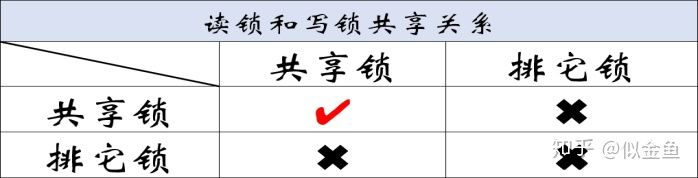


### 行锁和表锁


|锁类型 | 支持的存储引擎 |
| ---- | ---- |
| 表锁| MyISAM/MEMORY /InnoDB/BDB|
| 行锁 | InnoDB|
| 页面锁 | BDB|

### InnoDB锁的实现(行锁和间隙锁)

* InnoDB 行锁是通过给索引上的索引项加锁来实现的，InnoDB 这种行锁实现特点意味着：只有通过索引条件检索数据，InnoDB 才使用行级锁，否则，InnoDB 将使用表锁！

* 当我们用范围条件而不是相等条件检索数据，并请求共享或排他锁时，InnoDB会给符合条件的已有数据记录的索引项加锁；对于键值在条件范围内但并不存在的记录，叫做“间隙（GAP)”，InnoDB也会对这个“间隙”加锁，这种锁机制就是所谓的间隙锁（Next-Key锁）。

* **InnoDB使用间隙锁的目的：**[参考地址](https://zhuanlan.zhihu.com/p/29150809)

  1. 防止幻读，以满足相关隔离级别的要求；
  2. 满足恢复和复制的需要：

  MySQL 通过 BINLOG 录入执行成功的 INSERT、UPDATE、DELETE 等更新数据的 SQL 语句，并由此实现 MySQL 数据库的恢复和主从复制。MySQL 的恢复机制（复制其实就是在 Slave Mysql 不断做基于 BINLOG 的恢复）有以下特点：

  一是 MySQL 的恢复是 SQL 语句级的，也就是重新执行 BINLOG 中的 SQL 语句。

  二是 MySQL 的 Binlog 是按照事务提交的先后顺序记录的， 恢复也是按这个顺序进行的。

  由此可见，MySQL 的恢复机制要求：在一个事务未提交前，其他并发事务不能插入满足其锁定条件的任何记录，也就是不允许出现幻读。


### 意向锁
为了允许行锁和表锁共存，实现多粒度锁机制，InnoDB 还有两种内部使用的意向锁（Intention Locks），这两种意向锁都是**表锁**：

- 意向共享锁（IS）：事务打算给数据行加行共享锁，事务在给一个数据行加共享锁前必须先取得该表的 IS 锁。
- 意向排他锁（IX）：事务打算给数据行加行排他锁，事务在给一个数据行加排他锁前必须先取得该表的 IX 锁。

**锁模式的兼容情况：**

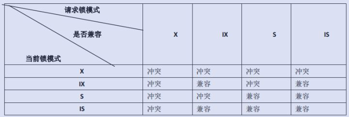

（如果一个事务请求的锁模式与当前的锁兼容， InnoDB 就将请求的锁授予该事务； 反之， 如果两者不兼容，该事务就要等待锁释放。）

## 索引


### mysql join的实现(如何在交叉查询的时候做优化)

* 被驱动表的关联数据上有索引的情况下，优先使用**`Index Nested-Loop Join`**

* 无法使用**`Index Nested-Loop Join`**的时候，默认使用**Block Nested-Loop Join**

  

#### join的时候注意事项
1. 永远用小结果集驱动大结果集(其本质就是减少外层循环的数据数量)
2. 为匹配的条件增加索引(减少内层表的循环次数)
3. 增大join buffer size的大小（一次缓存的数据越多，那么外层表循环的次数就越少）
4. 减少不必要的字段查询（字段越少，join buffer 所缓存的数据就越多，外层表的循环次数就越少）


####  **Simple Nested-Loop Join（简单的嵌套循环连接）**

简单来说嵌套循环连接算法就是一个双层for 循环 ，通过循环外层表的行数据，逐个与内层表的所有行数据进行比较来获取结果，当执行select * from user tb1 left join level tb2 on tb1.id=tb2.user_id

时，我们会按类似下面代码的思路进行数据匹配：

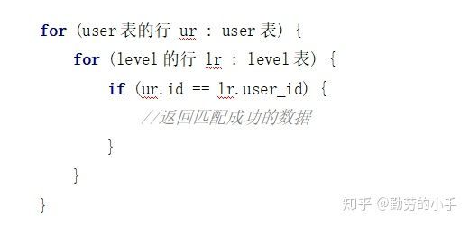

**整个匹配过程会如下图：**


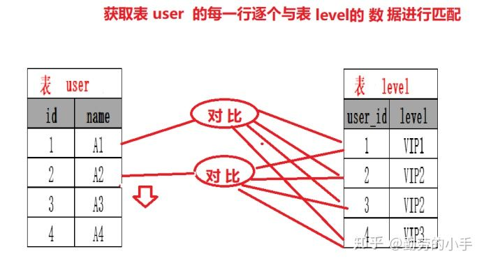

**特点：**

Nested-Loop Join 简单粗暴容易理解，就是通过双层循环比较数据来获得结果，但是这种算法显然太过于粗鲁，如果每个表有1万条数据，那么对数据比较的次数=1万 * 1万 =1亿次，很显然这种查询效率会非常慢。

当然mysql 肯定不会这么粗暴的去进行表的连接，所以就出现了后面的两种对Nested-Loop Join 优化算法，在执行join 查询时mysql 会根据情况选择 后面的两种优join优化算法的一种进行join查询。

####  **Index Nested-Loop Join（索引嵌套循环连接）**

Index Nested-Loop Join其优化的思路 主要是为了减少内层表数据的匹配次数， 简单来说Index Nested-Loop Join 就是通过外层表匹配条件 直接与内层表索引进行匹配，避免和内层表的每条记录去进行比较， 这样极大的减少了对内层表的匹配次数，从原来的匹配次数=外层表行数 * 内层表行数,变成了 外层表的行数 * 内层表索引的高度，极大的提升了 join的性能。

**案例：**

如SQL：select * from user tb1 left join level tb2 on tb1.id=tb2.user_id

当level 表的 user_id 为索引的时候执行过程会如下图：

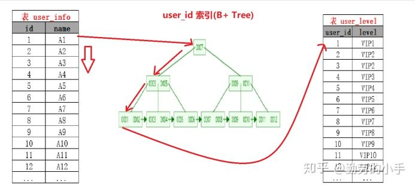

**注意：使用Index Nested-Loop Join** **算法的前提是匹配的字段必须建立了索引。**

#### **Block Nested-Loop Join（缓存块嵌套循环连接）**

**Block Nested-Loop Join** 其优化思路是减少外层表的循环次数，**Block Nested-Loop Join** 通过一次性缓存多条数据，把参与查询的列缓存到join buffer 里，,然后拿join buffer里的数据批量与内层表的数据进行匹配，从而减少了外层循环的次数，当我们不使用**Index Nested-Loop Join**的时候，默认使用的是**Block Nested-Loop Join**。

**案例：**

如SQL：select * from user tb1 left join level tb2 on tb1.id=tb2.user_id

当level 表的 user_id 不为索引的时候执行过程会如下图：

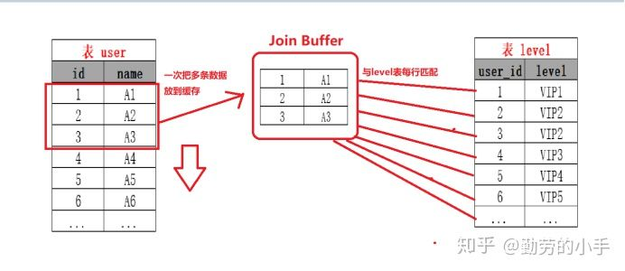


## 为什么使用B+tree存储数据

需要从数据存储开始讲

1. 数据存储在磁盘上，磁盘分为 盘面 >>>> 柱面 >>> 扇区

2. 从磁盘上操作请求（读 / 写）完成过程由三个动作组成：(磁盘读取慢的原因)

   - A. 寻道（时间）：磁头移动定位到指定磁道。
   - B. 旋转延迟（时间）：等待指定扇区从磁头下旋转经过。
   - C. 数据传输（时间）：数据在磁盘与内存之间的实际传输。
   
3. 根据计算机科学中著名的局部性原理，每次磁盘读取会预读一部分，。预读的长度一般为页（Page）的整数倍。(`提高io效率的方式`)
  1. 一个数据被用到时，其附近的数据一般来说也会被马上使用。
  2. 程序运行期间所需要的数据通常比较集中。
  3. 由于磁盘顺序读取的效率很高（不需要寻道时间，只需要很少的旋转时间），因此对于具有局部性的程序来说，预读可以提高 I/O 效率。
  
4. 每个存储块称为一页（在许多操作系统中，页的大小通常为 4k），主存和磁盘以页为单位交换数据，当程序要读取的数据不在主存中时，会触发一个缺页异常。

上面讲了数据从磁盘到内存的过程，那为什么要用b+tree呢？
b+tree是N叉树(相比红黑树而言，非叶子节点能存放更多的索引)，节点存放索引，不存放数据，那么非叶子节点能在相同容量的情况下，存放更多的索引内容(相比于b-tree而言)，每次磁盘load到内存中后能容易查到数据(通过聚合索引)。


## 执行计划怎么看

[执行计划解释](https://www.cnblogs.com/LQBlog/p/10723158.html)

### 执行计划查询方式
EXPLAIN关键字

```
#查出订单状态存在1010的订单的所有行项目信息
EXPLAIN select * from   sl_sales_bill_copy1 lb
 join sl_sales_bill_head_copy1 lh on lh.SALES_BILL_NO = lb.SALES_BILL_NO 
where lb.SALES_BILL_NO in(select ls.SALES_BILL_NO from order_status ls where ls.status_code=1010)  
```

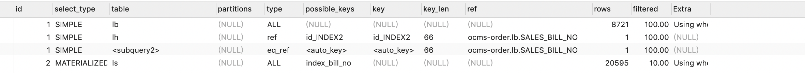

### id

执行顺序 值越大的优先执行 如果相同则根据顺序来定,所以可以看出来，上面的sql最里面的ls表被先查询

### select_type

查询的类型，主要是用于区分普通查询、联合查询、子查询等复杂的查询

1. SIMPLE：简单的select查询，查询中不包含子查询或者union
2. PRIMARY：查询中包含任何复杂的子部分，最外层查询则被标记为primary
3. SUBQUERY：在select 或 where列表中包含了子查询
4. DERIVED：在from列表中包含的子查询被标记为derived（衍生），mysql或递归执行这些子查询，把结果放在零时表里
5. UNION：若第二个select出现在union之后，则被标记为union；若union包含在from子句的子查询中，外层select将被标记为derived
6. UNION RESULT：从union表获取结果的select

### type


查询的指标 结果从优劣从优到劣排序为

system > const > eq_ref > ref > fulltext > ref_or_null > index_merge > unique_subquery > index_subquery > range > index > ALL

**一般来说，好的sql查询至少达到range级别，最好能达到ref**

#### **system:**

const的特例平时无法重现 可以忽略 

#### **const:**(primary key 或者 unique索引)

表示通过扫描索引 扫描一行就找到了数据 const用于比较primary key 或者 unique索引。因为只需匹配一行数据，所有很快。如果将主键置于where列表中，mysql就能将该查询转换为一个const 

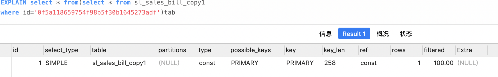

####  eq_ref(非驱动表关联字段为主键或者唯一索引查找时)

非驱动表关联字段为主键或者唯一索引查找时

lb.id为主键索引

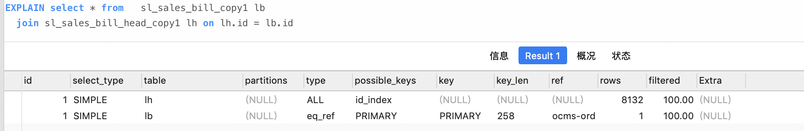

如果where条件中查询非驱动表为非唯一索引或者主键索引则会降为ref

#### ref(非驱动表关联字段为非唯一索引)

非驱动表关联字段为非唯一索引

lh.SALES_BILL_NO为非唯一索引

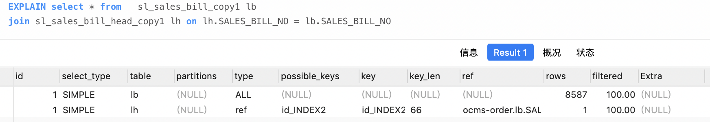

#### range(索引字段上的范围查询)

表示范围查询 常见于between 和>, >=,<, <= 前提是字段有建立btree索引

 count未建立索引执行计划

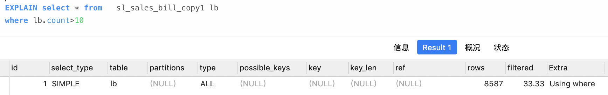

count建立索引后

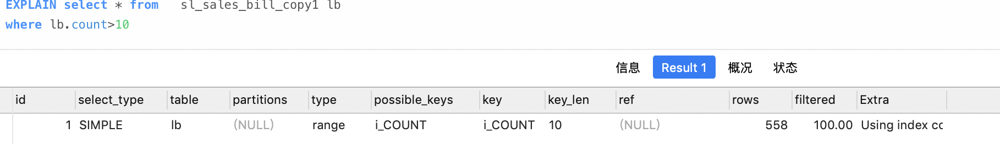

#### index(全索引查询)

与ALL类似 只是index全表扫描扫描的是索引页而不是数据行

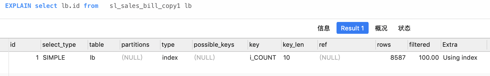

因为我们id做了索引 所以只需要去索引页里面取出所有id数据就好了

#### **ALL**(全表查询)

全表扫描

### possible_keys
指出MySQL能使用哪个索引在表中找到行，查询涉及到的字段上若存在索引，则该索引将被列出，但不一定被查询使用

### key
实际使用的索引，如果为NULL，则没有使用索引

### key_len
表示索引中使用的字节数，查询中使用的索引的长度（最大可能长度），并非实际使用长度，理论上长度越短越好。key_len是根据表定义计算而得的，不是通过表内检索出的

### ref
显示索引的那一列被使用了，如果可能，是一个常量const。

### rows
根据表统计信息及索引选用情况，大致估算出找到所需的记录所需要读取的行数

### Extra
包含不适合在其他列中显示但十分重要的额外信息

#### Using index 

表示使用了覆盖索引,覆盖索引:表示索引包含了返回和查询的所有列 而不需要读取文件

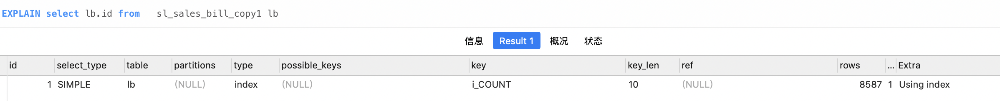

 

 如果查询和返回返回非索引字段

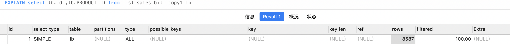

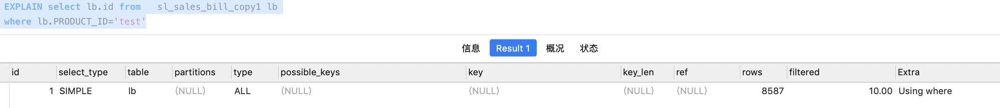

#### Using where

Using where的作用只是提醒我们MySQL将用where子句来过滤结果集

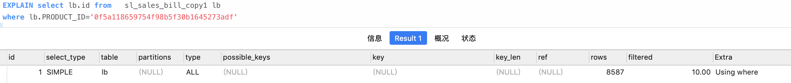

#### Using temporary

表示mysql需要临时表转存数据 常见于 group by使用非索引字段

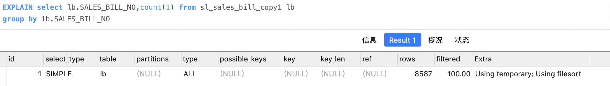

#### Using filesort
表示使用了非索引字段排序，因为索引字段的排序已经在索引里面了

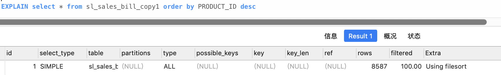


### 什么情况下会导致索引失效

1. 使用or的时候，所有的条件都必须有索引。如果一个没有的话，就会导致索引失效

2. 复合索引的情况，没有最左匹配的情况下，无法使用索引

3. like查询是以%开头。也是最左匹配的意思

   

4. 数据类型隐式转化的情况

   

5. 对索引字段进行计算会导致索引失效。错误的例子：select * from test where id-1=9; 正确的例子：select * from test where id=10; 
6. ,not in ,not exist. 
7. B-tree索引 is null不会走,is not null会走,位图索引 is null,is not null 都会走 
8. 联合索引 is not null 只要在建立的索引列（不分先后）都会走, in null时 必须要和建立索引第一列一起使用,当建立索引第一位置条件是is null 时,其他建立索引的列可以是is null（但必须在所有列 都满足is null的时候）,或者=一个值； 当建立索引的第一位置是=一个值时,其他索引列可以是任何情况（包括is null =一个值）,以上两种情况索引都会走。其他情况不会走。
9. 7和8没遇见过