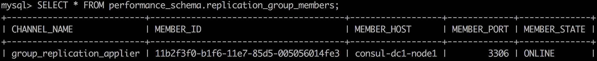
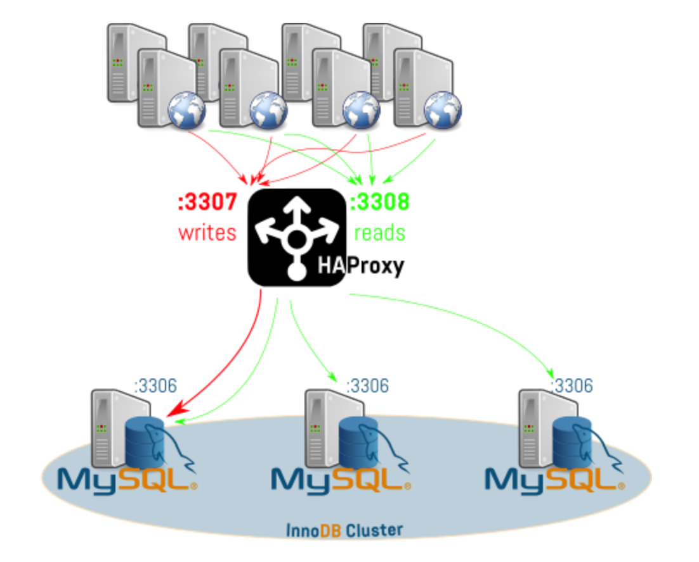

# MGR和HAProxy实现高可靠性MySQL集群

 五月 24, 2019 0条评论 507次阅读 0人点赞

## 问题的提出

使用MySQl Utilities可以很好地解决MySQL复制中的宕切（Failover）问题。但是实际上，一个真正的高可用数据库环境要解决的问题需要包括下面这些：
\1. 主从数据及时同步，确保数据无丢失
\2. 自动宕切，无需干预
\3. 应用层无感知，不需要随着数据库拓扑环境的动态改变做修改
\4. 可扩展性，节点的自动加入和移除
\5. 负载均衡

本文就从这几个方面详细说明MySQL异步复制、半同步复制的问题，以及MySQL Group Replication（组复制、MRG）和HAProxy是如何解决这些问题的

## 异步复制架构

异步复制的原理以及配置方式，在这篇“[【博文】](http://blog.csdn.net/hguisu/article/details/7325124)”中有详细介绍，常见的复制架构有以下几种情况

### 主从复制

主从复制，一主多从，主库提供读写功能，从库提供只读功能。当一个事务在master 提交成功时，会把binlog文件同步到从库服务器上落地为relay log给从服务器执行。这个过程的原理图如图所示：

这个过程主库是不考虑从库是否有接收到binlog文件，以及是否执行成功。有可能出现这种情况，当主库commit一个事务后，数据库发生宕机，刚好它的binlog还没来得及传送到slave端，这个时候选任何一个从服务器都会丢失这个事务，造成数据丢失情况

### 级联架构

为了缓解一主多从架构中，多个从节点从主节点同步binlog对主节点造成的压力，也可以采用级联架构，也就是一个从节点再挂一个或者多个从节点。
当然这种架构和单纯的主从复制架构问题是一样的，级联层次越多，丢数据的可能性也就越大

### 多主架构

为了缓解主从复制和级联架构中，主节点的写压力，可以配置多个主节点，每个主节点都是可读写节点，通过binlog同步到其他节点。不过这个架构，除了有主从复制的问题之外，还有一个冲突的问题，也就是如果多个主节点同时更新同一个主键的记录时会造成冲突
最典型的例子，如果不做特殊配置，两个主节点的并发事务会生成相同的自增主键，事务提交时肯定会出错导致一个失败

## 半同步复制

为了避免出现主从数据不一致的情况，MySQL引入了半同步复制，添加多了一个从库反馈机制，主库执行完事务后，同步binlog给从库，从库ack反馈接收到binlog，主库提交commit，反馈给客户端，释放会话；这个过程的原理图如图所示：

但是半同步复制也并不完美，主要有以下几个问题：
\1. 写压力全部在主节点上（当然有的场景这个不是个大问题）
\2. 主节点宕机之后，需要手工选择主节点，并在其他从节点上执行change master操作
\3. 即使主节点收到ack之后再提交，也不能保证从节点在应用relay log时没有问题

## 组复制原理

组复制正是为了解决异步复制和半同步复制存在的问题而提出来的。

### 1. 状态机复制和Paxos协议

#### 状态机复制原理

- 所有的服务器初始化为相同的状态
- 同一状态下，按照同样的顺序接受同样的输入，产生完全相同的输出状态

#### Paxos协议

MySQL Group Replication实现了一个基于Paxos协议的原子广播系统。每个节点上有一个广播模块接收用户的请求。广播模块之间进行通讯，对请求进行全局排序。最终每个节点的广播模块上都会有一个顺序完全一样的请求队列。广播模块将队列中的请求按照顺序发送给DB执行，符合状态机复制的要求（按照同样的顺序执行同样的操作）。因此所有DB的数据保持一致。
原子广播的原理如图所示：

### 2. 冲突检测

Group Replication广播的不是原始事务语句而是事务的Binlog Events。因此广播模块是嵌在事务执行流程中的，而不需要和客户端交互。当事务语句执行完准备提交时，Group Replication会捕捉到事务的Binlog Events然后进行原子广播。先执行，再全局排序的方法会导致冲突。即当前事务排在另一个修改了同一行数据的事务的后面，但是执行却在前面。因此需要做冲突检测。

事务在每个节点上都需要在Certify模块进行冲突检测，不管是本地事务还是远程事务。冲突检测的过程是在每个模块上单独进行的，不需要在各个节点之间交互。根据状态机复制的原理，所有节点上的事务都是按照同样的顺序做的冲突检测，因此任何一个事务在所有节点上的冲突检测结果都是相同的。如果事务在一个节点上认证成功了，那么在其他节点上肯定也是成功的，反之亦然。

冲突检测的原理其实也比较简单：
– 事务是否修改了同样的数据（以行为单位，通过主键识别）。
– 是否是同时修改的。通过事务执行时的数据库快照版本来判定。数据库的快照是用GTID SET来标识的。事务提交前从全局变量gtid_executed中获取GTID SET。这个GTID SET就是代表了当前事务在提交前，数据库中已经执行了的GTIDs。也即是当前事务提交前，数据库的快照版本。数据库的快照版本会随着事务的Binlog Events一起广播到其他的节点上，用来做冲突检测。
举几个例子：
\1. T1和T2分别修改不同的主键，不冲突
\2. T1和T2修改相同的主键，但是T1修改的快照版本是v1，T2修改的快照版本是v2，且T1排在T2前面，则不冲突，最终结果是T2执行的结果
\3. T1和T2修改相同的主键，且修改的快照版本相同，则冲突，排在前面的事务Certify通过，排在后面的事务则丢弃
\4. T1和T2修改相同的主键，T1排在T2前面，但是修改的版本却大于T2的版本，则冲突，T1接受，T2丢弃

### 3. 同步机制

根据MySQL官网文档，Group Replication的同步方式可以用下面的示意图表示

这是一个一致性更强的同步机制，当所有节点冲突检测通过之后同步进行提交。

### 4. 事务完整执行流程

将相关事务的日志写入到本地通道之后，后面的所有任务，例如将本地事务日志利用Paxos协议进行全局一致性广播，验证事务冲突等，全部有MRG来完成，用户线程进入等待状态，当有验证结果之后，被唤醒并根据验证结果决定是提交还是回滚

### 5. 故障检测和自动宕切

Group Replication中有一个故障检测（ Failure Detection）机制，会提供某些节点可能死掉的信息，然后广播给同一个Group的各个节点，如果确定宕机，那么组内的节点就会与它隔离开来，该节点即无法同步其他节点的传送过来的binlog events，也无法执行任何本地事务。

该机制不仅仅隔离故障成员，在单主模式下，如果主节点宕机，还可以根据规则（根据成员ID升序排列）自动选择一个从节点作为新的主节点。

当然故障检测机制依赖的成员服务（membership service），不仅仅能进行故障检测，也能够检测新成员的加入，新成员加入之后会自动同步所有缺失的数据

## 组复制环境的搭建

[MySQL官网](https://dev.mysql.com/doc/refman/5.7/en/group-replication-configuring-instances.html \”MySQL官网\”)对组复制环境的搭建有详细的描述。本文简单描述一下搭建的步骤

### 1. 配置基本要求

如下配置建议写在配置文件中，以MySQL5.7.19为例，配置文件的位置在
/etc/mysql/mysql.conf.d/mysqld.cnf
注意节点ID和本节点IP需要根据情况进行修改

| 12345678910111213141516171819202122232425262728 | #为每个节点设定唯一id  server_id=1  #开启全局事务id  gtid_mode=ON   enforce_gtid_consistency=ON  #将复制的元数据存到系统表中，而不是文件中  master_info_repository=TABLE  relay_log_info_repository=TABLE  #打开binlog，行复制并且disable binlog checksum  binlog_checksum=NONE  log_slave_updates=ON  log_bin=binlog  binlog_format=ROW   #对每个事务获取write set，并且用XXHASH64算法获取hash值  transaction_write_set_extraction=XXHASH64  #group的唯一名字  loose-group_replication_group_name=\"aaaaaaaa-aaaa-aaaa-aaaa-aaaaaaaaaaaa\"  #节点启动的时候不要自动启动组复制  loose-group_replication_start_on_boot=off  #本节点的IP地址和端口，注意该端口是组内成员之间通信的端口，而不是MySQL对外提供服务的端口  loose-group_replication_local_address= \"127.0.0.1:24901\"  #种子节点的IP和端口号，新成员加入到集群的时候需要联系种子节点，启动集群的节点不使用该选项。  loose-group_replication_group_seeds= \"127.0.0.1:24901,127.0.0.1:24902,127.0.0.1:24903\"  #是否启动集群  loose-group_replication_bootstrap_group= off  注意：该选项任何时候只能用于一个节点，通常情况下是启动集群的时候使用，启动之后需要关闭该选项。否则使用该选项启动多个节点，就会造成同名的多个Group，认为制造脑裂的场景。 |
| ----------------------------------------------- | ------------------------------------------------------------ |
|                                                 |                                                              |

### 2. 创建复制用户

在上面配置文件修改完成之后，重新启动MySQL服务，连接到服务器，并执行以下脚本创建复制用户

| 123456 | mysql&gt; SET SQL_LOG_BIN=0;mysql&gt; CREATE USER rpl_user@'%' IDENTIFIED BY 'password';mysql&gt; GRANT REPLICATION SLAVE ON *.* TO rpl_user@'%';mysql&gt; FLUSH PRIVILEGES;mysql&gt; SET SQL_LOG_BIN=1; |
| ------ | ------------------------------------------------------------ |
|        |                                                              |

然后在group_replication_recovery这复制渠道中使用新创建的用户

| 12   | mysql&gt; CHANGE MASTER TO MASTER_USER='rpl_user', MASTER_PASSWORD='password' FOR CHANNEL 'group_replication_recovery'; |
| ---- | ------------------------------------------------------------ |
|      |                                                              |

### 3. 安装组复制插件

使用如下命令安装组复制插件
mysql> INSTALL PLUGIN group_replication SONAME ‘group_replication.so’;

然后可以使用命令show plugins查看插件的安装状态

| 12   | mysql&gt; SHOW PLUGINS; |
| ---- | ----------------------- |
|      |                         |

……

### 4. 启动集群

使用如下命令启动集群，不过一定要注意group_replication_bootstrap_group这个选项只能在第一个启动该集群的节点上打开，启动集群会后需要关闭，否则会造成人为的脑裂，也就是会有多个同名的Group启动

| 1234 | SET GLOBAL group_replication_bootstrap_group=ON;START GROUP_REPLICATION;SET GLOBAL group_replication_bootstrap_group=OFF; |
| ---- | ------------------------------------------------------------ |
|      |                                                              |

查看集群中成员状态

| 12   | mysql&gt; SELECT * FROM performance_schema.replication_group_members; |
| ---- | ------------------------------------------------------------ |
|      |                                                              |

为了验证后续步骤新加入节点的数据恢复功能，这个时候就可以在主节点上插入一些数据了

| 12345 | mysql&gt; CREATE DATABASE test;mysql&gt; USE test;mysql&gt; CREATE TABLE t1 (c1 INT PRIMARY KEY, c2 TEXT NOT NULL);mysql&gt; INSERT INTO t1 VALUES (1, 'Luis'); |
| ----- | ------------------------------------------------------------ |
|       |                                                              |

### 5. 增加更多的集群节点

按照上面同样的步骤，包括修改配置文件，创建用户，安装插件，启动组复制就可以增加新节点到集群中。务必注意只有主节点才可以启用group_replication_bootstrap_group选项。

同样可以使用SQL script来查看成员状态
mysql> SELECT * FROM performance_schema.replication_group_members;

并且使用脚本来查看数据同步的情况
mysql> SELECT * FROM test.t1;

至此，一个单主模式的MySQL组复制环境就已经搭建起来了

### 6. 故障检测和自动宕切

步骤5实际上已经演示了MySQL组复制的弹性和可扩展性，新节点自动加入，下面的步骤演示MySQL组复制的故障检测和自动宕切能力。

1. 使用下面的命令查看当前集群的成员和集群的主节点

   mysql> SELECT * FROM performance_schema.replication_group_members;

   mysql> select * from performance_schema.global_status where variable_name like ‘%group%’;

   在我的环境下面，上述脚本的执行结果如图所示：

   

   在该执行结果中，node1是当前集群主节点。

   

2. 停止node1上的MySQL service，再次查看成员状态时，可以看到node3已经变成了主节点了。

3. 在node3上写入数据，然后重新启动node1 MySQL Service, 并加入集群。这个时候node1变成从节点，并且自动获得了下线期间的数据

4. 停止node2 MySQL service，这个时候只是成员状态有变化

## HAProxy

前文提到的高可用环境的几个要求，包括自动同步无数据丢失、可扩展性、自动宕切等，MySQL组复制已经能很好地解决了。但是仍然还有几个问题没法单独通过MySQL 组复制来达成，就是应用层自动宕切和负载均衡。当主节点宕机之后，应用层要能自动访问新的主节点，并且只读负载要均衡地分布在各个可用节点之间。

这个时候HAProxy就闪亮登场了。其提供高可用性、负载均衡，以及基于TCP和HTTP的应用程序代理，完整的HAProxy的实现原理和配置方式超出了本文的范围，仅仅简单描述一下利用HAPxoxy实现MySQL 组复制环境的宕切和负载均衡的配置。整体架构图如下图所示：

HAProxy的配置文件如下

| 12345678910111213141516171819202122232425262728 | /etc/haproxy/haproxy.cfg   frontend mysql-gr-front_write  bind *:3307  mode tcp  default_backend mysql-gr-back_write   backend mysql-gr-back_write  mode tcp  balance leastconn  option httpchk  server mysql1 10.206.131.63:3306 check port 6446 inter 1000 rise 1 fall 2 on-marked-up shutdown-backup-sessions  server mysql2 10.206.131.132:3306 check port 6446 inter 1000 rise 1 fall 2 backup  server mysql3 10.206.131.156:3306 check port 6446 inter 1000 rise 1 fall 2 backup   frontend mysql-gr-front_read  bind *:3308  mode tcp  default_backend mysql-gr-back_read   backend mysql-gr-back_read  mode tcp  balance leastconn  option httpchk  server mysql1 10.206.131.63:3306 check port 6447 inter 1000 rise 1 fall 2  server mysql2 10.206.131.132:3306 check port 6447 inter 1000 rise 1 fall 2  server mysql3 10.206.131.156:3306 check port 6447 inter 1000 rise 1 fall 2 |
| ----------------------------------------------- | ------------------------------------------------------------ |
|                                                 |                                                              |

为了实现上述HAPxoxy检查，需要实现两个不同的xinetd服务(注意inetd服务需要部署在每个MySQL节点上，而HAProxy是部署在一台单独的服务器上)，用于检查MySQL组成员的状况，并决定那个节点是可读写节点，哪些节点是只读节点。完整的check脚本请参考[github](https://github.com/lefred/mysql_gr_routing_check \”github\”)

下面是对xinetd服务的设定
/etc/xinetd.d/mysql_gr_routing_check_write

| 1234567891011121314151617 | # default: on# description: check to see if the node is a viable routing candidateservice mysql_gr_routing_check_write{disable = noflags = REUSEsocket_type = streamport = 6446wait = nouser = mysqlserver = /usr/local/bin/mysql_gr_routing_check.shserver_args = 100 writelog_on_failure += USERIDonly_from = localhost 10.206.131.0/24per_source = UNLIMITED} |
| ------------------------- | ------------------------------------------------------------ |
|                           |                                                              |

/etc/xinetd.d/mysql_gr_routing_check_read

| 1234567891011121314151617 | # default: on# description: check to see if the node is a viable routing candidateservice mysql_gr_routing_check_read{disable = noflags = REUSEsocket_type = streamport = 6447wait = nouser = mysqlserver = /usr/local/bin/mysql_gr_routing_check.shserver_args = 100 readlog_on_failure += USERIDonly_from = localhost 10.206.131.0/24per_source = UNLIMITED} |
| ------------------------- | ------------------------------------------------------------ |
|                           |                                                              |

最后还要更新/etc/services中的设定

| 123  | mysql_gr_routing_check_write 6446/tcp # MySQL Group Replicationmysql_gr_routing_check_read 6447/tcp # MySQL Group Replication |
| ---- | ------------------------------------------------------------ |
|      |                                                              |

紧接着可以通过命令行来验证一下xinetd服务配置是否正确

检查可读写服务：

| 123456789101112 | [root@mysql1 bin]# telnet 10.206.131.63 6446Trying 10.206.131.63...Connected to 10.206.131.63.Escape character is \'^]\'.HTTP/1.1 200 OKContent-Type: text/plainConnection: closeContent-Length: 40 Group Replication member is a viable routing candidate for write.Connection closed by foreign host. |
| --------------- | ------------------------------------------------------------ |
|                 |                                                              |

检查只读服务：

| 123456789101112 | [root@mysql1 bin]# telnet 10.206.131.63 6447Trying 10.206.131.63...Connected to 10.206.131.63.Escape character is \'^]\'.HTTP/1.1 200 OKContent-Type: text/plainConnection: closeContent-Length: 40 Group Replication member is a viable routing candidate for read.Connection closed by foreign host. |
| --------------- | ------------------------------------------------------------ |
|                 |                                                              |

至此，HAProxy宕切和负载均衡都已经设定完毕，下面可以来从应用层面检查一下
\1. 首先用mysql链接HAProxy节点
mysql -h10.206.131.83 -P3307 -uroot -p
\2. 查看当前所连接的主机
mysql> select @@hostname;
可以看到该脚本一直返回同一个可读写节点
\3. 再次连接到HAproxy的只读端口，并查看所连接的主机
mysql -h10.206.131.83 -P3308 -uroot -p
mysql> select @@hostname;
可以看到所连接的主机在node1，node2和node3之间变化，达到了负载均衡的效果。

## MySQL高可用架构搭建过程中遇到的问题

1. Ubuntu 仓库发布的MySQL 5.7.19没有组复制功能，连动态库group_replication.so都没有，也无法启用组复制plugin
2. 集群中的每个节点，最好要有唯一的hostname，并且在/etc/hosts中配置上每个几点的IP hostname的映射关系。否则导致的问题新加入的节点一直处于recovering状态
3. 集群中的表结构必须都要有主键，如果没有主键，数据是无法插入的，会提示下面的错误
   `ERROR 3098 (HY000) at line 557: The table does not comply with the requirements by an external plugin`
4. Ubuntu14.04 官方的HaProxy无法正常启动，请参考 “[Installing HAProxy on Ubuntu 14.04](https://www.vultr.com/docs/installing-and-configuring-haproxy-on-ubuntu-14-04 \”Installing HAProxy on Ubuntu 14.04\”)” 进行安装
5. 修改密码操作必须设置binlog不记录，执行后再打开，否则会引起START GROUP_REPLICATION执行报错。设定方法
   `mysql> SET SQL_LOG_BIN=0;`
6. 某一个节点因为某种原因下线之后，在重新上线之前，一定不能执行写操作，否则会报错，并导致该节点无法加入到集群中：
   `The member contains transactions not present in the group. The member will now exit the group`
7. xinetd中要允许HAProxy所在的机器访问，否则HAProxy无法确认MySQL的状态
8. 为什么没有选择MySQL Router作为负载均衡或者其他方案，而要选择HAProxy？
   因为MySQL Router没有区分可写节点和只读节点。 HAProxy本身是一个业界成熟的解决方案，支持万级并发
9. 为什么没有选择MySQL Cluster或者其他方案？
   MySQL Cluster虽然也是一个高可用数据库集群环境，但是配置相对比较复杂一些，而且在某些情况下因为事务执行慢而导致同步问题
10. MySQL connector/J为什么不行？MySQL connector/J类似于MySQL Router，对单个节点的故障有一定程度的容忍性，但是并没有负载均衡
11. 是否有考虑过HAProxy自身的灾备？
    HAProxy本身是支持双机热备的，也支持虚拟IP，不过HAProxy本身支持上万级并发，暂时没有考虑这个功能
12. 读节点加入组的时候，start group_replication抛出了下面的错误。

| 12345 | 2017-02-20T07:56:30.064556Z 0 [ERROR] Plugin group_replication reported: 'This member has more executed transactions than those present in the group. Local transactions: 89328c79-f730-11e6-ab63-782bcb377193:1-2 &gt; Group transactions: 7c744904-f730-11e6-a72d-782bcb377193:1-4'2017-02-20T07:56:30.064580Z 0 [ERROR] Plugin group_replication reported: 'The member contains transactions not present in the group. The member will now exit the group.'2017-02-20T07:56:30.064587Z 0 [Note] Plugin group_replication reported: 'To force this member into the group you can use the group_replication_allow_local_disjoint_gtids_join option' |
| ----- | ------------------------------------------------------------ |
|       |                                                              |

可以很明显看到日志中已经提示了，需要设置参数,也就是兼容加入组。group_replication_allow_local_disjoint_gtids_join设置完成后运行start group_replication即可。

【2018-03-07】补充：HAProxy自动route的原理是：通过mysql的函数自动获取集群主备状态，写到一个mysql view中，然后xinetd服务执行一个shell脚本去读取mysql view中的可读可写状态，返回给haproxy，haproxy根据返回的状态判断可以route到哪些节点。所以集群环境搭建好了之后，一定要注意执行[github](https://github.com/lefred/mysql_gr_routing_check \”github\”)上的sql脚本，以创建视图，保证视图中可以读取主备状态。

【2018-05-31】补充新踩的两个坑：
\1. 因为上面mysql view是创建系统用户下面的，缺省情况下普通用户是没有权限select的，所以/usr/local/bin/mysql_gr_routing_check.sh这个脚本中配置的mysql用户必须是有权限的用户，否则执行该脚本一直输出为空
\2. /usr/local/bin/mysql_gr_routing_check.sh脚本的执行已经能按照期望输出了，但是通过telnet确认服务是否正常的时候，telnet连上但是没有任何返回。检查tail -f /var/log/syslog发现如下错误

| 12   | execv( /usr/local/bin/mysql_gr_routing_check.sh ) failed: Exec format error (errno = 8) |
| ---- | ------------------------------------------------------------ |
|      |                                                              |

其实这个错误的原因非常简单，就是要求脚本的第一行，必须是

| 12   | #!/bin/bash |
| ---- | ----------- |
|      |             |