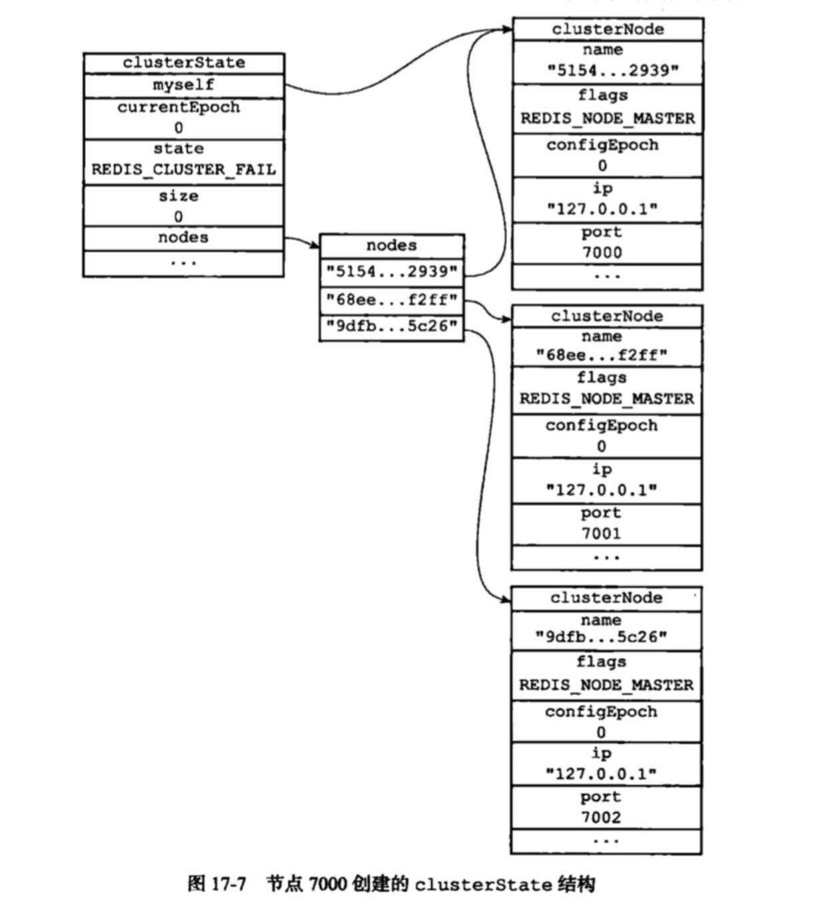

## Redis 
### 为什么要用redis
1. 高并发
	高并发情况下，如果请求全都落到数据库上去，数据库肯定就崩了。数据库能承受的并发量一般到2000就差不多了，redis能抗上万的并发量。将热点数据放入redis,能在高并发的情况下给数据库降压。
2. 高性能
	redis数据在内存，mysql数据在磁盘上，响应速度肯定是redis快很多。
### redis 线程模型


1. 接受连接处使用多路复用的模式，同时监听多个socket
2. 将事件放入队列中，文件事件分派器单线程讲事件关联处理器，进行处理。所以说redis是单线程的。


	

### redis和memcached比较


### redis的过期删除

**定期删除+惰性删除。**

- **定期删除**：隔一段时间，***随机抽取一些设置了过期时间的key，检查其是否过期，如果过期就删除。***

- **惰性删除** ：定期删除可能会导致很多过期 key 到了时间并没有被删除掉。所以就有了惰性删除。假如你的过期 key，靠定期删除没有被删除掉，还停留在内存里，除非你的系统去查一下那个 key，才会被redis给删除掉。这就是所谓的惰性删除，也是够懒的哈！

### redis的内存淘汰机制

[深入理解redis的内存淘汰机制](https://blog.csdn.net/azurelaker/article/details/85045245)

对于那些定期删除没删到，但是有没有get(惰性删除删不掉)，长时间下去，内存也会出现不够用的情况。

**redis 提供 6种数据淘汰策略：**

1. **volatile-lru**：从已设置过期时间的数据集（server.db[i].expires）中挑选最近最少使用的数据淘汰
2. **volatile-ttl**：从已设置过期时间的数据集（server.db[i].expires）中挑选将要过期的数据淘汰
3. **volatile-random**：从已设置过期时间的数据集（server.db[i].expires）中任意选择数据淘汰
4. **allkeys-lru**：当内存不足以容纳新写入数据时，在键空间中，移除最近最少使用的key（这个是最常用的）
5. **allkeys-random**：从数据集（server.db[i].dict）中任意选择数据淘汰
6. **no-eviction**：禁止驱逐数据，也就是说当内存不足以容纳新写入数据时，新写入操作会报错。这个应该没人使用吧！

4.0版本后增加以下两种：

1. **volatile-lfu**：从已设置过期时间的数据集(server.db[i].expires)中挑选最不经常使用的数据淘汰
2. **allkeys-lfu**：当内存不足以容纳新写入数据时，在键空间中，移除最不经常使用的key

#### redis的lru实现
1. redis Object中维护了一个lru字段
	
	```c
	typedef struct redisObject {
	    unsigned type:4;
	    unsigned encoding:4;
	    unsigned lru:REDIS_LRU_BITS; /* lru time (relative to server.lruclock) */
	    int refcount;
	    void *ptr;
	} robj;
	```

2. 访问key的时候，更新lru成server.lruclock;
	```c
	robj *lookupKey(redisDb *db, robj *key) {
    dictEntry *de = dictFind(db->dict,key->ptr);
    if (de) {
        robj *val = dictGetVal(de);

        /* Update the access time for the ageing algorithm.
         * Don't do it if we have a saving child, as this will trigger
         * a copy on write madness. */
        if (server.rdb_child_pid == -1 && server.aof_child_pid == -1)
            val->lru = server.lruclock;
        return val;
    } else {
        return NULL;
    }
}
	```
	
3. 这个server.lruclockyou由系统定期更新，减少访问系统时间的次数

4. 需要内存淘汰的时候，根据配置参数`maxmemory_samples`，随机从redis中获取maxmemory_samples个key,放入需要比较的范围内

5. 使用对象的lru，计算每个key的热度
	```c
unsigned long estimateObjectIdleTime(robj *o) {
    if (server.lruclock >= o->lru) {
        return (server.lruclock - o->lru) * REDIS_LRU_CLOCK_RESOLUTION;
    } else {
        return ((REDIS_LRU_CLOCK_MAX - o->lru) + server.lruclock) *
                    REDIS_LRU_CLOCK_RESOLUTION;
    }
}
	```
	
6. 淘汰那些最凉的

#### redis的lfu实现

[lfu实现,暂时没看懂](https://www.cnblogs.com/linxiyue/p/10955533.html)


## redis的备份方式
### RDB (redis database redis数据库快照)
#### 触发命令
1. `SAVE` 
    1.  阻塞
2. `BGSAVE`
    1. 另起子线程，不会阻塞


```c
// redisServer 结构中包括属性saveParams-- 可以用来指定BGSAVE的执行时间
struct redisServer {
    //...
    struct saveParam *saveParams;
    //修改计数器
    long dirty;
    //上次执行保存的时间
    time_t lastSave;
    //...
}

struct saveParam{
    time_t seconds; //秒数
    int changes;    //修改次数
}

```

按照上面的结构体可以看出，我们可以根据`秒数`和`修改次数`触发`BGSAVE`
```
save 900 1  ===> 900s内数据库执行了超过1次修改，触发BGSAVE

```

触发条件判断
```c
 def serverCron(){
     for(saveParam in server.saveParams){
         //距离上次保存的时间间隔
         saveInterval = now - server.lastSave;
         
         if(server.dirty > saveParam.changes && saveInterval > saveParam.seconds){
             BGSAVE(); //执行BGSAVE
         }
     }
 }

```

### AOF (append only file)
```c
struct redisServer{
    //...
    //AOF缓冲区
    sds aof_buf;
    //...
}
```
redis会在执行命令后会将写命令加入`aof_buf`缓冲区中

Redis 服务器进程就是一个事件循环(loop)
```c
def eventLoop():
    while true:
        //处理文件事件，接受命令并发送命令回复
        //期间写入操作会加入到aof_buf缓存中
        processFileEvents();
        
        //处理时间时间  执行serverCoron之类的定时运行的函数
        processTimeEvents();
        
        //判断是否需要将aof_buf中的内容写入和同步到AOF文件中
        flushAppendOnlyFile;

```
| 名称 | 含义                                                         |
| ---- | ------------------------------------------------------------ |
| 写入 | 调用write函数，操作系统通常会将内容暂时保存在内存缓冲区中    |
| 同步 | 缓冲区空间满了或者时间到了或者特殊设置情况下将缓冲区中的内容写入磁盘中 |

* redis AOF写入和同步的时间配置

| appendfsync选项值 | 写入行为                                                     |
| ----------------- | ------------------------------------------------------------ |
| always            | 每次执行时都会讲aof_buf缓冲区内容写入并同步到AOF文件，<br> 1. 效率低 <br> 2. 最安全，最多丢失一个eventLoop内产生的数据 |
| everysec          | 会将aof_buf内容写入AOF中，如果上次同步时间超过1S就会做AOF文件的同步 |
| no                | 会将aof_buf内容写入AOF中，但是何时进行同步需要依赖操作系统<br>1.执行效率最高<br>2.如果宕机,丢失的数据会是`最多`的 |

#### AOF重写`节约空间`
AOF的意思是将写操作命令追加到AOF文件最后，难免会出现一个key反复被操作，就会出现很多冗余的命令，文件就会变得很大。<br>
`AOF重写`就是按照当前数据库中的kv,重新生成一份AOF文件，那么不管中间出现过多少次的反复操作，在重写的AOF文件中，只会存在一条。`做到节约空间`

```c
def aof_rewrite(new_aof_file_name):
    // 创建新的AOF文件
    f = createFile(new_aof_file_name);
    for db in redisServer.db:
        // 忽略空的db
        f.write_command("SELECT" + db.id)
        
        //遍历db中的键
        for key in db:
            //忽略过期的键
            if(key.is_expried):continue;
            
            //按照不同类型生成命令，写入新的文件中
            //......
            
            //如果key有有效期，重写过期命令
            if(key.have_expire_time()):
                rewrite_exire_time(key)
    
    // 关闭文件
    f.close()
```

#### AOF后台重写
AOF重写涉及到大量的写入操作，所以需要单独启动子进程进行操作
1. 子进程进行AOF重写的时候，父进程还可以继续处理命令请求
> 问题：在子进程进行AOF重写的时候，父进程还在处理命令，那么AOF重写完成之后，还是会出现数据不一致<br>
> >redis的处理方式是，定义一个AOF重写缓冲区，<br>
> >在子进程进行AOF重写的时候，执行的写命令会被加入到这个`AOF重写的缓冲区`，在子进程完成AOF重写通知父进程后，父进程会将`AOF重写缓冲区`内容加入到新出现的这个AOF文件中

### RDB和AOF比较
1. RDB同步只能间隔着操作，AOF可以做到实时
2. RDB文件会相对比较小，AOF如果没有重写会相对比较大
3. 启动时如果AOF持久化功能是开启的，会优先载入AOF文件


## redis的主从复制
1. 成为从服务器的命令: `SLAVEOF`

复制功能分为 `同步` + `命令传播`

`同步`：将从服务器的状态更新到主服务器的状态(只在建立连接的时候)
`命令传播`:同步完成之后，主服务器接收到命令，导致的主从双方不一致的情况，通过命令的传播来维持主从的一致性

### 同步功能的实现
1. `SYNC命令`(旧版本的复制功能)=完整的重同步
2. `PSYNC命令`(新版本的复制功能)=完整重同步+部分重同步

##### 旧版的SYNC操作 
1. 从服务器发送SYNC命令<br> 
2. 主服务器收到SYNC命令后，执行BGSAVE命令，生成RDB文件(这个RDB文件仅记录到执行BGSAVE命令时的数据库状态)，`并且创建一个缓存区将从现在开始的写命令写进来`
3. 从服务器加载RDB文件，恢复到主服务器开始BGSAVE时的状态
4. 主服务器将缓冲区的命令发送给从服务器，保证生成RDB文件时的写命令也能被完整执行

>`旧版SYNC的缺点`:只有单纯的完整重同步导致断开连接后重连上来的从服务器也必须要让主服务器重新生成RDB文件。<br>1.生成RDB文件影响性能<br>2. 传输RDB文件增加网络负担

所以在新版本的`PSYNC命令`中增加了`部分重同步`的操作

##### 新版的PSYNC
从服务器断开连接后重新连接的主服务器如果还是原来的那台，并且中间两者相差的命令查的不多，可以仅对中间相差的命令做部分的重同步

1. 主从服务器各自维护一个偏移量offset
2. 主服务器每次向从服务器复制N个字节的数据时，就将自己的offset增加N
3. 从服务器接收到N个字节的数据时，就将自己的offset增加N
4. 通过这两个offset就可以知道主从服务器之间相差的偏差了

`PSYNC的复制积压缓存区`：主服务器维护一个先进先出(FIFO)的固定长度的队列(默认1MB),主服务器在复制给从服务器的时候，也会往这个队列里面存放数据。其中每一个字节都有对应的偏移量offset(和主从服务器维护的offset一个概念)
5. 当PSYNC命令时，发现主从服务器有偏差，并且从服务器当前的offset还在这个`复制积压缓存区`的话，就可以使用`部分重同步`了

> PSYNC命令 PYSNC <runid> <offset> <br> runid:本从服务器上次同步的主服务id,用来比较是不是断开前连接的是本主服务器，如果不是，直接完整重同步 <br> offset:从服务器当前的offset,用来判断是否使用部分重同步

#### 复制的实现步骤

1. 设置需要同步的主服务器 <br> SLAVEOF `ip` `port`
2. 建立socket
3. 发送PING命令确认连接是否正常
4. 身份验证
5. 发送端口命令 --告诉主服务器自己的监听端口（不知道啥作用）
6. 同步 PSYNC
7. 命令传播
8. 心跳检测
    1. 检查网络连接状态
    2. 检测命令丢失（传递offset）
    3. 辅助实现 min-slaves (还不知道怎么实现)

## redis的高可用架构
### 哨兵模式

哨兵模式是redis`高可用`的实现方式之一
使用一个或者多个哨兵(Sentinel)实例组成的系统，对redis节点进行监控，在主节点出现故障的情况下，能将从节点中的一个升级为主节点，进行故障转义，保证系统的可用性。


#### 哨兵们是怎么感知整个系统中的所有节点(主节点/从节点/哨兵节点)的
1. 首先主节点的信息是配置在哨兵(Sentinel)的配置文件中
2. 哨兵节点会和配置的主节点建立起两条连接`命令连接`和`订阅连接`
3. 哨兵会通过`命令连接`每10s发送一次`INFO`命令，通过`INFO命令`，主节点会返回自己的run_id和自己的`从节点信息`
4. 哨兵会对这些从节点也建立两条连接`命令连接`和`订阅连接`
5. 哨兵通过`命令连接`向从节点发送`INFO`命令，获取到他的一些信息
    a. run_id
    b. role
    c. 从服务器的复制偏移量 offset
    d. 等
6. 因为哨兵对与集群中的其他节点(主从节点)当前都有两条连接，`命令连接`和`订阅连接`
    a. 通过`命令连接`向服务器的`_sentinel:hello`频道发送一条消息，内容包括自己的ip端口、run_id、配置纪元(后续投票的时候会用到)等
    b. 通过`订阅连接`对服务器的`_sentinel:hello`频道做了监听，所以所有的向该频道发送的哨兵的消息都能被接受到
    c. 解析监听到的消息，进行分析提取，就可以知道还有那些别的哨兵服务节点也在监听这些主从节点了，更新结构体将这些哨兵节点记录下来
    d. 向观察到的其他的哨兵节点建立`命令连接`----没有`订阅连接`
#### 哨兵模式下的故障迁移
###### 主观下线
哨兵(Sentinel)节点会每秒一次的频率向建立了命令连接的实例发送PING命令，如果在`down-after-milliseconds`毫秒内没有做出有效响应包括(PONG/LOADING/MASTERDOWN)以外的响应，哨兵就会将该实例在本结构体中的状态标记为`SRI_S_DOWN`主观下线

###### 客观下线
当一个哨兵节点发现主节点处于主观下线状态是，会向其他的哨兵节点发出询问，该节点是不是已经主观下线了。如果超过配置参数`quorum`个节点认为是主观下线时，该哨兵节点就会将自己维护的结构体中该主节点标记为`SRI_O_DOWN`客观下线
询问命令`SENTINEL is-master-down-by-addr <ip> <port> <current_epoch> <run_id>`

| 参数          | 意义                           |
| ------------- | ------------------------------ |
| ip/port       | 当前认为下线的主节点的ip和端口 |
| current_epoch | 配置纪元                       |
| run_id | *标识仅用于询问是否下线 <br/>  有值标识该哨兵节点希望对方将自己设置为leader <br/> `询问时用*，选举时用run_id`
###### leader选举
在认为主节点`客观下线`的情况下,哨兵节点节点间会发起一次选举，命令还是上面的命令`SENTINEL is-master-down-by-addr <ip> <port> <current_epoch> <run_id>`,只是`run_id`这次会将`自己的run_id`带进去，希望接受者将自己设置为主节点。如果超过半数以上的节点返回将该节点标记为leader的情况下，会有该leader对故障进行迁移

###### 故障迁移
1. 在从节点中挑选出新的主节点
    a. 通讯正常
    b. 优先级排序
    c. 优先级相同是选择offset最大的
2. 将该节点设置成新的主节点 `SLAVEOF no one`,并确保在后续的INGO命令时，该节点返回状态为master
3. 将其他的从节点设置成从新的主节点复制, `SLAVEOF命令` 
4. 将旧的主节点变成新的主节点的从节点

#### 优缺点
* 优点
 高可用，在主节点故障时能实现故障的转移
* 缺点：好像没办法做到水平拓展，如果内容很大的情况下


### 集群模式
官方提供的分布式方案(槽指派/重新分片/故障转移)
集群内的节点，都会有个数据结构存储整个集群内的节点信息


```c
//整体
struct clusterState{
  clusterNode *mySelf;
  ....
  dict *nodes;  //集群内的所有节点
}

// 单个节点
struct clusterNode {
  char name[];
  char ip[];
  int port;
  clusterLink *link;  //保存节点间，连接的信息
  int flags;    //状态标记
}

//节点间连接的信息
struct clusterLink{
  mstime_t ctime;  //创建时间
  int fd; //tcp套接字描述符
  sds sndbuf;  // 输出缓存区
  sds rcvbuf;  //输入缓存区
  struct clusterNode *node;
}
```


#### 槽指派
redis集群可以被分为16384个槽，只有这些槽全被指派了处理的节点的情况下，集群的状态才能是上线状态(ok)
操作redis集群的时候，将key作为参数，就可以计算出对应的处理槽上，所以存储等操作都应该在该槽对应的节点上。通过这种方式，可以完美的实现集群存储的水平拓展。
```c
def slot_number(key):
  return CRC16(key) & 16383
//得到的结果就是槽的序号
```

`槽指派的信息是怎么存储的`
```c
struct clusterState{
  clusterNode *slots[16384]
 }

struct clusterNode{
  unsigned char slots[16384/8]
}
```
通过上面两个结构体中的定义可以看出，槽指派的信息是分了两种方式，保存在结构体里面。


>分两种存储的好处<br/>1. 如果需要判断某一个节点负责的槽，只需要获取方式二中的数组做判断就可以<br/>2.如果找某个槽是哪个节点负责，只需要获取方式一的列表，一查就知道

#### 重新分片
将已经指派给节点的槽，重新执行新的节点。


#### 故障转移
##### 发现故障节点
1. 集群内的节点会向其他节点发送PING命令，检查是否在线
2. 如果未能在规定时间内做出PONG响应，则会把对应的节点标记为疑似下线
3. 集群中一半以上`负责处理槽的主节点`都将主节点X标记为疑似下线的话，那么这个主节点X就会被认为是`已下线`
4. 向集群广播主节点X`已下线`,大家收到消息后都会把自己维护的结构体里的主节点X标记为`已下线`

###### 从节点选举
1. 当从节点发现自己复制的主节点已下线了，会向集群里面广播一条消息，要求所有有投票权的节点给自己投票(`所有负责处理槽的主节点都有投票权`)
2. 主节点会向第一个给他发选举消息的从节点回复支持
3. 当支持数量超过N/2+1的情况下，该从节点当选新的主节点

##### 故障的迁移
1. 新当选的从节点执行 `SLAVEOF no one`,修改成主节点
2. 新的主节点会撤销所有已下线的老的主节点的槽指派，指派给自己
3. 新的主节点向集群发送命令，通知其他节点自己已经变成主节点了，负责哪些槽指派
4. 新的主节点开始处理自己负责的槽的命令

#### 集群模式和哨兵模式的区别
1. 哨兵模式监控权交给了哨兵系统，集群模式中是工作节点自己做监控
2. 哨兵模式发起选举是选举一个leader哨兵节点来处理故障转移，集群模式是在从节点中选举一个新的主节点，来处理故障的转移


## 使用redis做缓存可能遇到的问题

### 缓存穿透

大量无命中的请求，缓存中没有数据，请求达到数据库，数据库还是没有数据，之后的请求还是会从透过缓存落到数据库，不断的被穿透。

#### 解决办法
1. 为数据库中没有值的key，在redis中也建立临时的缓存数据空。缺点是可能会在缓存中添加大量的空值键(
2. 使用布隆过滤器来检测数据存不存在。缺点是需要维护布隆过滤器。

### 缓存雪崩
大量设置了过期时间的key在同一时间过期，导致大量请求都达到DB上。DB瞬间压力太大，直接雪崩。
#### 解决方式
1. 合理的利用锁，或者队列的方式避免缓存失效的时候对DB的压力---导致访问的吞吐量下降
2. 分散key的失效时间
3. 使用hystrix限流和降级


### 缓存击穿
某个热点数据在失效的时候，大量的请求涌入DB层，导致服务挂掉。`有点像电流击穿空气`
#### 解决办法
1. 使用互斥锁(mutex key)
当发现缓存值为空的时候，使用锁的方式，试真正访问数据库的只要一个请求


```java
public String get(key) {
      String value = redis.get(key);
      if (value == null) { //代表缓存值过期
          //设置3min的超时，防止del操作失败的时候，下次缓存过期一直不能load db
		  if (redis.setnx(key_mutex, 1, 3 * 60) == 1) {  //代表设置成功
               value = db.get(key);
                      redis.set(key, value, expire_secs);
                      redis.del(key_mutex);
              } else {  //这个时候代表同时候的其他线程已经load db并回设到缓存了，这时候重试获取缓存值即可
                      sleep(50);
                      get(key);  //重试
              }
          } else {
              return value;      
          }
```

2. "提前"使用互斥锁(mutex key)
差不多逻辑就是使用一个比过期时间段的time,获取value的时候，判断缓存时间是不是到time了，如果到了提前刷新cache和value
```java
v = memcache.get(key);  
if (v == null) {  
    if (memcache.add(key_mutex, 3 * 60 * 1000) == true) {  
        value = db.get(key);  
        memcache.set(key, value);  
        memcache.delete(key_mutex);  
    } else {  
        sleep(50);  
        retry();  
    }  
} else {  
    if (v.timeout <= now()) {  
        if (memcache.add(key_mutex, 3 * 60 * 1000) == true) {  
            // extend the timeout for other threads  
            v.timeout += 3 * 60 * 1000;  
            memcache.set(key, v, KEY_TIMEOUT * 2);  
  
            // load the latest value from db  
            v = db.get(key);  
            v.timeout = KEY_TIMEOUT;  
            memcache.set(key, value, KEY_TIMEOUT * 2);  
            memcache.delete(key_mutex);  
        } else {  
            sleep(50);  
            retry();  
        }  
    }  
} 
```
3. "永不过期"
数据层面上的永不过期，value中维护一个timeout,如果获取值的时候发现过期了，进行维护
```java
String get(final String key) {  
        V v = redis.get(key);  
        String value = v.getValue();  
        long timeout = v.getTimeout();  
        if (v.timeout <= System.currentTimeMillis()) {  
            // 异步更新后台异常执行  
            threadPool.execute(new Runnable() {  
                public void run() {  
                    String keyMutex = "mutex:" + key;  
                    if (redis.setnx(keyMutex, "1", 3*60)) {  
                        String dbValue = db.get(key);  
                        redis.set(key, dbValue);  
                        redis.delete(keyMutex);  
                    }  
                }  
            });  
        }  
        return value;  
}
```


#### 整体处理方式

- 事前：Redis 高可用，主从 + 哨兵，Redis Cluster，避免全盘崩溃。
- 事中：本地 ehcache 缓存 + hystrix 限流 & 降级，避免数据库承受太多压力。
- 事后：Redis 持久化，一旦重启，自动从磁盘上加载数据，快速恢复缓存数据。

#### 请求处理方式

1. 用户请求先访问本地缓存，无命中后再访问 Redis，如果本地缓存和 Redis 都没有再查数据库，并把数据添加到本地缓存和 Redis；
2. 由于设置了限流，一段时间范围内超出的请求走降级处理(返回默认值，或给出友情提示)。


## Redis  知识体系


