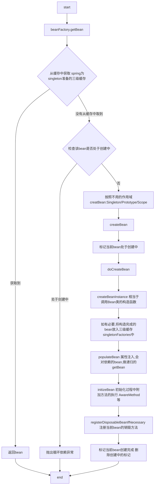

## 先给个图



## 开始源码分析

spring中获取bean的常见的方式，一般从BeanFactory中或者ApplicationContext中获取。因为ApplicationContext接口继承了BeanFactory接口，所以直接讲BeanFactory.getBean(String beanName) <br>
AbstractBeanFactory的getBean调用的是该类的doGetBean方法


```java
protected <T> T doGetBean(final String name, @Nullable final Class<T> requiredType,
			@Nullable final Object[] args, boolean typeCheckOnly) throws BeansException {

		final String beanName = transformedBeanName(name);
		Object bean;

		// 从spring的三级缓存中获取bean---解决循环依赖的关键
		Object sharedInstance = getSingleton(beanName);
		if (sharedInstance != null && args == null) {
			if (logger.isDebugEnabled()) {
				if (isSingletonCurrentlyInCreation(beanName)) {
					logger.debug("Returning eagerly cached instance of com.demo.li.singleton bean '" + beanName +
							"' that is not fully initialized yet - a consequence of a circular reference");
				}
				else {
					logger.debug("Returning cached instance of com.demo.li.singleton bean '" + beanName + "'");
				}
			}
			bean = getObjectForBeanInstance(sharedInstance, name, beanName, null);
		}

		else {
			// Fail if we're already creating this bean instance:
			// We're assumably within a circular reference.
			if (isPrototypeCurrentlyInCreation(beanName)) {
				throw new BeanCurrentlyInCreationException(beanName);
			}

            //忽略部分代码
			.....

			try {
				final RootBeanDefinition mbd = getMergedLocalBeanDefinition(beanName);
				checkMergedBeanDefinition(mbd, beanName, args);

				//忽略部分代码,getDependsOn依赖bean先加载
			    .....

				// Create bean instance.
				if (mbd.isSingleton()) {
					sharedInstance = getSingleton(beanName, () -> {
						try {
							return createBean(beanName, mbd, args);
						}
						catch (BeansException ex) {
							destroySingleton(beanName);
							throw ex;
						}
					});
					bean = getObjectForBeanInstance(sharedInstance, name, beanName, mbd);
				}

				else if (mbd.isPrototype()) {
					// It's a prototype -> create a new instance.
					Object prototypeInstance = null;
					try {
						beforePrototypeCreation(beanName);
						prototypeInstance = createBean(beanName, mbd, args);
					}
					finally {
						afterPrototypeCreation(beanName);
					}
					bean = getObjectForBeanInstance(prototypeInstance, name, beanName, mbd);
				}

				else {
					String scopeName = mbd.getScope();
					final Scope scope = this.scopes.get(scopeName);
					if (scope == null) {
						throw new IllegalStateException("No Scope registered for scope name '" + scopeName + "'");
					}
					try {
						Object scopedInstance = scope.get(beanName, () -> {
							beforePrototypeCreation(beanName);
							try {
								return createBean(beanName, mbd, args);
							}
							finally {
								afterPrototypeCreation(beanName);
							}
						});
						bean = getObjectForBeanInstance(scopedInstance, name, beanName, mbd);
					}
					catch (IllegalStateException ex) {
						throw new BeanCreationException(beanName,
								"Scope '" + scopeName + "' is not active for the current com.demo.li.thread; consider " +
								"defining a scoped proxy for this bean if you intend to refer to it from a com.demo.li.singleton",
								ex);
					}
				}
			}
			catch (BeansException ex) {
				cleanupAfterBeanCreationFailure(beanName);
				throw ex;
			}
		}

		//忽略部分代码--类型的校验
		.....
		}
		return (T) bean;
	}
```

上述的代码中大致的流程如下：
1. 从Spring维护的三级缓存中获取一个singleton bean，获取成功直接返回
2. 判断该bean是否处于创建中，如果是说明出现了循环依赖，抛异常
3. 根据bean的作用域，分别用不同的方式获取bean，如果获取不到最终调用的都是同一个createBean方式
4. getObjectForBeanInstance 如果上述方法获取到的是一个FactoryBean的情况下，需要从里面获取对应的我们需要的Bean

下面分析下singleton bean的获取

```java
// Create bean instance.
if (mbd.isSingleton()) {
	sharedInstance = getSingleton(beanName, () -> {
		try {
			return createBean(beanName, mbd, args);
		}
		catch (BeansException ex) {
			destroySingleton(beanName);
			throw ex;
		}
	});
	bean = getObjectForBeanInstance(sharedInstance, name, beanName, mbd);
}
```

```java
public Object getSingleton(String beanName, ObjectFactory<?> singletonFactory) {
		Assert.notNull(beanName, "Bean name must not be null");
		synchronized (this.singletonObjects) {
			Object singletonObject = this.singletonObjects.get(beanName);
			if (singletonObject == null) {
				if (this.singletonsCurrentlyInDestruction) {
					throw new BeanCreationNotAllowedException(beanName,
							"Singleton bean creation not allowed while singletons of this factory are in destruction " +
							"(Do not request a bean from a BeanFactory in a destroy method implementation!)");
				}
				if (logger.isDebugEnabled()) {
					logger.debug("Creating shared instance of com.demo.li.singleton bean '" + beanName + "'");
				}
				beforeSingletonCreation(beanName);
				//定义异常
				...
				try {
					singletonObject = singletonFactory.getObject();
					newSingleton = true;
				}
				catch (IllegalStateException ex) {
					com.demo.licom.demo.li.singletonn
					// if yes, proceed with it since the exception indicates that state.
					singletonObject = this.singletonObjects.get(beanName);
					if (singletonObject == null) {
						throw ex;
					}
				}
				catch (BeanCreationException ex) {
				    //封装异常
					...
				}
				finally {
					...
					afterSingletonCreation(beanName);
				}
				if (newSingleton) {
					addSingleton(beanName, singletonObject);
				}
			}
			return singletonObject;
		}
	}
```
1. 因为singleton的bean只能存在一个，所以对singletonObjects这个缓存做加锁获取
2. 做循环依赖判断
3. beforeSingletonCreation(beanName);//也就是把这个beanName标记成正在创建中
4. 通过singletonFactory的方法获取bean --> 也就是调用createBean方法
5. afterSingletonCreation(beanName);//去除该beanName正在创建中的标记
6. 如果是新创建的singleton的bean的话，把他加入singletonObjects缓存中
7. 这个singletonObjects缓存也就是上面所说的三级缓存的中的第一级（具体后续再说）


> 不管是singleton还是Prototype还是其他的scope，在从作用域中获取不到bean的情况下，都是调用的createBean


* 知识点梳理：
1. FactoryBean：https://www.cnblogs.com/davidwang456/p/3688250.html
2. bean的作用域：
    1. singleton:整个容器中保留一份
    2. prototype:每次使用的时候，com.demo.li.singleton3. 其他scope
       1. SimpleThreadScope
       2. RequestScope
       3. SessionScope