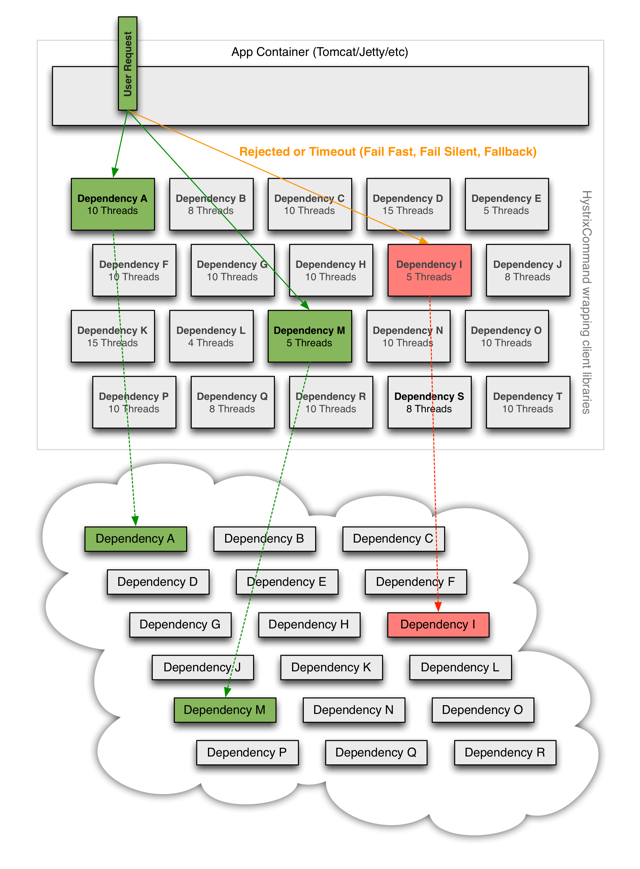

# 系统的容错性

一个系统运行期间不可能100%完全不出问题，就算我们的系统不出问题，依赖的系统也会出问题。

所以在面对不同的场景的时候，我们就应该在设计上避免底层不可用带来的影响，让依赖的服务的故障不影响用户的正常体验，比如搜索功能故障，可以暂时禁用，并给予友好提示，而不应该因此造成整个系统的不可用.其次应该同时让系统能应对这个错误，并具有恢复能力,比如故障的服务可能在一段时间后会恢复正常后，对应的依赖服务应有所感知并进行恢复.


## 请求超时

对于网络请求的情况，需要合理设计请求超时时间，不能因为依赖服务异常，导致大量请求被阻塞。

>  http超时时间

## 请求重试

利用重试操作来解决网络问题带来的调用失败

1. 重试次数不宜太多
2. 对于非强依赖的服务尽量少重试

> kafka producer发送消息的时候可以设置重试次数

## 限流

**控制并发**：

1000个请求并发进来需要请求依赖服务，可能只能允许其中100个去请求。而其他的请求可以直接返回不进行处理。这样保证了我们的并发数和我们的设计的负载水平相一致。

> 1. hystrix:使用信号量来控制。
>
> 2. 也可以使用分布式的方式来控制集群的并发访问，比如在redis里面加标记

**控制速率**：

1. ##### 漏桶算法（从桶里流出的速率恒定）

	

3. ##### 令牌桶算法(能够解决突发流量)

	

   guava的RateLimiter实现的是令牌桶的方式，

   ```java
   RateLimiter:
   
   //申请令牌
   public double acquire(int permits) {
     //检查需要的令牌数量是否合法
     checkPermits(permits);
     long microsToWait;
     //加锁的方式，计算需要等待的时间
     synchronized (mutex) {
       microsToWait = reserveNextTicket(permits, readSafeMicros());
     }
     //按照计算出来的时间进行sleep
     ticker.sleepMicrosUninterruptibly(microsToWait);
     return 1.0 * microsToWait / TimeUnit.SECONDS.toMicros(1L);
   }
   
   /**
      * Reserves next ticket and returns the wait time that the caller must wait for.
      */
   private long reserveNextTicket(double requiredPermits, long nowMicros) {
     //更新下令牌桶
     resync(nowMicros);
     //到获取到下个令牌的时间，也就是我们需要sleep的时间
     long microsToNextFreeTicket = nextFreeTicketMicros - nowMicros;
     //可以花费的令牌数量 =  Math.min(申请令牌数,当前已经产生未消费的令牌数)
     double storedPermitsToSpend = Math.min(requiredPermits, this.storedPermits);
     //计算还需要的令牌数
     double freshPermits = requiredPermits - storedPermitsToSpend;
   
     //计算生成这些新的令牌需要的时间 --- 还需要的令牌数 * 间隔
     long waitMicros = storedPermitsToWaitTime(this.storedPermits, storedPermitsToSpend)
       + (long) (freshPermits * stableIntervalMicros);
   //重新计算下次可用令牌的生成时间 = 当前可用令牌的时间 + 生成还需要的新令牌需要的时间
     this.nextFreeTicketMicros = nextFreeTicketMicros + waitMicros;
     //减掉本次使用的令牌数
     this.storedPermits -= storedPermitsToSpend;
     //把本次的等待时间返回出去，当acquire去sleep
     return microsToNextFreeTicket;
   }
   
   //使用当前时间去同步状态
    private void resync(long nowMicros) {
       // if nextFreeTicket is in the past, resync to now
      //如果当前时间已经超出了上次获取令牌的时候计算出来的下次产生令牌的时间的话，需要进行维护这个storedPermits
       if (nowMicros > nextFreeTicketMicros) {
         //超出上次计算的下次生成令牌的时间数量 = nowMicros - nextFreeTicketMicros，
         //这段时间能生成的令牌数量 = 超出时间数/生成令牌的间隔时间
         //当前的令牌数 = Math.min(maxPermits,storedPermits+新生成的令牌数）
         storedPermits = Math.min(maxPermits,
             storedPermits + (nowMicros - nextFreeTicketMicros) / stableIntervalMicros);
         //更新下下次生成令牌的时间=当前
         nextFreeTicketMicros = nowMicros;
       }
     }
   ```

   总结下guava的RateLimiter设计思想：

  * storedPermits：当前已经生成的，但是还没使用的令牌数量
* nextFreeTicketMicros ： 下一个有效令牌的生成时间
  
  
  
  ```java
  //可以花费的令牌数量 =  Math.min(申请令牌数,当前已经产生未消费的令牌数)
  double storedPermitsToSpend = Math.min(requiredPermits, this.storedPermits);
  //计算还需要的令牌数
  double freshPermits = requiredPermits - storedPermitsToSpend;
  
  //计算生成这些新的令牌需要的时间 --- 还需要的令牌数 * 间隔
  long waitMicros = storedPermitsToWaitTime(this.storedPermits, storedPermitsToSpend)
    + (long) (freshPermits * stableIntervalMicros);
  //重新计算下次可用令牌的生成时间 = 当前可用令牌的时间 + 生成还需要的新令牌需要的时间
     this.nextFreeTicketMicros = nextFreeTicketMicros + waitMicros;
  ```
  
  上面几句的逻辑存在两种情况，
  
  1. 本次请求需要令牌数在已经生成的令牌范围内
  
     freshPermits = 0；
  
     waitMicros = 0；
  
     nextFreeTicketMicros = 原来计算的下次生成下个空闲令牌的时间
  
     storedPermits > 0
  
     
  
  2. 还需要弄出几个新的令牌才行
  
     freshPermits = n 
  
     waitMicros =  n * 间隔
  
     nextFreeTicketMicros = 原来的nextFreeTicketMicros + waitMicros，
  
     storedPermits = 0;
  
     因为本次申请完了之后，nextFreeTicketMicros之前的令牌已经被用完了。
  
   


## 船舱隔离

这个模式借鉴造船行业的经验，在造船业人们往往利用舱壁将不同的船舱隔离起来，这样如果一个船舱破了进水，只损失一个船舱，其它船舱可以不受影响.不把错误扩大到整个系统的层面


**hystrix的线程隔离**  就是了这个模式的思想，给每个commandGroup分配一个线程池，如果这个group依赖的服务出了故障，也不会导致全部的请求都被卡在对这个依赖的请求中。如果下图中的DependencyI线程池只分配10个线程，那么如果当前有100个线程在请求，至少90个请求不会因为I异常而阻塞。

```java
protected AbstractCommand(HystrixCommandGroupKey group, HystrixCommandKey key, HystrixThreadPoolKey threadPoolKey, HystrixCircuitBreaker circuitBreaker, HystrixThreadPool threadPool,
            HystrixCommandProperties.Setter commandPropertiesDefaults, HystrixThreadPoolProperties.Setter threadPoolPropertiesDefaults,
            HystrixCommandMetrics metrics, TryableSemaphore fallbackSemaphore, TryableSemaphore executionSemaphore,
            HystrixPropertiesStrategy propertiesStrategy, HystrixCommandExecutionHook executionHook) {

        this.commandGroup = initGroupKey(group);
        this.commandKey = initCommandKey(key, getClass());
        this.properties = initCommandProperties(this.commandKey, propertiesStrategy, commandPropertiesDefaults);
        this.threadPoolKey = initThreadPoolKey(threadPoolKey, this.commandGroup, this.properties.executionIsolationThreadPoolKeyOverride().get());
        this.metrics = initMetrics(metrics, this.commandGroup, this.threadPoolKey, this.commandKey, this.properties);
        this.circuitBreaker = initCircuitBreaker(this.properties.circuitBreakerEnabled().get(), circuitBreaker, this.commandGroup, this.commandKey, this.properties, this.metrics);
  //按照commandKey等创建了一个线程池
        this.threadPool = initThreadPool(threadPool, this.threadPoolKey, threadPoolPropertiesDefaults);

        ....
    }

```


> 还没找到哪个位置用了这个threadpool是怎么使用的，好像不是常规的线程池啊~~~~




## 熔断器

短时间内某个依赖的系统失败次数大量出现。像家里面的熔断器一样，打开熔断。

可以提供 fallback，进行快速失败。

熔断器：

```java
HystrixCircuitBreaker:
enum Status {
  CLOSED, OPEN, HALF_OPEN;
}
```


### attemptExecution：

```java
HystrixCircuitBreaker: 熔断器
@Override
//判断是否允许执行
public boolean attemptExecution() {
  //如果熔断器强制开着，不能执行
  if (properties.circuitBreakerForceOpen().get()) {
    return false;
  }
  //如果熔断器强制关着，可以执行
  if (properties.circuitBreakerForceClosed().get()) {
    return true;
  }
  //如果当前熔断器没开，可以执行
  if (circuitOpened.get() == -1) {
    return true;
  } else {
    //如果当前熔断器开着，判断是否过了sleep窗口，如果过了CAS设置成半开放
    if (isAfterSleepWindow()) {
      //only the first request after sleep window should execute
      //if the executing command succeeds, the status will transition to CLOSED
      //if the executing command fails, the status will transition to OPEN
      //if the executing command gets unsubscribed, the status will transition to OPEN
      if (status.compareAndSet(Status.OPEN, Status.HALF_OPEN)) {
        return true;
      } else {
        return false;
      }
    } else {
      return false;
    }
  }
}
}
```

发起请求的时候，会询问熔断器：

1. 如果熔断器强制开着，不能执行
2. 如果熔断器强制关着，可以执行
3. 如果当前熔断器没开，可以执行
4. 如果当前熔断器开着，判断是否过了sleep窗口，如果过了CAS设置成半开放

### close -> open

```java
HystrixCircuitBreaker:

private Subscription subscribeToStream() {

  return metrics.getHealthCountsStream()
    .observe()
    .subscribe(new Subscriber<HealthCounts>() {
      ...

      @Override
      public void onNext(HealthCounts hc) {
        if (hc.getTotalRequests() < properties.circuitBreakerRequestVolumeThreshold().get()) 				{
          //如果请求量还不到判定标准不处理
        } else {
          //如果错误数量还不达标，不处理
          if (hc.getErrorPercentage() < properties.circuitBreakerErrorThresholdPercentage().get()) {
            //we are not past the minimum error threshold for the stat window,
            // so no change to circuit status.
            //如果当前是关闭，那就是保持关闭
            // if it was CLOSED, it stays CLOSED
            //如果当前是半开状态，上一节的逻辑会处理
            // if it was half-open, we need to wait for a successful command execution
            //如果当前是打开状态，那就应该不会有请求进来
            // if it was open, we need to wait for sleep window to elapse
          } else {
            //如果错误数量到了一定成功，打开熔断器
            // our failure rate is too high, we need to set the state to OPEN
            if (status.compareAndSet(Status.CLOSED, Status.OPEN)) {
              circuitOpened.set(System.currentTimeMillis());
            }
          }
        }
      }
    });
}

```

HystrixCircuitBreaker会订阅处理时间，在这个过程中判断是否应该打开熔断器

1. 请求量达标
2. 错误量达标

### open -> half_open

```java
HystrixCircuitBreaker: 熔断器
  //如果当前熔断器没开，可以执行
  if (circuitOpened.get() == -1) {
    return true;
  } else {
    //如果当前熔断器开着，判断是否过了sleep窗口，如果过了CAS设置成半开放
    if (isAfterSleepWindow()) {
      //only the first request after sleep window should execute
      //if the executing command succeeds, the status will transition to CLOSED
      //if the executing command fails, the status will transition to OPEN
      //if the executing command gets unsubscribed, the status will transition to OPEN
      if (status.compareAndSet(Status.OPEN, Status.HALF_OPEN)) {
        return true;
      } else {
        return false;
      }
    } else {
      return false;
    }
```

熔断器打开后，会有一个窗口期，在这个期间内请求无法进入，但是过了这个窗口期，会尝试把状态设置成HALF_OPEN.根据后面的请求情况来判断是开还是关。（做做试探）

### half_open -> open/close

```java
 private Observable<R> executeCommandAndObserve(final AbstractCommand<R> _cmd) {
   final HystrixRequestContext currentRequestContext = HystrixRequestContext.getContextForCurrentThread();

   ....
		//执行成功的情况,执行circuitBreaker.markSuccess();将熔断器状态设置成CLOSE
     final Action0 markOnCompleted = new Action0() {
     @Override
     public void call() {
       if (!commandIsScalar()) {
         ....
         circuitBreaker.markSuccess();
       }
     }
   };
   
   //处理失败
   final Func1<Throwable, Observable<R>> handleFallback = new Func1<Throwable, Observable<R>>() {
            @Override
            public Observable<R> call(Throwable t) {
              //如果是失败，将HALF_OPEN设置成OPEN
                circuitBreaker.markNonSuccess();
               .....
            }
        };


   ...
		//执行业务逻辑
     return execution.doOnNext(markEmits)
     .doOnCompleted(markOnCompleted)//绑定到completed事件上
     .onErrorResumeNext(handleFallback)
     .doOnEach(setRequestContext);
 }

```
如果当前是HALF_OPEN状态：
1. 如果请求失败了，打开熔断器，进入sleep窗口期。
2. 如果请求成功了，关闭熔断器，后面的请求能正常执行。


## 降级 fallback

1. 自定义处理：在这种场景下，可以使用默认数据，本地数据，缓存数据来临时支撑，也可以将请求放入队列，或者使用备用服务获取数据等，适用于业务的关键流程与严重影响用户体验的场景，如商家/产品信息等核心服务。
2. 故障沉默（fail-silent）：直接返回空值或缺省值，适用于可降级功能的场景，如产品推荐之类的功能，数据为空也不太影响用户体验。
3. 快速失败（fail-fast）：直接抛出异常，适用于数据非强依赖的场景，如非核心服务超时的处理。


## 相关资料

[美团技术团队的容错](https://tech.meituan.com/2016/11/11/service-fault-tolerant-pattern.html)

