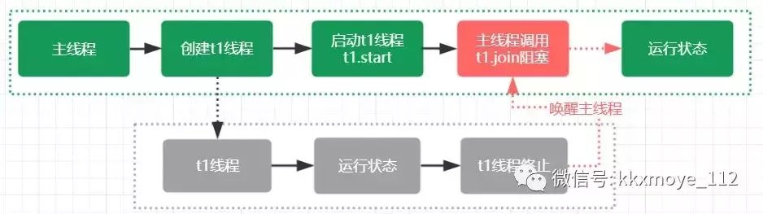

# (四)Thread.join的作用和原理

[](https://www.jianshu.com/u/a77a15099aae)

[架构师修炼宝典](https://www.jianshu.com/u/a77a15099aae)关注

12018.12.04 18:04:55字数 1,073阅读 15,475

# 文章简介

很多人对Thread.join的作用以及实现了解得很少，毕竟这个api我们很少使用。这篇文章仍然会结合使用及原理进行深度分析

# 内容导航

1. Thread.join的作用
2. Thread.join的实现原理
3. 什么时候会使用Thread.join

# Thread.join的作用

之前有人问过我一个这样的面试题

> Java中如何让多线程按照自己指定的顺序执行？

这个问题最简单的回答是通过Thread.join来实现，久而久之就让很多人误以为Thread.join是用来保证线程的顺序性的。
下面这段代码演示了Thread.join的作用


```java
public class JoinDemo extends Thread{
    int i;
    Thread previousThread; //上一个线程
    public JoinDemo(Thread previousThread,int i){
        this.previousThread=previousThread;
        this.i=i;
    }
    @Override
    public void run() {
        try {
          //调用上一个线程的join方法，大家可以自己演示的时候可以把这行代码注释掉
            previousThread.join(); 
        } catch (InterruptedException e) {
            e.printStackTrace();
        }
        System.out.println("num:"+i);
    }
    public static void main(String[] args) {
        Thread previousThread=Thread.currentThread();
        for(int i=0;i<10;i++){
            JoinDemo joinDemo=new JoinDemo(previousThread,i);
            joinDemo.start();
            previousThread=joinDemo;
        }
    }
}
```

上面的代码，注意 previousThread.join部分，大家可以把这行代码注释以后看看运行效果，在没有加join的时候运行的结果是不确定的。加了join以后，运行结果按照递增的顺序展示出来。

> thread.join的含义是当前线程需要等待previousThread线程终止之后才从thread.join返回。简单来说，就是线程没有执行完之前，会一直阻塞在join方法处。

下面的图表现了join对于线程的作用




# Thread.join的实现原理

> 线程是如何被阻塞的？又是通过什么方法唤醒的呢？先来看看Thread.join方法做了什么事情


```java
public class Thread implements Runnable {
    ...
    public final void join() throws InterruptedException {
        join(0);
    }
    ...
    public final synchronized void join(long millis) throws InterruptedException {
        long base = System.currentTimeMillis();
        long now = 0;
        if (millis < 0) {
            throw new IllegalArgumentException("timeout value is negative");
        }
        if (millis == 0) { //判断是否携带阻塞的超时时间，等于0表示没有设置超时时间
            while (isAlive()) {//isAlive获取线程状态，无线等待直到previousThread线程结束
                wait(0); //调用Object中的wait方法实现线程的阻塞
            }
        } else { //阻塞直到超时
            while (isAlive()) { 
                long delay = millis - now;
                if (delay <= 0) {
                    break;
                }
                wait(delay);
                now = System.currentTimeMillis() - base;
            }
        }
    }
    ...
```

从join方法的源码来看，join方法的本质调用的是Object中的wait方法实现线程的阻塞，wait方法的实现原理我们在后续的文章再说详细阐述。**但是我们需要知道的是，调用wait方法必须要获取锁**，所以join方法是被synchronized修饰的，synchronized修饰在方法层面相当于synchronized(this),this就是previousThread本身的实例。

有很多人不理解join为什么阻塞的是主线程呢? 不理解的原因是阻塞主线程的方法是放在previousThread这个实例作用，让大家误以为应该阻塞previousThread线程。实际上主线程会持有previousThread这个对象的锁，然后调用wait方法去阻塞，而这个方法的调用者是在主线程中的。所以造成主线程阻塞。

> 第二个问题，为什么previousThread线程执行完毕就能够唤醒住线程呢？或者说是在什么时候唤醒的？

要了解这个问题，我们又得翻jdk的源码，但是如果大家对线程有一定的基本了解的话，通过wait方法阻塞的线程，需要通过notify或者notifyall来唤醒。所以在线程执行完毕以后会有一个唤醒的操作，只是我们不需要关心。
接下来在hotspot的源码中找到 thread.cpp，看看线程退出以后有没有做相关的事情来证明我们的猜想.


```java
void JavaThread::exit(bool destroy_vm, ExitType exit_type) {
  assert(this == JavaThread::current(),  "thread consistency check");
  ...
  // Notify waiters on thread object. This has to be done after exit() is called
  // on the thread (if the thread is the last thread in a daemon ThreadGroup the
  // group should have the destroyed bit set before waiters are notified).
  ensure_join(this); 
  assert(!this->has_pending_exception(), "ensure_join should have cleared");
  ...
```

观察一下 ensure_join(this)这行代码上的注释，唤醒处于等待的线程对象，这个是在线程终止之后做的清理工作，这个方法的定义代码片段如下


```java
static void ensure_join(JavaThread* thread) {
  // We do not need to grap the Threads_lock, since we are operating on ourself.
  Handle threadObj(thread, thread->threadObj());
  assert(threadObj.not_null(), "java thread object must exist");
  ObjectLocker lock(threadObj, thread);
  // Ignore pending exception (ThreadDeath), since we are exiting anyway
  thread->clear_pending_exception();
  // Thread is exiting. So set thread_status field in  java.lang.Thread class to TERMINATED.
  java_lang_Thread::set_thread_status(threadObj(), java_lang_Thread::TERMINATED);
  // Clear the native thread instance - this makes isAlive return false and allows the join()
  // to complete once we've done the notify_all below
  //这里是清除native线程，这个操作会导致isAlive()方法返回false
  java_lang_Thread::set_thread(threadObj(), NULL);
  lock.notify_all(thread);//注意这里
  // Ignore pending exception (ThreadDeath), since we are exiting anyway
  thread->clear_pending_exception();
}
```

ensure_join方法中，调用 lock.notify_all(thread); 唤醒所有等待thread锁的线程，意味着调用了join方法被阻塞的主线程会被唤醒； 到目前为止，我们基本上对join的原理做了一个比较详细的分析

> 总结，Thread.join其实底层是通过wait/notifyall来实现线程的通信达到线程阻塞的目的；当线程执行结束以后，会触发两个事情，第一个是设置native线程对象为null、第二个是通过notifyall方法，让等待在previousThread对象锁上的wait方法被唤醒。

# 什么时候会使用Thread.join

在实际应用开发中，我们很少会使用thread.join。在实际使用过程中，我们可以通过join方法来等待线程执行的结果，其实有点类似future/callable的功能。
我们通过以下伪代码来说明join的使用场景


```java
public void joinDemo(){
   //....
   Thread t=new Thread(payService);
   t.start();
   //.... 
   //其他业务逻辑处理,不需要确定t线程是否执行完
   insertData();
   //后续的处理，需要依赖t线程的执行结果，可以在这里调用join方法等待t线程执行结束
   t.join();
}
```