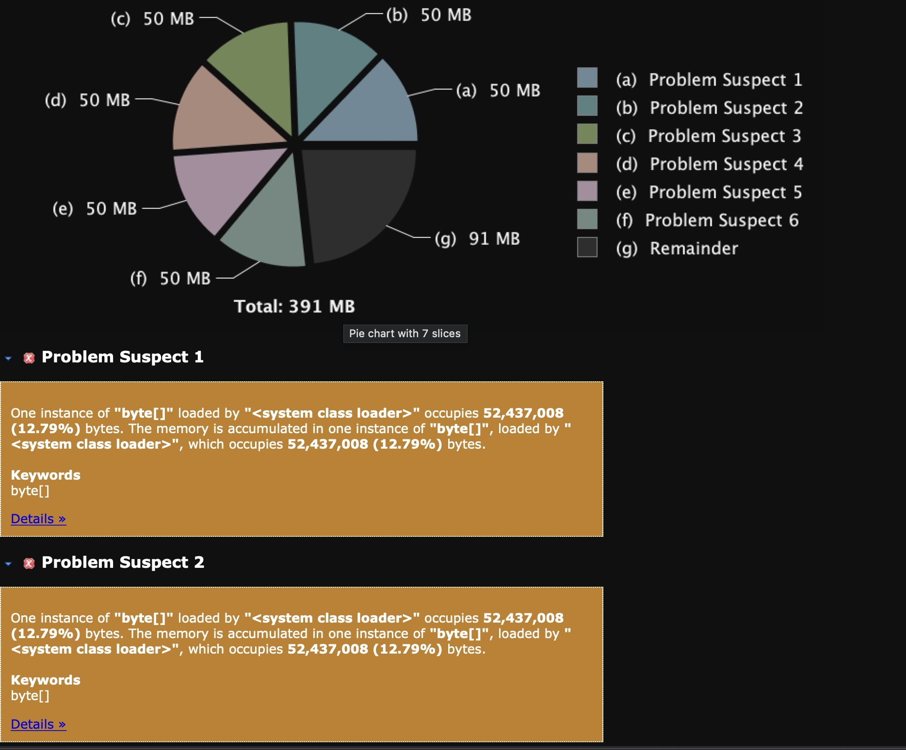
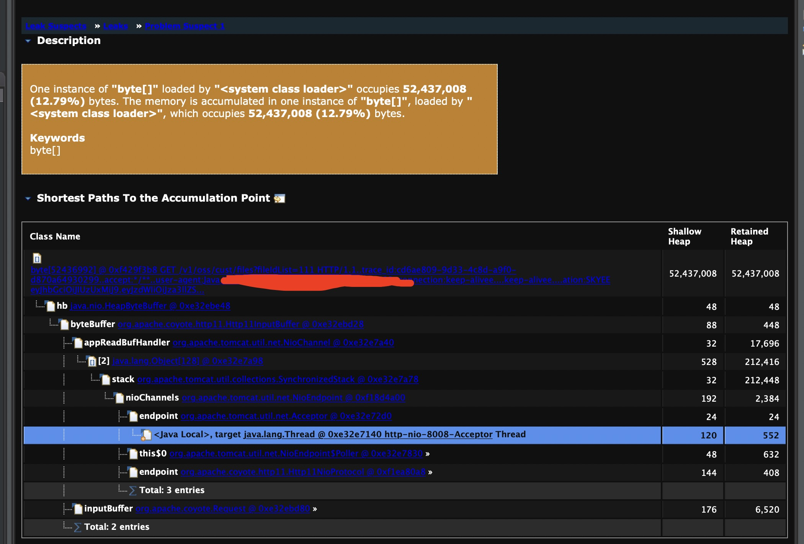

# 记一次 springboot max-http-header-size 设置过大导致OOM

最近在测试环境上发现有个系统时不时的会出现OOM问题，

## 问题排查过程

### 1. 导出dump内容后发现



> 发现里面有好多50MB的空间被byte[]占用


### 2. 选择其中的一个点进去

显示的内容为一个http的请求，但是这个接口返回的信息很简单，不存在占用大量空间的情况。

### 3. 网上搜索
根据里面的关键字 HeapByteBuffer oom 在网上搜索出 [网上参考文章](https://blog.csdn.net/weixin_37882382/article/details/103203841)


和当前系统出现的情况一对比，很贴近，果然在配置文件里面找到这样一行配置
```properties
server:
  max-http-header-size: 50MB
```

## 源码分析问题

### 1. ServerProperties
根据配置文件往上找，**server.max-http-header-size**配置项是在 **ServerProperties**中被定义的

```java
public DataSize getMaxHttpHeaderSize() {
	return this.maxHttpHeaderSize;
}

public void setMaxHttpHeaderSize(DataSize maxHttpHeaderSize) {
	this.maxHttpHeaderSize = maxHttpHeaderSize;
}
```

### 2. TomcatWebServerFactoryCustomizer

```java
@SuppressWarnings("rawtypes")
private void customizeMaxHttpHeaderSize(ConfigurableTomcatWebServerFactory factory, int maxHttpHeaderSize) {
	factory.addConnectorCustomizers((connector) -> {
		ProtocolHandler handler = connector.getProtocolHandler();
		if (handler instanceof AbstractHttp11Protocol) {
			AbstractHttp11Protocol protocol = (AbstractHttp11Protocol) handler;
			protocol.setMaxHttpHeaderSize(maxHttpHeaderSize);
		}
	});
}
```

### 3. protocol 中怎么使用MaxHttpHeaderSize

```java
 public Http11Processor(AbstractHttp11Protocol<?> protocol, Adapter adapter) {
       .... 

        inputBuffer = new Http11InputBuffer(request, protocol.getMaxHttpHeaderSize(),
                protocol.getRejectIllegalHeaderName(), httpParser);
        request.setInputBuffer(inputBuffer);

        outputBuffer = new Http11OutputBuffer(response, protocol.getMaxHttpHeaderSize());
        response.setOutputBuffer(outputBuffer);
	....
 }
```

Http11Processor 会为 request和response各分配两个buffer

### 4. Http11InputBuffer.init

```java
void init(SocketWrapperBase<?> socketWrapper) {

        wrapper = socketWrapper;
        wrapper.setAppReadBufHandler(this);

        int bufLength = headerBufferSize +
                wrapper.getSocketBufferHandler().getReadBuffer().capacity();
        if (byteBuffer == null || byteBuffer.capacity() < bufLength) {
            byteBuffer = ByteBuffer.allocate(bufLength);
            byteBuffer.position(0).limit(0);
        }
    }
```
buffer的大小是算上header的BufferSize的。

所以，当我们在配置文件中，配置了过大的**server.max-http-header-size**，就会导致每个处理http请求的processor都会多占用50M * 2的空间
```properties
server:
  max-http-header-size: 50MB
```


